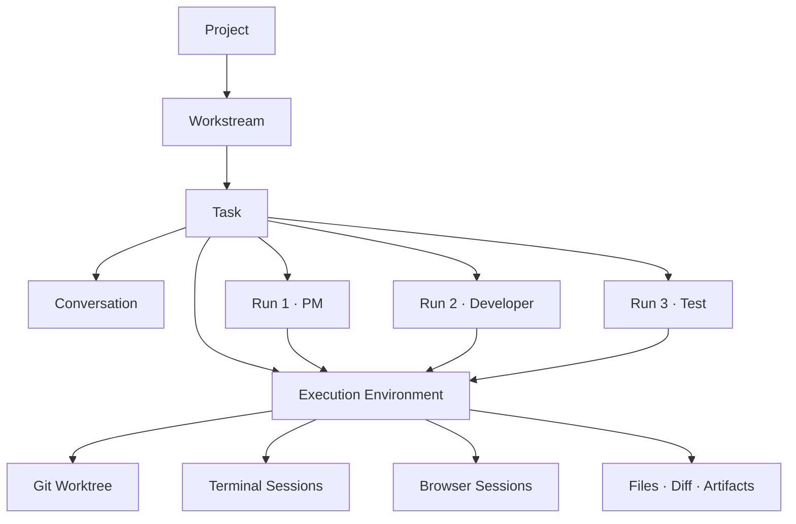

# OPAL Product OS 데스크톱 워크벤치 제안서

> 상태: 폐기
> 작성일: 2026-09-10
> 목적: 검증된 OSS Runtime을 조립하고 OPAL 고유의 Task 중심 Agent 작업 모델을 구현하는 데스크톱 제품 방향 확정

---

## 1. 제안 요약

OPAL Console을 로컬 프로젝트를 조회하는 웹 대시보드에서 **Task 중심의 데스크톱 Agent Workbench**로 확장한다.

이 제품은 새로운 Agent IDE의 모든 기능을 직접 구현하지 않는다. Electron, ACP SDK, xterm, node-pty, Monaco, agent-browser, Playwright, Git과 Orca·Buzz의 검증된 구현을 용도에 맞게 재사용하고, OPAL의 차별화 영역인 다음 기능에 개발 역량을 집중한다.

- `Project → Workstream → Task → Run` 작업 모델
- 프로젝트 PM·전문·사용자 에이전트 정의
- Task와 Agent Run의 연결 및 멘션 라우팅
- 대화·실행·도구·검증·결과의 통합 이력
- OPAL pilot·state·brain·memory와 Runtime의 연결
- 사람이 실행 과정과 결과를 이해하고 통제하는 Workbench

제품은 Orca나 Buzz를 포크하지 않는다. package·공개 CLI·프로토콜을 우선 사용하고, 독립성과 유지 가치가 확인된 모듈만 Adapter 뒤로 추출한다. 이를 **OSS Harvest 전략**으로 정의한다.

---

## 2. 배경과 문제

현재 OPAL Console은 React·TypeScript·Vite 프런트엔드와 FastAPI 백엔드로 구성된 로컬 읽기 중심 대시보드다. 프로젝트, 태스크 칸반, 메모리, 환경 진단, Project Brain, 설정을 제공하지만 Terminal·Browser·Editor·Git Worktree·ACP Agent Runtime을 하나의 작업 단위로 묶지 않는다.

근거:

- Console 구성: `docs/PROJECT.md §주요 컴포넌트 (OPAL Console)`
- 읽기 중심 아키텍처: `docs/ARCHITECTURE.md §OPAL Console`
- 현재 프런트엔드 스택: `dashboard/frontend/package.json`
- 기존 ACP Agent Hub 기능안: `docs/proposals/opal-console-acp-agent-hub.md`

기존 ACP Agent Hub 안은 Console에서 PM과 전문 에이전트를 호출하는 기능을 정의했지만 다음 제품 요구를 상위 개념으로 다루지 못한다.

- Agent가 실제로 작업하는 중앙 Workbench
- Task마다 격리되거나 공유되는 Execution Environment
- Terminal·Browser·Files·Git Diff의 일관된 수명주기
- Agent Browser를 이용한 관찰·조작과 Playwright 검증
- 앱 종료 후 Task·Run·Terminal·Browser·Layout 복원
- OSS Runtime을 교체 가능한 Adapter로 사용하는 개발 전략

따라서 기능 추가가 아니라 제품의 상위 도메인과 Runtime 구조를 다시 정의해야 한다.

---

## 3. 제품 비전

### 3.1 제품 정의

OPAL Product OS는 사용자가 프로젝트의 작업을 만들고, 적절한 Agent에게 맡기고, 실행 환경과 결과를 한 화면에서 관찰·검토·재개하는 로컬 데스크톱 애플리케이션이다.

```text
Project 선택
  → Workstream 선택
  → Task 생성 또는 재개
  → Agent에게 대화·업무 지시
  → Run 생성
  → Terminal·Browser·Files에서 작업
  → 검증 실행
  → Git Diff와 Result 검토
  → Task 완료 또는 다음 Run
```

### 3.2 핵심 가설

> 사용자는 여러 CLI와 창을 직접 관리하지 않고도 하나의 Task 안에서 Agent의 대화, 실행, 파일 변경, 브라우저 검증과 결과를 이해하고 통제할 수 있다.

### 3.3 차별화 영역

| 영역 | 직접 소유하는 이유 |
|---|---|
| Task 중심 작업 모델 | 제품의 정보 구조와 사용자 흐름을 결정 |
| Agent Role | `.opal/AGENT.md`와 전문 에이전트를 프로젝트 지식에 연결 |
| Task → Agent orchestration | PM·전문 Agent의 책임·위임·검증 관계를 정의 |
| Context·Memory | Project Brain·memory·task artifact를 실행에 선별 주입 |
| Run·Result | 실행 과정과 변경·검증·승인을 하나의 결과로 구성 |
| OPAL workflow 연동 | pilot·state-tool·하네스의 추적성과 Gate를 유지 |

Terminal 렌더러, PTY, 범용 Editor, 브라우저 자동화 엔진, ACP wire protocol, Git 자체는 차별화 영역으로 보지 않는다.

---

## 4. 용어와 도메인 모델

### 4.1 사용자 용어

| 기존 협업 도구 용어 | 제품 용어 | 의미 |
|---|---|---|
| Workspace | Project | 하나의 실제 프로젝트 또는 Repository |
| Channel | Stream | Product·Development·Research·Review 같은 업무 흐름 |
| Thread | Task | 목표·대화·실행·결과를 소유하는 작업 단위 |
| Agent Session | Run | 특정 Agent가 Task를 수행한 한 번의 실행 |
| Pane | Tool View | Terminal·Browser·Editor·Diff를 보여주는 화면 |
| 중앙 Workspace | Workbench | 실제 작업과 검토가 일어나는 중앙 영역 |

UI에는 간결한 `Stream`을 사용한다. 구현 코드와 데이터 스키마에서는 ACP·WebSocket stream과 구분하기 위해 `workstream`을 사용한다.

### 4.2 Execution Environment 추가

Worktree·Terminal·Browser는 하나의 Run보다 오래 유지될 수 있다. 실패한 Run 이후 다른 Agent가 같은 Worktree와 dev server를 이어받을 수 있으므로 `Execution Environment`를 독립 엔티티로 둔다.



### 4.3 엔티티 책임

| 엔티티 | 책임 | 주요 관계 |
|---|---|---|
| Project | Repository, 프로젝트 설정, OPAL 자산의 루트 | 여러 Workstream |
| Workstream | 업무 성격과 Task 분류 | 한 Project에 속함 |
| Task | 목표, Conversation, Run, Environment, Result의 집합 | 한 Workstream에 속함 |
| Conversation | Task 안의 사용자·Agent 메시지와 멘션 | 여러 Run을 유발 |
| Run | 특정 Agent가 특정 요청을 수행한 한 번의 시도 | 한 Environment를 참조 |
| Execution Environment | Worktree·Terminal·Browser·프로세스 수명 | 여러 Run이 재사용 가능 |
| Agent Definition | 역할·전문성·지침 | `.opal/AGENT.md` 또는 `.opal/agents/` |
| Runtime Binding | Agent와 ACP runtime·model·mode·permission 연결 | 사용자별 로컬 설정 |
| Result | 변경 파일, 검증, 산출물, 결론, 잔여 문제 | Task의 현재 결과 |
| Activity Event | 메시지·실행·도구·승인·검증 사건 | append-only 기록 |

### 4.4 Task 중심 원칙

- 모든 Agent Run은 반드시 하나의 Task에 속한다.
- 아직 정식 작업으로 확정되지 않은 대화는 `Inbox` Stream의 Draft Task로 생성한다.
- Project 전체에 떠 있는 대화방을 별도 핵심 엔티티로 만들지 않는다.
- Workstream은 분류와 탐색 단위이며 프로세스·권한·동시성 경계가 아니다.
- Tool View는 UI 표현이며 Terminal·Browser 수명은 Execution Environment가 소유한다.
- 현재 상태와 이력을 분리한다. Task 현재 상태는 OPAL state 또는 App Core projection이 소유하고 Activity Event는 과거 사건을 보존한다.

---

## 5. 주요 사용자 흐름

### 5.1 프로젝트 연결

1. 사용자가 로컬 폴더를 Project로 연결한다.
2. Git repository와 OPAL 프로젝트 여부를 진단한다.
3. `.opal/AGENT.md`가 있으면 기본 PM을 자동 발견한다.
4. `.opal/agents/*/AGENT.md`와 프레임워크 Agent를 Catalog에 등록한다.
5. 기본 Workstream을 생성하거나 기존 구성을 복원한다.
6. Project Brain·memory·task 현황을 읽기 모델로 연결한다.

### 5.2 Task 생성과 Agent 실행

1. 사용자가 Workstream에서 Task를 만든다.
2. 기본 PM이 요청을 구체화하거나 사용자가 Agent를 직접 선택한다.
3. App Core가 Run과 필요한 Execution Environment를 만든다.
4. Agent Runtime이 ACP session을 시작한다.
5. Agent는 대화하고 Terminal·Browser·File·Git Runtime을 사용한다.
6. 실행 사건과 변경 결과가 Task timeline에 기록된다.
7. 사용자는 권한 요청과 OPAL Gate를 처리한다.
8. Result에서 diff·검증·산출물·잔여 문제를 검토한다.

### 5.3 멘션과 다중 Agent

```text
@opal-pm 로그인 오류를 태스크로 정리하고 구현해줘.
@opal-be-agent API 원인을 분석해줘.
@opal-test-agent 수정 결과를 브라우저에서 검증해줘.
```

- 멘션 없음: Task의 lead Agent 또는 프로젝트 기본 PM
- 단일 멘션: 해당 Agent의 새 Run 또는 기존 Participant session 재개
- 복수 멘션: 첫 Agent가 lead, 나머지는 collaborator 후보
- `각자 답변` 같은 명시적 지시: 독립 Run fan-out
- PM 위임: parent Run 아래 전문 Agent child Run 생성

다중 Agent가 같은 작업 경로에 동시에 쓰지 않도록 Environment의 쓰기 lock 또는 별도 Worktree를 사용한다.

### 5.4 Agent Browser 검증

```text
Developer Agent
  → 코드 수정
  → Terminal에서 dev server 시작
  → Browser Runtime으로 localhost 접속
  → snapshot·click·fill·navigation
  → console·network 확인
  → Playwright 검증 실행
  → screenshot·trace·결과 저장
  → Task Result에 PASS/FAIL 반영
```

Agent Browser의 탐색 성공만으로 검증 PASS를 선언하지 않는다. 재현 가능한 assertion과 수용 기준 판정은 Verification Runtime이 담당한다.

---

## 6. 기술 스택 제안

### 6.1 기본 스택

| 영역 | 기술 |
|---|---|
| Desktop | Electron |
| Renderer | React 19, TypeScript, Vite |
| UI state | Zustand |
| Server state | TanStack Query 또는 IPC query layer |
| Terminal | xterm.js |
| PTY | node-pty |
| Editor | Monaco Editor |
| Browser automation | agent-browser |
| Verification | Playwright |
| Local database | SQLite |
| Git | Git CLI |
| Agent protocol | ACP TypeScript SDK stable v1 |
| OPAL compatibility | 기존 FastAPI·Python/Bash/Node tool sidecar |

현재 Console renderer는 이미 React 19·TypeScript·Vite·Zustand를 사용한다. 기존 UI와 상태 모델을 Electron renderer로 재사용하고 Desktop Runtime만 새 경계로 추가한다.

### 6.2 Electron 선택 이유

- Orca와 주요 재사용 후보가 TypeScript·Electron 생태계에 있음
- node-pty, xterm, Monaco, Playwright를 같은 런타임에서 조합하기 쉬움
- 현재 OPAL Console React 자산의 이동 비용이 낮음
- 1인 개발에서 Rust·TypeScript 이중 구현과 bridge 유지비를 줄임

Electron을 사용한다는 사실이 Renderer에 Node 권한을 주는 근거가 되지 않는다. Main·Preload·Renderer·Remote Browser의 권한을 분리한다.

### 6.3 기존 FastAPI의 처리

기존 FastAPI 백엔드를 즉시 폐기하거나 전부 TypeScript로 다시 작성하지 않는다.

| 단계 | FastAPI 역할 |
|---|---|
| 초기 | 기존 Project·Task·Brain·Memory·Doctor read model과 OPAL tool adapter |
| 전환 | Electron Main의 `OpalRuntimeAdapter` 뒤에서 sidecar로 실행 |
| 안정화 | 사용량과 결합도를 측정해 필요한 서비스만 선택적으로 이관 |
| 최종 | 유지 비용이 더 낮으면 sidecar를 정식 구조로 유지 가능 |

이 경계는 기존 기능 회귀와 초기 재작성 비용을 줄인다.

---

## 7. 목표 아키텍처

```text
┌─────────────────────────────────────────────────────────┐
│ Electron Renderer                                       │
│ Stream Navigator · Task List · Workbench · Result       │
├─────────────────────────────────────────────────────────┤
│ Typed Preload API                                       │
│ capability별 좁은 IPC · sender/input validation          │
├─────────────────────────────────────────────────────────┤
│ Electron Main / App Core                                │
│ Project · Workstream · Task · Run · Environment         │
│ Agent Catalog · Orchestrator · Event Log · Persistence  │
├─────────────────────────────────────────────────────────┤
│ Runtime Layer                                           │
│ Agent · Terminal · Browser · Verification · Git · File  │
│ OPAL Runtime                                             │
├──────────────┬────────────┬─────────────┬────────────────┤
│ ACP SDK      │ node-pty   │ agent-      │ Git / OPAL     │
│              │ + xterm    │ browser     │ tools          │
├──────────────┴────────────┴─────────────┴────────────────┤
│ Claude · Codex · Cursor · Other ACP Agents              │
└─────────────────────────────────────────────────────────┘
```

### 7.1 프로세스 경계

| 프로세스 | 권한과 책임 |
|---|---|
| Electron Main | 파일·프로세스·PTY·Git·SQLite·Runtime 수명 |
| Preload | 허용된 typed IPC만 Renderer에 노출 |
| Renderer | UI와 사용자 입력, 직접 OS 접근 없음 |
| Agent process | ACP stdio, Project/Worktree 범위 권한 |
| PTY process | Terminal command와 scrollback |
| Browser process | Task별 CDP·profile·storage 격리 |
| FastAPI sidecar | 기존 OPAL read model과 tool orchestration |

### 7.2 Runtime 공통 원칙

- UI는 OSS package나 CLI를 직접 호출하지 않는다.
- App Core도 공급자별 세부 인자를 직접 알지 않는다.
- 모든 외부 구현은 Runtime interface와 Adapter 뒤에 둔다.
- Runtime 이벤트는 App Core 공통 Activity Event로 정규화한다.
- Runtime 교체가 Project·Task·Run 데이터 마이그레이션을 요구하지 않게 한다.

---

## 8. Runtime Interface

### 8.1 Agent Runtime

```ts
interface AgentRuntime {
  probe(definition: RuntimeDefinition): Promise<RuntimeHealth>;
  createSession(input: AgentSessionInput): Promise<AgentSession>;
  prompt(sessionId: string, input: AgentPrompt): AsyncIterable<AgentEvent>;
  cancel(sessionId: string): Promise<void>;
  resume(sessionId: string): Promise<AgentSession>;
  close(sessionId: string): Promise<void>;
}
```

ACP TypeScript SDK stable v1을 사용한다. ACP v2는 draft 기간에 Core 의존으로 채택하지 않는다. 공식 SDK: [agentclientprotocol/typescript-sdk](https://github.com/agentclientprotocol/typescript-sdk).

### 8.2 Terminal Runtime

```ts
interface TerminalRuntime {
  create(environmentId: string, options: TerminalOptions): Promise<TerminalSession>;
  write(sessionId: string, data: string): Promise<void>;
  resize(sessionId: string, cols: number, rows: number): Promise<void>;
  read(sessionId: string, cursor?: string): Promise<TerminalChunk>;
  interrupt(sessionId: string): Promise<void>;
  close(sessionId: string): Promise<void>;
}
```

초기 Adapter 후보:

1. `OrcaTerminalAdapter`: Orca 공개 CLI/RPC 사용
2. `NodePtyTerminalAdapter`: 자체 node-pty Runtime

### 8.3 Browser Runtime

```ts
interface BrowserRuntime {
  create(environmentId: string, options: BrowserOptions): Promise<BrowserSession>;
  navigate(sessionId: string, url: string): Promise<void>;
  snapshot(sessionId: string): Promise<BrowserSnapshot>;
  click(sessionId: string, ref: string): Promise<void>;
  fill(sessionId: string, ref: string, value: string): Promise<void>;
  screenshot(sessionId: string): Promise<ArtifactRef>;
  getConsole(sessionId: string): Promise<BrowserLog[]>;
  getNetwork(sessionId: string): Promise<NetworkEntry[]>;
  close(sessionId: string): Promise<void>;
}
```

초기 구현은 `AgentBrowserAdapter`로 한다. agent-browser는 CDP 연결, session, snapshot과 상호작용을 제공하며 Apache-2.0이다. 공식 원천: [vercel-labs/agent-browser](https://github.com/vercel-labs/agent-browser).

### 8.4 Verification Runtime

```ts
interface VerificationRuntime {
  run(environmentId: string, plan: VerificationPlan): Promise<VerificationResult>;
  cancel(runId: string): Promise<void>;
  artifacts(runId: string): Promise<ArtifactRef[]>;
}
```

Playwright Adapter는 테스트 결과, trace, screenshot, console·network evidence를 수집해 OPAL TEST-SCENARIO와 Result에 연결한다.

### 8.5 Git Runtime

```ts
interface GitRuntime {
  status(projectId: string): Promise<GitStatus>;
  createEnvironment(input: WorktreeInput): Promise<WorktreeRef>;
  diff(environmentId: string): Promise<DiffResult>;
  changedFiles(environmentId: string): Promise<ChangedFile[]>;
  disposeEnvironment(environmentId: string): Promise<void>;
}
```

초기에는 Orca CLI Adapter와 Git CLI Adapter를 비교 스파이크한다. Worktree 생성은 Task 생성의 기본 동작이 아니라 충돌·격리 필요가 확인된 실행 정책으로 둔다.

### 8.6 File Runtime

```ts
interface FileRuntime {
  list(environmentId: string, path?: string): Promise<FileNode[]>;
  read(environmentId: string, path: string): Promise<FileContent>;
  write(environmentId: string, path: string, content: string): Promise<void>;
  watch(environmentId: string, paths: string[]): AsyncIterable<FileEvent>;
}
```

Editor는 File Runtime만 사용하며 임의 절대경로를 직접 읽지 않는다.

### 8.7 OPAL Runtime

```ts
interface OpalRuntime {
  discoverProject(path: string): Promise<OpalProjectInfo>;
  listAgents(projectId: string): Promise<AgentDefinition[]>;
  createTask(input: OpalTaskInput): Promise<OpalTaskRef>;
  getTaskState(taskId: string): Promise<OpalTaskState>;
  runPilot(taskId: string, pilot: string): AsyncIterable<OpalEvent>;
  searchBrain(projectId: string, query: string): Promise<BrainResult[]>;
}
```

초기 구현은 기존 FastAPI와 OPAL tool CLI를 Adapter로 감싼다. `state.json`을 직접 수정하지 않고 state-tool과 pilot 계약을 유지한다.

---

## 9. Agent 모델

### 9.1 Agent Definition 탐색

| 우선순위 | 경로 | 의미 |
|---:|---|---|
| 1 | `{project}/.opal/AGENT.md` | 프로젝트 기본 PM |
| 2 | `{project}/.opal/agents/{id}/AGENT.md` | 프로젝트 전문·사용자 Agent |
| 3 | `~/.opal/agents/{id}/AGENT.md` | 프레임워크 Agent |

루트 `.opal/AGENT.md`에 별도 metadata가 없으면 프로젝트 이름으로 ID와 표시 이름을 만든다.

```text
OPAL/.opal/AGENT.md -> @opal-pm -> OPAL PM
MAMS/.opal/AGENT.md -> @mams-pm -> MAMS PM
```

Agent 역할 원문과 Runtime Binding은 분리한다.

```text
Agent Definition: .opal/AGENT.md
Runtime Binding:  OPAL PM -> Claude ACP -> Sonnet -> ask permission
```

### 9.2 사용자 Agent

사용자가 UI에서 Agent를 만들면 기존 `opal-agent-creator` 계약을 통해 `{project}/.opal/agents/{id}/AGENT.md`를 생성한다. App 전용 Agent JSON 문법을 별도로 만들지 않는다.

생성 흐름:

1. 역할·전문 영역·입출력·금지사항 입력
2. 기존 프레임워크 Agent 상속 여부 선택
3. AGENT.md 미리보기
4. 사용자 확인
5. 표준 위치에 생성
6. Catalog 재스캔과 검증
7. Runtime·model binding

### 9.3 Agent Run

Run은 다음 스냅샷을 가진다.

- Agent Definition digest와 실행 시점 원문
- Runtime와 model·mode·permission
- Task·Environment
- 요청 메시지와 parent Run
- 시작·종료 시각과 상태
- 도구·권한·위임·검증 이벤트
- 변경 파일과 Result contribution

Agent Definition이나 binding이 나중에 바뀌어도 과거 Run의 실행 조건은 유지한다.

---

## 10. Workbench UX

### 10.1 기본 레이아웃

```text
┌──────────────┬──────────────────────────────┬──────────────┐
│ WORKSTREAMS  │ WORKBENCH                    │ PROJECT      │
│              │                              │              │
│ Product      │ Conversation / Agent         │ Files        │
│ Development  │ Terminal                     │ Git Diff     │
│ Research     │ Browser                      │ Artifacts    │
│ Review       │ Editor / Result              │ Context      │
│              │                              │              │
│ TASKS        │                              │              │
│ Login Fix    │                              │              │
│ API Bug      │                              │              │
└──────────────┴──────────────────────────────┴──────────────┘
```

### 10.2 Task 내부 탭

| 탭 | 내용 |
|---|---|
| Conversation | 사용자·PM·전문 Agent 대화와 멘션 |
| Runs | 실행 목록, parent-child tree, 상태, runtime/model |
| Terminal | Environment의 PTY sessions |
| Browser | Agent Browser View와 automation 상태 |
| Files | 파일 탐색과 Editor |
| Diff | 기준점 대비 변경 파일과 patch |
| Verification | 실행한 테스트와 evidence |
| Result | 결론·산출물·검증·잔여 문제 |

모든 탭을 MVP에서 완성하지 않는다. Task와 Run의 데이터 계약을 먼저 고정하고 Tool View를 순차 추가한다.

### 10.3 상태 표시

Run 상태:

```text
queued -> starting -> running -> waiting_permission -> completed
                         ├─────> blocked
                         ├─────> failed
                         ├─────> cancelled
                         └─────> lost
```

Task 상태는 Run 상태와 동일하지 않다. 하나의 Run이 실패해도 Task는 다음 Run으로 계속될 수 있으며 OPAL Task는 `state.json` 상태를 우선한다.

---

## 11. Agent Browser와 검증

### 11.1 Browser Session 소유권

Browser Session은 Execution Environment에 속한다.

- 전용 user data directory
- CDP endpoint
- cookie·local storage·로그인 상태
- 열린 tab과 현재 URL
- snapshot과 screenshot
- console·network events
- 다운로드와 trace artifact

Run은 Browser Session을 사용하지만 소유하거나 임의 삭제하지 않는다. Environment 종료 정책이 session을 정리한다.

### 11.2 보안 경계

- CDP는 loopback interface에만 바인딩한다.
- App Renderer와 Agent Browser content를 같은 privileged context에 두지 않는다.
- Remote content에는 Node integration을 활성화하지 않는다.
- Browser View에서 App Core IPC를 노출하지 않는다.
- download·file chooser·clipboard·camera·location 권한은 정책과 사용자 승인으로 제어한다.
- Task 간 Browser profile과 인증 상태 공유는 명시적 선택일 때만 허용한다.

Electron 공식 보안 지침은 remote content에 Node 권한을 노출하지 않고 context isolation·sandbox·navigation·IPC 검증을 적용하도록 권고한다. 참고: [Electron Security](https://www.electronjs.org/docs/latest/tutorial/security).

### 11.3 검증 결과

```json
{
  "verification_id": "verify_01...",
  "task_id": "task_01...",
  "run_id": "run_03...",
  "status": "passed",
  "checks": [
    { "id": "AC-1", "status": "passed", "evidence": ["artifact://trace/..."] }
  ],
  "command": "playwright test tests/login.spec.ts",
  "exit_code": 0,
  "artifacts": ["trace.zip", "login-success.png"]
}
```

PASS는 실행 증거와 수용 기준 매핑이 있을 때만 확정한다.

---

## 12. OSS Harvest 전략

### 12.1 재사용 등급

| Level | 전략 | 적용 기준 |
|---|---|---|
| L1 | 공식 package 사용 | 안정된 API와 유지되는 배포 package 존재 |
| L1.5 | 공개 CLI·RPC·protocol Adapter | 기능은 필요하지만 내부 소스 결합을 원하지 않음 |
| L2 | 모듈 추출·vendor | 독립 경계·테스트·라이선스·유지 이점 확인 |
| L3 | Architecture와 테스트 사례 참고 | 내부 결합이 크거나 제품 모델이 다름 |
| Direct | 직접 구현 | OPAL의 차별화 영역 |

### 12.2 기능별 기본 전략

| 기능 | 기본 전략 | 후보 원천 |
|---|---|---|
| Desktop Runtime | L1 | Electron |
| Terminal Rendering | L1 | xterm.js |
| PTY | L1 | node-pty |
| Code Editor | L1, MVP 후반 | Monaco |
| Browser automation | L1 | agent-browser |
| E2E Verification | L1 | Playwright |
| ACP | L1 | 공식 TypeScript SDK stable v1 |
| Git | L1.5 | Git CLI |
| Worktree manager | L1.5 우선, L2 검토 | Orca CLI·source |
| Terminal session manager | L1.5 우선, L2 검토 | Orca CLI·source |
| Browser session glue | L1 + L3, L2 검토 | agent-browser·Orca |
| Session persistence | L3 후 직접 구현, 일부 L2 검토 | Orca |
| ACP recovery pattern | L3 | Buzz |
| Mention queue·activity event | L3 | Buzz |
| Workstream·Task·Run | Direct | OPAL Product OS |
| Agent Role·orchestration | Direct | OPAL Product OS |
| Context·Memory | Direct | OPAL |

### 12.3 Orca 활용

Orca는 Electron·TypeScript 기반이며 agent-browser, node-pty, Monaco, Playwright, xterm 계열을 실제로 조합한다. Worktree에는 repo checkout, terminal, browser tab과 UI 상태가 연결된다. 공식 원천:

- [Orca 저장소](https://github.com/stablyai/orca)
- [Orca Worktree 문서](https://www.onorca.dev/docs/model/worktrees)
- [Orca CLI 문서](https://www.onorca.dev/docs/cli/overview)
- [Orca MIT License](https://github.com/stablyai/orca/blob/main/LICENSE)

초기에는 다음 순서를 따른다.

1. 공개 CLI/RPC로 기능을 검증한다.
2. Runtime Adapter 계약이 실제 사용 흐름을 수용하는지 확인한다.
3. 성능·배포·UX 제약이 확인될 때만 내부 모듈 추출을 검토한다.
4. 추출 시 upstream commit, license, local patch와 테스트를 기록한다.

### 12.4 Buzz 활용

Buzz 전체, Nostr relay, identity, DM, voice, multi-user backend는 초기 제품 범위에서 제외한다.

참고 대상:

- 멘션 기반 Agent activation
- channel별 prompt 직렬화
- crash respawn과 reconnect replay
- cancel·rotate·shutdown control
- activity·audit event 구조

`buzz-acp`는 Buzz relay의 멘션을 ACP Agent로 전달하는 harness다. 우리 App의 ACP Client Core로 그대로 사용하지 않고 회복·큐·제어 패턴을 참고한다. 공식 원천:

- [Buzz 저장소](https://github.com/block/buzz)
- [buzz-acp README](https://github.com/block/buzz/blob/main/crates/buzz-acp/README.md)

Buzz는 Apache-2.0이다.

### 12.5 라이선스와 provenance

L2 소스 추출 시 다음 파일과 기록을 필수로 관리한다.

- 원본 repository와 commit SHA
- 원본 LICENSE·NOTICE
- 추출한 파일·모듈 목록
- 로컬 수정 patch 또는 변경 기록
- transitive dependency와 라이선스
- 업데이트·보안 패치 확인 주기
- 제품명·아이콘·상표 사용 여부

라이선스가 허용한다는 사실만으로 추출을 결정하지 않는다. 내부 결합도와 지속 업데이트 비용을 함께 판정한다.

---

## 13. 데이터와 로그

### 13.1 저장 자산

| 자산 | 저장 위치 | 역할 |
|---|---|---|
| App DB | 사용자 데이터 영역 SQLite | Project·Workstream·Task·Run·Environment·Conversation |
| Activity Event | SQLite append-only table | 실행·도구·권한·검증·오류 timeline |
| Terminal scrollback | chunk store 또는 압축 파일 | 재실행 후 Terminal 복원 |
| Browser artifacts | 사용자 artifact directory | screenshot·snapshot·trace·download |
| Task Run Log | `tasks/{task}/run/run-log.jsonl` | 프로젝트와 함께 이동하는 실행 증거 |
| OPAL state | `tasks/{task}/state.json` | workflow 현재 상태 SSOT |
| Project Brain | `.opal/brain/` | 승인된 장기 지식 |

### 13.2 Activity Event

```json
{
  "event_id": "evt_01...",
  "sequence": 42,
  "timestamp": "2026-09-10T18:00:00+09:00",
  "project_id": "project_opal",
  "task_id": "task_login_fix",
  "run_id": "run_02",
  "environment_id": "env_01",
  "actor": { "kind": "agent", "id": "opal-be-agent" },
  "event_type": "tool.completed",
  "summary": "백엔드 테스트 통과",
  "data": { "exit_code": 0, "artifact_refs": [] }
}
```

필수 종료 사건이 없는 Run은 완료로 추정하지 않고 `lost`로 복구한다. 이벤트는 수정하지 않으며 정정 이벤트를 추가한다.

### 13.3 로그 역할 분리

- Conversation Log: 사용자·Agent 메시지와 멘션
- Run Log: Agent·Terminal·Browser·Git·Verification 사건
- Permission Audit: 요청 capability와 사용자 결정
- Task Run Log: OPAL workflow와 검증의 portable evidence
- Runtime Diagnostic: 프로세스·ACP·PTY·CDP 장애

대화 전문을 Task Run Log나 Project Brain에 자동 복제하지 않는다. 장기 가치가 있는 결정은 사용자 또는 PM 검토 후 Brain에 반영한다.

### 13.4 검색과 재개

- Project·Workstream·Task·Agent·runtime·model·file·status·date 검색
- 대화 제목·태그·즐겨찾기·archive
- Run parent-child timeline
- 앱 재실행 후 Task·Environment·Tool View layout 복원
- 긴 대화의 context checkpoint와 원본 보존
- Markdown·JSON export
- 보존 기간과 soft delete
- 원본 ACP payload는 기본 미저장, 진단 opt-in

세부 계약은 `docs/proposals/opal-console-acp-agent-hub.md §대화 영속 모델`과 `docs/proposals/opal-task-run-log.md`를 하위 참고안으로 사용하되, Task·Run·Environment 식별자를 추가해 정합화한다.

---

## 14. 보안과 권한

### 14.1 권한 기본값

- Agent 도구 실행은 `ask`를 기본으로 한다.
- 읽기 전용·프로젝트 신뢰 정책을 선택할 수 있다.
- 무조건 승인하는 bypass를 기본 UI에서 제공하지 않는다.
- 파일·Terminal·Browser·Git 권한은 Runtime capability별로 구분한다.
- 영구 승인은 프로젝트와 정규화된 capability 범위로 제한한다.

### 14.2 IPC

- Renderer에 `ipcRenderer.send` 같은 범용 API를 노출하지 않는다.
- `terminal.write`, `browser.navigate`, `git.diff`처럼 용도별 typed method만 노출한다.
- Main에서 sender, schema, project, task, environment ownership을 검증한다.
- IPC 요청에 idempotency key와 audit actor를 포함한다.

### 14.3 실행 경계

- command와 args를 배열로 저장하고 shell interpolation을 사용하지 않는다.
- Project·Worktree canonical path와 symlink 이탈을 검증한다.
- Runtime process별 환경변수 allowlist를 사용한다.
- Browser CDP endpoint를 loopback에만 노출한다.
- Task 간 browser profile과 credentials를 기본 공유하지 않는다.
- 기존 사용자 변경과 Agent Run 변경을 구분할 수 없으면 UI에 명시한다.

---

## 15. 세션과 복구

### 15.1 복원 단위

앱 재실행 시 다음을 복원한다.

- 마지막 Project·Workstream·Task
- Workbench layout과 활성 Tool View
- Task Conversation과 Run timeline
- Execution Environment와 Worktree 참조
- Terminal metadata와 scrollback
- Browser tab·URL·profile 참조
- ACP session 재개 가능 여부
- queued·running·waiting_permission 상태

### 15.2 복구 규칙

- ACP `session/load` 가능: 기존 Agent session 재개
- 재개 불가: 과거 로그를 유지하고 checkpoint로 새 session 시작
- PTY process 생존: 기존 terminal 재연결
- PTY process 종료: scrollback을 읽기 전용으로 표시하고 새 terminal 선택
- Browser process 생존: CDP 재연결
- Browser process 종료: profile과 마지막 URL로 새 session 제안
- running Run 소유 process 없음: `lost`로 확정하고 재시도 가능 표시
- queued Run: 선행 조건과 idempotency key를 확인해 복원

복구는 과거 실행을 성공으로 추정하지 않는다.

---

## 16. MVP와 단계별 구현

### MVP 0 — Desktop Foundation

목표: 기존 Console을 Desktop shell에 올리고 새 도메인 Core를 시작한다.

범위:

1. Electron Main·Preload·Renderer 구조
2. 현재 React Console renderer 탑재
3. SQLite migration과 Project·Workstream·Task·Run·Environment 기본 모델
4. 한 프로젝트 폴더 연결
5. `.opal/AGENT.md` 기본 PM 발견
6. Runtime interface와 mock Adapter
7. 보안 기본 설정과 typed IPC

완료 기준:

- 앱에서 Project를 연결하고 다시 실행해도 복원됨
- Inbox Workstream과 Draft Task를 만들 수 있음
- PM Definition이 원본 파일에서 자동 발견됨
- Renderer가 직접 Node·파일·process 권한을 갖지 않음

### MVP 1 — One Task End-to-End

목표: 하나의 Task를 하나의 ACP Agent가 실제로 수행하고 결과를 남긴다.

범위:

1. Claude 또는 Codex 한 종류의 ACP Runtime
2. Task Conversation과 Agent Run
3. ACP streaming·permission·cancel
4. 단일 Terminal Runtime
5. File tree와 변경 파일
6. Git Diff
7. Activity Event와 대화 영속
8. 앱 재실행 후 Task·Run 복원
9. Task Result

완료 기준:

- 사용자가 Task를 만들고 기본 PM 또는 Agent에게 지시할 수 있음
- 실행 과정과 Terminal 출력을 관찰하고 취소할 수 있음
- 변경 파일·diff·결과를 같은 Task에서 검토할 수 있음
- 재실행 후 대화와 Run 종료 상태가 복원됨

### MVP 2 — Browser Verification

목표: Agent가 구현한 기능을 Browser에서 조작하고 재현 가능한 방식으로 검증한다.

범위:

1. BrowserRuntime과 Task별 Browser Session
2. agent-browser snapshot·click·fill·navigation
3. Terminal dev server와 localhost 연결
4. console·network capture
5. Playwright Verification Runtime
6. screenshot·trace·test result artifact
7. 수용 기준과 PASS/FAIL 연결

완료 기준:

- Agent가 Browser를 조작하고 과정이 화면에 표시됨
- Playwright 결과와 evidence가 Result에 연결됨
- Browser 탐색 성공만으로 PASS가 생성되지 않음

### MVP 3 — Multi-Agent Workbench

목표: PM과 전문 Agent가 같은 Task에서 역할을 나눠 수행한다.

범위:

1. 전문·사용자 Agent Catalog
2. `@mention` Router
3. Agent별 runtime·model binding
4. parent-child Run과 PM 위임
5. 실행 큐·순환·fan-out·동시성 제한
6. Worktree Environment
7. Task Run Log와 OPAL state 연결

완료 기준:

- 같은 Task에서 PM·Developer·Test Agent를 멘션할 수 있음
- PM이 child Run 결과를 검토하고 종합함
- 쓰기 충돌이 lock 또는 Worktree로 방지됨
- OPAL Task 상태와 App Run 상태가 섞이지 않음

### MVP 4 — Workbench 확장

목표: 반복 사용에 필요한 편집·탐색·복원 경험을 완성한다.

범위:

1. Monaco Editor
2. Terminal split과 다중 session
3. 다중 Browser tab
4. Workbench layout persistence
5. Activity 검색·내보내기·알림
6. context checkpoint와 usage
7. Orca 내부 모듈 추출 여부 최종 결정

완료 기준:

- Task의 주요 작업을 외부 앱 전환 없이 수행할 수 있음
- layout·scrollback·browser 상태가 설정된 수준으로 복원됨
- 로그와 Result를 검색·내보낼 수 있음

---

## 17. OSS 스파이크와 채택 Gate

각 Runtime 구현 전 다음 스파이크를 수행한다.

| Spike | 비교 대상 | 판정 질문 |
|---|---|---|
| S-1 ACP | 공식 SDK + Claude·Codex·Cursor | stable v1로 session·permission·cancel·resume가 성립하는가 |
| S-2 Terminal | Orca CLI vs node-pty | 재연결·scrollback·배포 비용 중 어느 쪽이 낮은가 |
| S-3 Worktree | Orca CLI vs Git CLI | Task Environment 계약을 공개 인터페이스로 충족하는가 |
| S-4 Browser | agent-browser + Electron View | CDP 격리·profile·snapshot·재연결이 성립하는가 |
| S-5 Verification | agent-browser + Playwright | 탐색과 assertion의 책임이 분리되는가 |
| S-6 Session | Orca 참고 + 자체 DB | 앱 종료 후 Task·Tool View 복원이 가능한가 |

채택 결과는 다음 형식으로 기록한다.

```text
Decision
  capability
  selected source and reuse level
  rejected alternatives
  evidence
  license/provenance
  adapter contract
  removal/replacement plan
```

---

## 18. 기존 OPAL Console 이관

### 18.1 재사용

| 현재 기능 | 새 위치 |
|---|---|
| 프로젝트 스캔·목록 | Project Navigator |
| 태스크 칸반 | Workstream·Task List와 Project overview |
| Project Brain | Task Context·Knowledge Tool View |
| Memory | Agent context source |
| Doctor | Runtime·Project Health |
| 설정 | Runtime·Agent·Environment Settings |
| 통계 | Project·Task·Run analytics |

### 18.2 단계적 이관

1. 현재 웹 Console을 Electron Renderer에서 그대로 실행한다.
2. Desktop 전용 페이지를 feature route로 추가한다.
3. 기존 FastAPI 호출을 `OpalRuntimeAdapter`로 감싼다.
4. Project·Task 식별자를 새 App Core와 매핑한다.
5. 새 Task 화면이 기존 칸반 상세를 대체할 수 있을 때 navigation을 전환한다.
6. 기존 Brain 대화 경로는 지식 질의로 유지하고 Agent Conversation은 Task로 이동한다.
7. 사용되지 않는 web daemon 경로는 실사용 확인 후 별도 제거 결정을 한다.

### 18.3 기존 제안과의 관계

`docs/proposals/opal-console-acp-agent-hub.md`에서 다음 요구는 유지한다.

- `.opal/AGENT.md` PM 자동 발견
- 전문·사용자 Agent Catalog
- runtime·model binding
- 멘션·PM 위임
- 권한·로그·검색·태스크 생성

다음 아키텍처 전제는 이 제안으로 교체한다.

- FastAPI 중심 웹 호스트 → Electron App Core + OPAL sidecar
- Conversation 중심 → Task 중심
- Python ACP SDK → TypeScript ACP SDK stable v1
- 브라우저 UI만 존재 → Workbench와 Runtime Layer
- 단일 세션 → Run + Execution Environment

이 제안이 채택되면 기존 문서는 하위 기능 스펙으로 정리하고 충돌하는 상위 전제를 본 문서에 맞춰 갱신한다.

---

## 19. 위험과 대응

| ID | 위험 | 대응 |
|---|---|---|
| R-1 | Electron Main이 거대한 단일 프로세스가 됨 | Runtime별 service와 process ownership 분리 |
| R-2 | Renderer 취약점이 OS 권한으로 확대 | sandbox·context isolation·typed IPC·remote content 격리 |
| R-3 | Orca 내부 코드 추출 후 upstream 추종 불가 | CLI/RPC 우선, L2 채택 Gate와 provenance |
| R-4 | node-pty native build가 배포를 복잡하게 함 | OS matrix spike와 packaging smoke test 선행 |
| R-5 | CDP endpoint와 Browser profile 노출 | loopback·Task 격리·permission·lifecycle cleanup |
| R-6 | Agent Browser의 탐색 결과를 검증으로 오인 | Playwright Verification Runtime과 evidence Gate |
| R-7 | Task·Run·OPAL state가 서로 다른 상태를 덮음 | 소유권 분리와 event projection |
| R-8 | 다중 Agent가 같은 파일을 충돌 수정 | Environment write lock·Worktree·diff 검토 |
| R-9 | 앱 복원 중 고아 process와 잘못된 완료 판정 | process owner marker·reconcile·lost 상태 |
| R-10 | 로그가 비밀정보와 대용량 출력을 축적 | redaction·raw opt-in·보존 기간·export 검사 |
| R-11 | MVP에 Monaco·split·multi-agent가 들어와 지연 | One Task End-to-End 이후 순차 도입 |
| R-12 | FastAPI와 Electron Main의 이중 Core | FastAPI는 OpalRuntime 경계로 제한하고 사용량 기반 이관 |

---

## 20. 파일럿과 실행 전략

전체 제품 구현은 `oppl` Project Loop로 관리한다.

```text
//oppl OPAL Product OS 데스크톱 워크벤치 구현
```

OPPL 설계 루프에서 이 제안서를 PRD·TRD·CONTRACT·backlog 입력으로 사용한다. 실행 루프는 MVP와 Runtime 단위의 개별 `opd` 태스크를 생성한다.

권장 초기 backlog:

| 순서 | 태스크 | 기본 pilot |
|---:|---|---|
| 1 | Product domain·SQLite·IPC 계약 | opd |
| 2 | Electron shell과 기존 Console renderer 이관 | opd |
| 3 | ACP stable v1 호환성 spike | opd |
| 4 | Agent Catalog와 PM 자동 발견 | opd |
| 5 | One Task Conversation·Run | opd |
| 6 | Terminal Runtime 비교·채택 | opd |
| 7 | File·Git Diff·Result | opd |
| 8 | Browser Runtime spike와 구현 | opd |
| 9 | Playwright Verification Runtime | opd |
| 10 | Mention·PM delegation·queue | opd |
| 11 | Worktree Execution Environment | opd |
| 12 | Session·layout·scrollback 복원 | opd |

각 `opd`는 ANALYSIS와 PLAN에서 OSS reuse level을 먼저 판정한다. 구현 방식은 `직접 개발`, `공식 package`, `공개 CLI/RPC Adapter`, `Orca 추출`, `Buzz 참고`, `기타 OSS` 중 하나로 결정하고 근거와 제거 계획을 PLAN에 기록한다.

---

## 21. 수용 기준

### 21.1 제품 구조

- [ ] Project·Workstream·Task·Run·Execution Environment의 책임이 분리된다.
- [ ] 모든 Conversation과 Agent Run이 Task에 귀속된다.
- [ ] Draft 대화는 Inbox Workstream의 Draft Task로 관리된다.
- [ ] Tool View는 Environment를 표시하며 process 수명을 직접 소유하지 않는다.

### 21.2 Agent와 OPAL

- [ ] `.opal/AGENT.md`가 프로젝트 기본 PM으로 자동 발견된다.
- [ ] 프로젝트·프레임워크·사용자 Agent를 멘션할 수 있다.
- [ ] Agent Definition과 runtime·model binding이 분리된다.
- [ ] pilot·state-tool·brain·memory가 OpalRuntime으로 연결된다.
- [ ] OPAL state와 App Run 상태가 서로 덮어쓰지 않는다.

### 21.3 Runtime

- [ ] 공식 ACP SDK stable v1로 Agent session을 실행한다.
- [ ] Terminal·Browser·Verification·Git·File Runtime이 Adapter 뒤에 있다.
- [ ] 하나의 Task에서 Agent·Terminal·Browser·Files·Diff·Result를 연결해 볼 수 있다.
- [ ] Runtime 구현을 교체해도 Task·Run 데이터 계약이 유지된다.

### 21.4 검증과 복구

- [ ] Browser 조작과 Playwright 검증 결과가 분리된다.
- [ ] PASS/FAIL에 수용 기준과 실행 evidence가 연결된다.
- [ ] 앱 재실행 후 Project·Task·Run·Environment·대화가 복원된다.
- [ ] 재연결할 수 없는 Run은 완료가 아니라 lost로 판정된다.
- [ ] 변경 파일과 기존 사용자 변경의 귀속 불확실성이 표시된다.

### 21.5 OSS와 보안

- [ ] 기능별 reuse level과 채택 근거가 기록된다.
- [ ] L2 추출물에 upstream commit·LICENSE·NOTICE·patch가 기록된다.
- [ ] Renderer와 remote Browser content가 Node·App Core 권한을 직접 갖지 않는다.
- [ ] CDP·PTY·파일·Git·Agent 권한이 프로젝트와 Task 범위로 통제된다.
- [ ] 민감정보와 원본 runtime 출력에 redaction·보존 정책이 적용된다.

---

## 22. 권고 결정

| 항목 | 권고 |
|---|---|
| 제품 방향 | OPAL Console 기능 확장이 아니라 Task 중심 Desktop Workbench |
| 도메인 | Project → Workstream → Task → Run + Execution Environment |
| Desktop | Electron |
| 기존 Console | React renderer 재사용, FastAPI는 초기 OpalRuntime sidecar |
| Agent protocol | 공식 ACP TypeScript SDK stable v1 |
| Agent Browser | 핵심 Runtime 채택 |
| 최종 E2E 판정 | Playwright Verification Runtime |
| Orca | 포크 금지, CLI/RPC 우선, 검증 후 모듈 추출 |
| Buzz | ACP recovery·mention queue·activity event 패턴 참고 |
| 자체 구현 | Workstream·Task·Run·Agent Role·orchestration·context·result |
| 첫 제품 경계 | MVP 1 One Task End-to-End |
| 전체 파일럿 | oppl |
| 개별 구현 | MVP·Runtime별 opd |

이 제안을 채택하면 OPAL은 Agent CLI를 보여주는 또 하나의 UI가 아니라, 프로젝트 작업의 시작부터 실행 환경·검증·결과까지 소유하는 Product OS로 발전한다.
