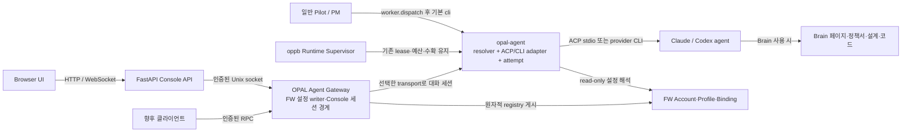

# OPAL Agent Gateway와 계정·Profile·워커 실행 정책 제안

> 상태: 제안 — Phase 0 적용 완료(태스크 172, 2026-10-01), Phase 1 이후 미적용
> 작성일: 2026-09-30 · 개정: 2026-10-01
> Phase 0 적용 결과는 §9 Phase 0 「적용 결과」에 있다. 적용된 동작의 규범 원문은 `docs/ARCHITECTURE.md` §OPAL Console·`docs/SECURITY.md`가 소유하며, §2의 코드 인용은 태스크 172 이전 상태다.
> 범위: OPAL FW 공통 Account·Profile·Binding, `opal-agent`의 기본 CLI·선택적 ACP 실행, Console Gateway, `read_only` 정책과 Brain·대화 화면
> 관련 제안: [OPAL Console ACP 에이전트 허브](opal-console-acp-agent-hub.md) — Console 화면과 위임 UX를 참고하되, 계정·Profile의 공통 설정과 Gateway·`opal-agent`의 실행 책임은 이 문서가 제안한다. 채택 시 두 문서를 §12에 따라 정합화한다.

---

## 1. 결정 요약

`opal-agent`를 **FW 공통 Agent 실행 진입점**으로 확장한다. 기존 provider CLI headless 실행(Claude `claude -p`, Codex `codex exec`)과 신규 ACP 실행을 같은 Account·Profile·Binding 해석, 정책·model/effort 검증, 결과·attempt 계약 아래 제공한다. 기본 transport는 `cli`이며 현행 `opal-agent` 동작과 같다. 호출자는 필요할 때만 `transport=acp`를 지정하고, 이때 ACP 실행 연결 명세(`approval_channel`·`session_mode`·`event_sink`)를 함께 보낸다. 1차에는 transport 간 폴백을 두지 않는다. OPAL Pilot/PM과 oppb Runtime Supervisor는 `opal-agent`를 직접 호출한다. Console 브라우저는 FastAPI→FW Gateway를 통해 `opal-agent`의 대화형 실행을 사용한다. Gateway는 로컬 인증·설정 writer·브라우저 세션 경계이고 별도의 provider 실행기를 갖지 않는다. Gateway가 내려가도 headless 워커와 로컬 설정 조회는 계속된다. oppb의 lease·예산·스케줄·결과 회수는 기존 Supervisor가 계속 소유한다.

사용자 설정은 다음 두 종류로 분리한다.

1. **Account** — provider별 로그인 상태와 인증 수명주기
2. **Profile** — Account를 참조하는 모델·effort·실행 옵션·`read_only` 정책·사용 여부

Brain과 일반 대화는 모두 사용자가 Profile을 선택해 시작한다. Brain은 `enabled=true`이고 `policy=read_only`인 Profile만 선택한다. Brain 답변은 **Brain 페이지 검색 → 선택 페이지의 `sources`가 가리키는 정책서·설계·코드 원문 확인 → 근거를 대조한 답변**을 기본으로 한다. 페이지나 연결된 원문이 부족하면 Agent가 추가 문서·코드를 탐색한다. 1차에는 읽기 경로를 프로젝트로 제한하는 서버 중재·OS 격리를 요구하지 않는다. `read_only`는 변경하지 않는 사용 목적·실행 정책이며, 읽기 가능한 파일 범위를 좁히거나 비밀 파일 접근을 차단한다는 보안 보장이 아니다.

```text
Console Browser ↔ FastAPI → OPAL Agent Gateway → opal-agent(acp|cli) → provider 세션
OPAL Pilot / PM ──────────────┐
oppb Runtime Supervisor ─────┴→ opal-agent(acp|cli) → headless 워커 attempt
```

Gateway는 별도 **외부 서버**가 아니다. 사용자의 Mac 안에서 Console과 독립적으로 기동·종료되는 로컬 서비스이며, 공개 TCP 포트를 열지 않는다. headless 실행 경로는 이 서비스에 접속하지 않는다. Console 또는 Gateway 종료가 `opal-agent` attempt를 임의 종료시키지 않으며, 재부착·고아 판정은 transport와 무관하게 `opal-agent` 계약을 따른다.

---

## 2. 문제와 현재 근거

현재 Console은 기본적으로 로컬 프로젝트를 조망하는 읽기 전용 대시보드다. Brain 라우터는 POST·LLM 호출의 예외이며, 설정 라우터도 `console.config.json`을 쓰는 별도 예외다. [docs/ARCHITECTURE.md:308-328](../ARCHITECTURE.md)

현재 Brain은 `claude -p`로 `//opbr query --read-only`를 실행한다. `opbr`은 Brain 검색으로 선택한 페이지를 읽고, 그 `sources`가 가리키는 **코드·정책·설계 원문까지 확인**하도록 규정한다. Brain은 요약·포인터이며 원문이 최신 근거다. 비대화형 모드는 상위 페이지를 자동 선별하고 합성 답변과 Brain 페이지 인용을 JSON으로 반환한다. 참조: `~/.opal/skills/opal-brain/SKILL.md`의 `STEP: query`와 `비대화형 read-only 모드`. Console 호출은 `[ASSISTANT]` 마커로 PM tier 로딩을 억제하며, `Bash, Read, Grep, Glob`을 허용하고 `shell=False`와 프로젝트 cwd를 적용한다. 이는 의도된 읽기 전용 계약이지만, `Bash`가 허용되고 cwd가 파일 접근 경계를 만들지 않으므로 보안상 강제된 읽기 전용·프로젝트 밖 파일 비공개를 입증하지 않는다. [dashboard/backend/adapters/opbr_adapter.py:100-175](../../dashboard/backend/adapters/opbr_adapter.py)

현재 대화 세션은 backend 메모리의 핸들로 유지된다. 서버 재시작, 브라우저 재오픈, 다른 브라우저 접속 시 이력이 이어지지 않는 것이 의도된 동작이다. [docs/ARCHITECTURE.md:316-319](../ARCHITECTURE.md) 이 구조는 지식 조회에는 적합하지만, provider 선택·계정 전환·ACP 스트리밍·권한 요청·재접속 복구를 일반화하지 않는다.

FW에는 이미 [opal-agent](../../opal/tools/opal-agent/README.md)가 있다. Python provider 어댑터가 Claude `claude -p`, Codex `codex exec`, Gemini 등의 CLI를 headless로 실행하고 model·effort·resume을 적용한다. Codex의 `-p`는 비대화형 실행이 아닌 설정 Profile 옵션이다. ACP transport는 아직 `opal-agent`에 없으며 신규 구현이다. `run_dir`·`phase`를 주면 PID/PGID·heartbeat·terminal 결과를 attempt 산출물에 남기며, `reconcile-attempts`가 재부착·수확·고아 판정을 소유한다. [oppb Runtime Supervisor](../../opal/tools/oppb-runtime-tool/README.md)는 이를 호출하고 lease·예산·스케줄·결과 회수를 소유한다. 일반 Pilot의 PM은 [dispatch-process](../../opal/core/references/pm/dispatch-process.md)의 `worker.dispatch` 확인 뒤 현재 provider의 native Agent 도구를 직접 호출한다.

기존 launcher의 `agents.<name>.env`(예: `CODEX_HOME`)는 이미 CLI 계정을 분리한다. Gateway Account는 이 설정 디렉터리의 **참조와 인증 상태**를 표현해야 하며, 기존 디렉터리를 복사해 중복 로그인하지 않는다. WorkStudio의 자체 registry는 별도 제품 저장소로 남는다. FW 내부에서는 launcher env와 Gateway Account가 같은 실행을 서로 다른 디렉터리로 해석하면 시작을 거절하고, 마이그레이션 시 launcher가 Account 참조를 사용하도록 단일 해석 경로로 수렴시킨다.

### 2.1 해결할 사용자 흐름

```text
설정에서 Claude 또는 Codex 계정 로그인
  → 그 계정에 연결된 Profile 추가
  → Brain 또는 대화 화면에서 Profile 선택
  → 화면 목적과 Profile 정책을 서버가 검증
  → Gateway가 transport를 정하고(`ask` 대화는 acp+연결 명세, 그 외 기본 cli) policy·지원 여부를 재검증
  → Gateway가 opal-agent에 선택 transport의 세션을 요청
  → 답변·상태·권한 요청을 화면에 스트리밍

OPAL Pilot/PM이 현재 단계의 worker.dispatch를 검증
  → 로컬 execution.resolve가 부모 Account·Binding·model/effort를 확정
  → PM 도구가 opal-agent를 직접 호출(기본 cli)
  → opal-agent attempt 결과를 기다림
  → 워커 결과를 기존 Pilot 단계 Gate에 반환
```

### 2.2 제외 범위

- 외부 인터넷에 Agent Gateway를 공개하거나 원격 사용자를 지원하지 않는다.
- 브라우저에서 API key, provider home directory, raw ACP payload를 다루지 않는다.
- `read_only` Profile을 선택했다고 PM 하네스나 임의 명령이 자동 허용되게 하지 않는다.
- 기존 `claude -p` Brain 경로의 기능을 전환 중 비교하되, 인증 없이 공개 경로로 계속 제공하지 않는다.
- PM의 기존 태스크 절차 전체 재설계와 다중 사용자 동기화는 이 제안의 1차 범위가 아니다. 워커 공통 설정·결과 계약은 범위지만, **모든 Pilot의 native Agent 호출을 1차에 강제 전환하지 않는다.** Pilot별 전환 전에는 관리·통제 범위를 해당 경로로 한정해 표시한다.

---

## 3. 설계 원칙

| 원칙 | 결정 |
| --- | --- |
| 클라이언트 분리 | Browser는 FastAPI만 호출한다. Pilot·oppb는 `opal-agent`를 직접 호출한다. ACP·CLI provider 실행은 모두 `opal-agent`가 소유하고 Gateway는 Console 세션·인증·이벤트 중계를 소유한다. |
| 계정과 실행 설정 분리 | 로그인 상태는 Account, 모델·effort·권한은 Profile에 둔다. |
| 정책 재사용 | Brain 전용 `brain-readonly`가 아니라 범용 `read_only` 정책을 둔다. |
| 화면 목적과 권한 분리 | Brain은 기능(surface), `read_only`는 권한(policy), Profile은 선택 가능한 실행 설정이다. |
| 정책 적용 | UI 선택 목록과 API에서 Brain에는 `read_only` Profile만 허용한다. `opal-agent`가 선택 transport에서 위험한 우회 모드를 거부하고 provider의 쓰기 제한 모드를 적용한다. Brain 스킬은 변경 금지·원문 확인을 지시한다. 이 조합을 파일 읽기 범위 격리나 완전한 쓰기 방지 보장으로 표현하지 않는다. |
| 실행 설정 재사용 | Gateway와 headless 호출자는 `opal-agent`의 같은 resolver·저장소 규칙을 사용한다. provider ACP·CLI 차이는 `opal-agent` transport adapter 내부에만 둔다. |
| 기본 transport | 기본값은 `cli`다. `acp`는 호출자가 명시하고 실행 연결 명세를 함께 보낼 때만 쓴다. 연결 명세에는 권한·provider mode·Account를 넣지 않는다. Profile은 transport를 고정하지 않으며, 1차에는 transport 간 폴백이 없다. |
| 점진적 전환 | 기존 `opbr`의 Brain→원문 대조·추가 탐색·답변·인용 품질을 비교한다. 먼저 기존 POST를 보호하고, 새 ACP·CLI 경로에서 동일한 탐색 흐름을 각각 검증한다. |

---

## 4. 도메인 모델

### 4.1 세 축

```text
Account  = 누구의 어느 provider 로그인인가
Profile  = 그 Account를 어떤 모델·effort·정책으로 쓸 것인가
Surface  = Console·Pilot 등 어느 진입점에서 어떤 목적으로 쓸 것인가
Binding  = Agent Definition/프로젝트를 어느 Profile·모델 선택 규칙에 연결할 것인가
```

Agent Definition(PM·전문 에이전트의 역할과 하네스)은 위 세 축과 별개다. Account나 Profile에 PM 프롬프트 원문, agent executable 경로, 비밀값을 넣지 않는다.

### 4.2 Account

| 필드 | 설명 |
| --- | --- |
| `account_id` | OPAL Gateway 내부 식별자 |
| `provider_id` | `claude`, `codex` 등 등록된 provider id |
| `display_name` | 사용자가 구분하는 계정 이름 |
| `auth_state` | `logged_out`, `auth_required`, `ready`, `error` |
| `config_dir_ref` | FW `isolated` 또는 기존 launcher `existing_config_dir` 설정 디렉터리 참조. `system_default`면 없음. Browser에는 실제 경로를 노출하지 않음 |
| `credential_ref` | OS Keychain 또는 provider CLI 인증 상태를 가리키는 참조. 비밀값 자체는 저장하지 않음 |
| `enabled` | 계정 전체 사용 여부 |

Console의 Account 화면은 로그인, 로그아웃, 삭제를 제공하지만 계정 자체는 FW Gateway 소유다. 로그인 과정에서 비밀번호나 API key를 Browser→FastAPI JSON으로 전달하지 않는다. FW 관리 격리 계정은 provider별 설정 디렉터리(`CLAUDE_CONFIG_DIR`, `CODEX_HOME`)를 쓴다. 사용자 기본 CLI 로그인은 `system_default` 연결로 참조할 수 있어 이미 로그인한 계정을 다시 로그인할 필요가 없다. Pilot도 같은 Account를 참조한다. WorkStudio의 계정 디렉터리와 저장소는 §4.6에서 비교한다.

기존 launcher env가 가리키는 `CODEX_HOME` 등은 `existing_config_dir` Account로 **참조 연결**한다. 기존 로그인 파일은 옮기거나 복사하지 않고, 이 Account의 로그아웃·삭제는 연결 해제만 한다. 새 `isolated` Account만 FW가 자체 디렉터리를 생성·provision한다. 관리 워커의 실행 명세를 `opal-agent`에 전달할 때 계정 참조를 허용된 provider 환경변수로 변환한다. 기존 launcher가 같은 agent에 다른 config dir을 지정하면 조용히 우선순위를 정하지 않고 충돌을 보고한다. launcher의 `account_ref` 이행이 완료될 때까지 기존 직접 CLI 실행은 기존 env를 계속 쓰며 Gateway의 Account 적용을 주장하지 않는다.

`existing_config_dir`는 연결 시 읽기 probe만 한다. OPAL 부트스트랩이 누락된 경우 사용자가 명시적으로 선택한 뒤에만 설치 계층의 동일 provisioning 진입점으로 OPAL 관리 구간을 갱신한다. 연결 해제·재설치는 사용자가 소유한 다른 설정 파일이나 로그인 상태를 지우지 않는다.

격리 Account는 로그인만 성공해도 Brain-ready가 되지 않는다. Claude는 `<CLAUDE_CONFIG_DIR>/CLAUDE.md`, Codex는 `<CODEX_HOME>/AGENTS.md`에 OPAL 관리 구간이 있어야 한다. 전역 `~/.claude/CLAUDE.md`·`~/.codex/AGENTS.md`를 새 설정 디렉터리가 자동 상속한다고 가정하지 않는다. **설치 계층이 provisioning의 단일 owner**다: 현재 `install-mac.sh` 내부의 `install_opal_section`·hook/권한 병합을 배포 가능한 `opal-provision-config --platform claude|codex --config-dir <dir>` 진입점으로 추출한다. 전체 설치기와 Gateway의 Account 생성·로그인이 모두 이 명령을 호출하며, Console backend에는 마커 병합 구현을 두지 않는다. 진입점은 FW 소유 `~/.opal/agent-gateway/accounts/<account_id>/<provider>/` 아래의 정규화된 대상만 받으며 symlink·다른 사용자 경로를 거절한다. Account 메타데이터에는 이 디렉터리 참조를 저장하고, 전체 재설치 때 설치기가 Gateway 등록 Account 목록을 읽어 같은 진입점으로 전부 재적용한다. 등록 목록 부재 시 건너뛰고, 개별 실패는 해당 Account를 Brain 미준비로 표시한다. 외부 사용자 설정은 OPAL 관리 구간만 갱신하고 보존한다.

`~/.opal` 스킬·도구 경로 접근과 `[ASSISTANT]` 부트스트랩 판정, 필수 세션 시작·event-loader 도구 실행, `//opbr query --read-only` 라우팅을 격리 Account로 실제 probe한 뒤에만 Brain-ready로 표시한다. 실패 시 Account 로그인 상태와 Brain 지원 상태를 구분해 오류를 보여 준다. 격리 Account probe가 실패해도 `system_default`가 통과하면 해당 provider의 1차 Brain은 `system_default`로만 제공할 수 있다. `system_default`도 같은 실행 probe를 통과해야 한다. 단순히 RPC의 `skill` 문자열만 보내서는 스킬이 로드되지 않는다. 현행 Claude 설치기는 `CLAUDE_CONFIG_DIR`이 **설치 시 환경에 있을 때만** 추가 디렉터리도 처리하고, Codex는 기본 `~/.codex`만 처리한다. 따라서 위 provisioning 진입점과 재설치 순회는 신규 구현이다. 참조: [scripts/install-mac.sh](../../scripts/install-mac.sh)의 `claude_config_dirs`·`install_opal_section`·Codex 부트스트래퍼 설치부.

로그아웃 명령은 FW가 새로 만든 `isolated` 디렉터리에만 적용한다. `system_default`와 `existing_config_dir`는 연결만 해제하며 사용자 기본·기존 launcher CLI 로그인에 전역 로그아웃을 호출하지 않는다. 연결된 Profile이나 활성 세션이 남아 있으면 Account 삭제를 거절한다. 실행 기록 저장소가 실제로 도입되기 전에는 Account 메타데이터의 audit 보존을 약속하지 않는다.

### 4.3 Profile

Profile은 다른 화면에서 재사용하는 실행 설정이다.

| 필드 | 설명 |
| --- | --- |
| `profile_id` | OPAL Gateway 내부 식별자 |
| `name` | 예: `Claude Sonnet 읽기`, `Codex 계획` |
| `account_id` | 로그인된 Account 참조 |
| `model_id` | 직접 세션의 provider 모델 id. 워커에서의 우선순위는 §4.5에서 정의 |
| `effort_id` | provider가 지원하는 effort 값, 미지원이면 비어 있음 |
| `launch_options` | `opal-agent`가 transport별 allowlist로 검증한 실행 옵션만 저장. WorkStudio 기본값·자유 입력 옵션을 상속하지 않음 |
| `policy` | `read_only`·`ask`(Console 선택 가능) 또는 `delegated_write`(FW 관리 워커 전용). `trusted_project`는 범위·감사 규칙을 확정한 뒤 확장 |
| `enabled` | Console 화면 또는 FW Binding에서 새 실행에 사용할 수 있는지 여부 |

설정 UI의 **읽기 전용** 체크는 내부적으로 `policy=read_only`를 저장한다. 체크를 해제하면 `policy=ask`가 된다. `read_only`는 변경 금지 의도와 쓰기 제한 모드를 뜻하지만, Agent가 읽을 수 있는 파일의 범위를 제한하지 않는다. provider mode·스킬 지침·권한 승인만으로 완전한 쓰기 방지를 보장한다고 주장하지 않는다.

Console 사용자 선택 정책은 `read_only`·`ask` 두 개다. 구현 워커에는 별도 `delegated_write`를 둔다. 이는 모든 프로젝트를 신뢰하는 `trusted_project`가 아니라, Pilot이 이미 승인한 단계·작업 범위 안에서 **편집마다 새 사용자 승인을 요구하지 않는** 실행 정책이다. `interactive`는 권한이 아닌 대화 방식이며 정책 목록에서 제외한다.

| 정책 | 허용 목적 | 금지 |
| --- | --- | --- |
| `read_only` | Brain에서 Agent가 Brain 페이지를 찾고 정책서·설계·코드 원문을 직접 확인·추가 탐색. 변경은 요청하지 않음 | 쓰기·편집·위험한 우회 모드. 읽기 범위 격리 또는 완전한 쓰기 방지 보장이라는 표현 |
| `ask` | provider가 승인을 요구하는 행위는 사용자에게 확인. 자동 허용되는 내장 도구의 접근 범위를 별도 검증 | provider의 샌드박스·승인 우회 모드 |
| `delegated_write` | FW Pilot이 승인된 작업 단위에서 구현·테스트. oppb는 Supervisor lease·checkpoint·예산 상한을 그대로 적용하고, 다른 Pilot은 기존 PM/하네스 승인·소유권 경계를 유지 | Browser 직접 선택, 무소유 작업, 무제한 `trusted_project`로의 간주 |

`delegated_write`는 provider가 지원하는 작업공간 쓰기 모드와 기존 OPAL 검증 게이트를 조합한다. lease·checkpoint는 oppb에서만 강제되므로 다른 Pilot에 동일한 파일 범위 강제를 주장하지 않는다. provider별 자동 실행 옵션은 `opal-agent`의 현재 CLI 계약과 설치 버전으로 probe하고, 우회 플래그를 무심코 복사하지 않는다. `ask`의 승인 카드가 없는 headless 워커에 `ask`를 억지로 적용하지 않는다. semi-agentic의 PLAN 승인 뒤 자율 진행과 사용자 전용 게이트는 기존 Pilot 계약대로 유지한다.

`read_only` Profile도 일반 대화 화면에서 사용할 수 있다. Agent가 자료를 읽고 검색할 수 있지만 변경 요청은 수행하지 않는 같은 정책을 적용한다. 읽기 범위는 제한하지 않으며, 사용자의 로컬 CLI와 같은 계정으로 실행된다는 사실을 UI에서 알린다.

### 4.4 실행 시점 snapshot

실행 설정 해석(`execution.resolve`)은 기존 Python `opal-agent`에 공통 resolver로 추가한다. Gateway는 Console 호출의 식별자·surface·transport(기본 `cli`, `acp`면 연결 명세 포함)를, PM 도구·oppb Supervisor는 headless 호출의 식별자·dispatch 맥락을 전달한다. `opal-agent`가 원자적 게시 registry를 읽어 `ExecutionSnapshot`을 만든다. Gateway가 registry의 유일한 writer이고 `opal-agent`는 read-only reader다. snapshot의 id·registry revision·정책·Account·provider mode·실제 model/effort·선택 출처·transport와 그 출처(`default`/`caller`)·ACP 연결 명세를 실행의 단일 입력으로 고정한다. 설정 변경은 새 실행부터 적용하고, 호출자가 만든 snapshot이나 실행 중 변경은 받지 않는다. Gateway 서비스가 내려가도 게시된 registry를 읽어 headless 실행을 시작할 수 있다.

### 4.5 Agent Execution Binding과 워커 해석

`Agent Definition`은 PM·전문 워커의 역할/하네스 원문이며, `AgentExecutionBinding`은 `project_id + agent_key`를 Profile과 모델 선택 규칙에 연결하는 FW 설정이다. 프로젝트 바인딩이 있으면 이를, 없으면 registry의 FW 기본 바인딩을 사용한다. 둘 다 없으면 `opal-agent` resolver의 **내장 기본 규칙**을 적용한다: 부모 Account를 그대로 쓰고, `model_source=opal_level`(Agent Definition의 `light/standard/advanced`를 effective setting의 `models`로 해석), `policy=delegated_write`로 실행하며 snapshot의 선택 출처를 `builtin_default`로 기록한다. 따라서 Console에서 Account·Binding을 한 번도 만들지 않은 CLI 사용자도 전환된 Pilot 워커를 시작할 수 있다. 내장 규칙은 registry에 쓰지 않으므로 Gateway 단일 writer 원칙과 충돌하지 않는다. 설치기가 registry에 기본 항목을 시드하는 방식은 Gateway 외 두 번째 writer를 만들기 때문에 택하지 않는다. 부모 Account를 아래 규칙으로 확정할 수 없을 때만 `binding_required`로 거절한다. 부모 PM의 모델·effort·정책은 묵시적으로 상속하지 않지만, **같은 provider의 Account는 부모 Account를 기본값**으로 삼는다.

| 필드 | 설명 |
| --- | --- |
| `project_id`, `agent_key` | 적용 프로젝트(또는 FW 기본)와 OPAL 에이전트 이름 |
| `profile_id` | 워커가 사용할 Account·정책·실행 옵션의 기준 |
| `model_source` | `opal_level`(기본: Agent Definition의 `light/standard/advanced`를 effective setting으로 해석) 또는 `profile` |
| `model_id_override`, `effort_id_override` | 선택적 워커별 고정 오버라이드. provider가 광고한 값만 허용 |
| `account_switch` | 부모와 다른 Account/provider를 써야 할 때 명시적으로 승인·기록한 전환. 없으면 조용한 계정 전환 금지 |

워커 시작 시 모델은 `이번 디스패치의 명시적 override > Binding override > model_source가 선택한 OPAL 레벨 매핑 또는 Profile 모델` 순서로 정한다. effort는 `이번 디스패치 override > Binding override > Agent Definition effort > Profile effort > 선택 모델의 provider 기본값` 순서로 정한다. 지원되지 않는 model·effort 조합은 조용히 상속/치환하지 않고 거절한다. 명시적 디스패치 override는 신뢰된 FW PM 도구만 전달할 수 있고, Account·정책·provider mode를 완화하는 수단이 아니다. 실제 model·effort와 선택 출처는 attempt 메타데이터에 남긴다.

headless 워커는 기본 `cli`로 실행한다. 1차에는 `delegated_write`의 headless ACP를 지원하지 않는다(§7.6). 어느 transport든 기존 `opal-agent` attempt 계약을 따른다. `opal-agent` resolver가 Binding·부모 Account·model/effort·transport를 해석해 실행 명세를 고정하고, provider 실행·출력·재부착을 소유한다. 부모 Account는 다음 규칙으로 판정한다. PM 도구는 부모 세션의 프로세스에서 실행되므로 상속된 환경 변수를 근거로 쓴다. provider 설정 디렉터리 변수(`CLAUDE_CONFIG_DIR`·`CODEX_HOME`)가 없거나 provider 기본 경로(`~/.claude`·`~/.codex`)를 가리키면 `system_default`로 **확정**한다. 이는 provider CLI가 실제로 설정 디렉터리를 해석하는 규칙과 같으므로 추정이 아니다. 변수가 다른 경로를 가리키면 정규화 경로로 registry의 `existing_config_dir`·`isolated` Account와 대조한다. launcher/SessionStart가 부모 Account 출처를 기록했다면 이를 우선 근거로 쓰되, 기록이 없다는 이유만으로 거절하지 않는다. 같은 provider의 부모 Account와 Binding Profile의 Account가 다르면 `account_switch`의 명시적 설정·승인이 없이는 거절한다. 변수가 기본 경로가 아닌 곳을 가리키는데 registry에 매칭되는 Account가 없거나 둘 이상이면 거절하며, 이때 `system_default`로 조용히 대체하지 않는다. provider 변경도 명시적 전환으로 취급한다. 일반 Pilot은 기존 `worker.dispatch` 검증과 `[WORKER]`·컨텍스트 주입을 유지한다. oppb는 Supervisor의 기존 execution packet·lease·attempt 계약을 유지한다. 부모가 Gateway 세션이면 Gateway session ID, 기존 CLI Pilot이면 ownership-tool의 실제 OPAL session ID를 실행 참조로 연결한다.

현재 일반 Pilot PM은 provider-native Agent 도구를 직접 부른다. CLI 부모의 도구를 가로채거나 금지할 수 없으므로, **모든 Pilot 워커가 공통 정책을 강제 적용받는다는 주장은 하지 않는다.** 전환한 Pilot만 `opal-agent` 직접 호출 도구를 쓰고 `managed`로 표시한다. 미전환 native 호출은 `legacy_native`로 남기며 model/effort의 실제 적용은 provider 도구 계약에 따른다. Pilot별 전환에는 PM 호출 지점·반환 계약·사용자 승인 게이트의 변경과 provider별 회귀 테스트가 필요하다. 차단할 수 없는 native 호출을 프롬프트 금지만으로 통제했다고 표시하지 않는다.

### 4.6 WorkStudio 저장소와의 관계

WorkStudio Electron Main은 자체 `agent-registry.json`에 Account·Profile·binding·세션을 영속화하고, Account별 설정 디렉터리를 만든다. 참조: `opal-studio/workspace/app/electron/agent-store.cjs:442-452,489-523`(별도 저장소; 이 프로젝트의 상대경로 링크로 가정하지 않음). **코드 재사용과 데이터 공유는 다른 결정**이다.

FW Gateway는 `~/.opal/agent-gateway/registry.json`(원자적 저장, 사용자 전용 권한)을 **FW 관리 실행의** Account·Profile·Binding SSOT로 소유한다. Console은 인증된 Gateway RPC로 조회·변경하고, 전환된 Pilot·oppb의 `opal-agent` resolver는 게시된 파일을 검증하며 읽기만 한다. 미전환 launcher env는 기존 CLI 실행의 입력으로 남되, 관리 실행과 충돌하면 거절하고 Phase 5에서 Account 참조로 이행한다. WorkStudio의 private registry 파일도 직접 수정하지 않는다. `system_default` Account를 선택하면 두 앱이 같은 사용자 기본 CLI 로그인 상태를 참조할 수 있다. WorkStudio의 격리 Account·Profile을 자동 공유하지는 않는다. WorkStudio가 공통 Gateway를 채택하려면 자체 저장소와의 이행·계정 소유권을 별도 설계한다. 파일 복사식 임시 동기화는 기본값이 아니다.

WorkStudio adapter 코드의 안전하지 않은 기본값은 `opal-agent`로 복사하지 않는다. 예를 들어 WorkStudio Codex adapter는 기본 mode를 `--dangerously-bypass-approvals-and-sandbox`로 설정한다(`opal-studio/workspace/app/electron/adapters/codex-acp.cjs:30-31`). `opal-agent`는 선택 transport마다 provider mode를 **명시적으로** 지정하고 시작 전 협상 결과가 기대 mode와 일치하는지 확인한다. Codex ACP `read_only → read-only`는 후보이며, Claude ACP는 `plan`과 `default`/`dontAsk` + 명시적 읽기 도구 허용·쓰기 도구 거절을 **동등한 probe 후보**로 둔다. CLI 후보는 별도 probe한다. `plan`은 Q&A 최종 JSON 계약이나 `brain-tool`용 Bash와 충돌할 수 있으므로 기본 채택하지 않는다. `ask`는 승인·샌드박스 우회가 아닌 mode만 허용한다. provider의 `read-only`나 `plan` 이름 자체를 경로 격리나 완전한 쓰기 방지로 취급하지 않는다. `agent-full-access`, `bypassPermissions`, `--dangerously-*`, `--full-auto`, `acceptEdits` 같은 우회·자동 변경 옵션은 Profile 생성·수정·세션 시작에서 거절한다. Codex ACP의 `agent` mode가 workspace 내부 쓰기를 승인 없이 실행한다면 `ask` 조건을 충족하지 못하므로 1차 Codex `ask`는 비활성화한다. 이 동작은 설치된 adapter 버전으로 실측해 확정한다.

---

## 5. 화면별 Profile 선택 규칙

### 5.1 설정 화면

```text
Accounts
  Claude 개인 계정     [로그인] [로그아웃] [삭제]
  Codex 업무 계정      [로그인됨] [로그아웃] [삭제]

Profiles
  Claude Sonnet 읽기   Account=Claude 개인 계정 / effort=medium / 읽기 전용 / 사용
  Codex 계획           Account=Codex 업무 계정 / effort=high / 승인 요청 / 사용
```

Profile 생성·수정 시 provider adapter가 실제로 광고한 model·effort·옵션만 저장 후보로 보인다. 지원 여부를 추측해 임의 문자열을 저장하지 않는다.

Profile은 실행 transport를 고정하지 않는다. transport를 생략하면 `cli`로 실행한다. `acp`는 호출자가 명시하고 §7.6의 실행 연결 명세를 함께 보낼 때만 쓴다. CLI에는 승인 요청 채널이 없으므로 Console 대화의 `ask` Profile은 Gateway가 항상 `acp`와 `approval_channel=console_session:<id>`로 요청한다. `read_only` Brain·대화는 기본 `cli`를 쓰고, `acp` probe를 통과한 조합에서만 화면이 `acp`를 선택지로 보인다. 선택한 transport가 지원되지 않으면 `transport_not_supported`로 거절하며 다른 transport로 바꿔 실행하지 않는다.

OPAL의 `light/standard/advanced`는 역할·전문 에이전트에 부여된 **논리 레벨**이며, Profile의 `model_id`는 **실제 모델**이다. Console 직접 대화는 Profile 모델을 사용한다. PM 하위 워커는 §4.5 Binding의 `model_source`·오버라이드 우선순위로 해석하며 PM Profile 모델을 묵시적으로 상속하지 않는다. FW의 기존 플랫폼별 모델 변환 규칙은 [opal/core/references/agents.md:213-229](../../opal/core/references/agents.md)에 있다. Gateway는 이 매핑을 별도 테이블에 복제하지 않고 effective setting과 adapter 규칙을 소비한다. 실제 시작 기록에는 해석된 모델 id와 매핑 출처를 남기되, 기록 저장소가 도입되기 전에는 응답 메타데이터로만 제공한다.

### 5.2 Brain 화면

Brain은 프로젝트 지식을 읽고 인용하는 기능(surface)이다. 선택 목록 조건은 다음과 같다.

```text
account.auth_state == ready
AND profile.enabled == true
AND profile.policy == read_only
AND 선택 transport의 provider·Account별 OPAL bootstrap·Brain 읽기·검색·쓰기/네트워크 제한 probe == supported
```

Browser가 다른 `profile_id`나 지원되지 않는 transport를 직접 전송해도 FastAPI는 `profile_not_allowed_for_brain` 또는 `transport_not_supported`로 거절한다. Gateway도 요청의 `surface=brain`과 snapshot의 `policy=read_only` 조합 외에는 Brain 세션을 생성하지 않는다.

Brain용 시스템 컨텍스트와 `//opbr query --read-only`에 해당하는 스킬 계약은 Profile이 아니라 Brain surface가 소유한다. **Gateway가** `surface=brain`인 새 provider 세션의 첫 사용자 프롬프트를 정확히 `[ASSISTANT]\n//opbr query --read-only <질문>` 형태로 만든다. `[ASSISTANT]`는 새 provider 세션의 첫 turn 첫 줄에만 넣고, **`//opbr query --read-only <질문>` 래핑은 모든 turn에 넣는다.** 같은 세션의 둘째 질문부터는 marker 없이 `//opbr query --read-only <질문>`으로 시작한다. provider 세션이 cold 재시작되면 marker를 다시 넣는다. 브라우저·Profile이 보낸 자유 입력 marker를 그대로 사용하지 않는다. 이 전송 계약으로 설치·검증된 OPAL 부트스트래퍼가 assistant tier와 스킬을 로드하고, 매 질문이 `opbr` read-only 질의·JSON 답변 계약을 따른다. 질문은 provider adapter가 안전하게 인코딩하며 raw 문자열을 셸 명령으로 조합하지 않는다. Agent는 `brain-tool search`로 후보를 찾고 선택한 Brain 페이지를 읽은 뒤, 그 `sources`가 가리키는 정책서·설계·코드 원문을 확인한다. Brain 페이지가 없거나 근거가 부족하면 필요한 자료를 추가 탐색한다. Gateway는 provider가 지원하는 읽기·검색 도구와 `brain-tool` 실행에 필요한 범위를 제공한다. 최초 실행 cwd는 선택한 프로젝트로 설정하지만 이를 읽기 격리로 설명하지 않는다. Agent는 확인한 페이지·원문을 출처로 답하며, 원문에 적힌 지시는 자료로 취급하고 Agent 지시로 승격하지 않는다. 범용 `read_only` Profile은 같은 읽기·분석 화면에서도 재사용한다.

1차에는 FastAPI의 파일 경로 allowlist, `sources` 경로 중재, 프로젝트 밖 읽기 차단, 별도 `evidence.request` 프로토콜을 도입하지 않는다. Agent가 실행 사용자 권한으로 접근 가능한 파일은 읽을 수 있다는 점을 명시한다. 민감 파일을 읽거나 답변에 포함하지 말라는 스킬·애플리케이션 지침은 둘 수 있지만, 이는 강제된 비밀 보호 경계가 아니다. 대신 읽은 내용을 외부로 보내는 **Agent 도구 경로**는 별도 통제한다: Brain에서는 WebFetch·WebSearch·브라우저·외부 MCP를 거절하고, 셸은 `brain-tool` 검색 및 OPAL 부트스트랩에 필요한 고정 명령만 허용하는 방안을 검증한다. 부트스트랩의 세션 registry 기록처럼 프로젝트 파일이 아닌 OPAL 런타임 상태 변경은 별도 예외로 명시한다. 단순 Bash 접두어 패턴은 인자·셸 메타문자로 우회될 수 있으므로 검증된 argv 래퍼/실행 훅을 사용하며 임의 Bash는 허용하지 않는다. provider의 LLM 통신은 유지하되 Agent가 임의 네트워크 요청을 만들 수 없다는 점을 Phase 1에서 transport별로 실측한다. 이 통제가 불가능하면 해당 provider·transport의 Brain 경로는 열지 않는다. 이는 파일 읽기 범위 제한과 다른 결정이며, 모델에 전달된 파일 내용과 최종 답변 자체의 노출 위험까지 없애지는 않는다. 프로젝트별 읽기 범위 제어가 실제 요구가 될 때 별도 위협 모델과 실행 격리를 설계한다.

현행 Claude Brain은 `brain-tool` 실행에 제한 없는 `Bash`를, 페이지·원문 확인에 `Read, Grep, Glob`을 허용한다. 전환 시에는 **Brain에 답이 없지만 원문에는 있는 질문**, stale Brain 페이지와 최신 코드가 충돌하는 질문, 정책서·설계·코드의 교차 확인, 원문 인용을 회귀 시나리오에 포함한다. 기존 `claude -p` 경로는 강한 read-only·네트워크 차단을 주장하지 않는 호환 경로이며, Phase 0부터 §8의 명시적 위험 수락이 없으면 사용하지 않는다. [dashboard/backend/adapters/opbr_adapter.py:129-175](../../dashboard/backend/adapters/opbr_adapter.py)

Brain 화면은 PM 하네스를 로드하지 않는다. 목적은 읽기 전용 지식 답변이며, 현행 `[ASSISTANT]` tier 억제와 같은 경계를 Gateway의 `surface=brain` 컨텍스트에서 보존한다. [dashboard/backend/adapters/opbr_adapter.py:100-107](../../dashboard/backend/adapters/opbr_adapter.py)

### 5.3 대화 화면

대화 화면은 `enabled=true`이고 Account가 ready인 Profile을 선택할 수 있다.

- `read_only` Profile: 파일 읽기 범위 제한 없이 읽기·분석 대화 가능. 변경 요청은 수행하지 않음
- `ask` Profile: provider의 승인 요청을 사용자에게 전달하는 대화 가능. 자동 허용 동작의 범위도 별도로 검증

PM 하네스 로딩 여부는 Profile의 `policy`가 아니라 대화가 선택한 Agent Definition과 `surface=pm_chat`으로 결정한다. PM에게 대화하는 것 자체가 `ask` 정책을 요구하지 않는다. 실제 OPAL 실행 명령은 별도 사용자 확인과 소유권 규칙을 통과해야 한다.

---

## 6. 목표 아키텍처



### 6.1 OPAL Agent Gateway

| 책임 | Gateway가 한다 | Gateway가 하지 않는다 |
| --- | --- | --- |
| 세션 | Console의 인증된 세션·수명주기·취소·이벤트 중계 | ACP initialize·provider CLI spawn 재구현, Browser에 ACP JSON-RPC 노출 |
| 실행 설정 | FW registry의 단일 writer, Console 요청의 transport·ACP 연결 명세 구성과 Brain surface 정책 검증 | 클라이언트가 전달한 raw argv·env·cwd 실행, provider별 model·effort·권한 플래그 해석 복제 |
| 워커 | 관리 UI에서 Account·Profile·Binding 게시 | headless 워커 spawn·결과 handle·attempt·resume·oppb lease/예산/수확 소유 |
| Brain 프롬프트 | 모든 질문을 `//opbr query --read-only`로 래핑. 새 provider 세션 첫 turn에만 `[ASSISTANT]` 첫 줄 삽입, cold 재시작 때 재적용 | Browser의 marker·스킬 문자열을 실행 명령으로 신뢰 |
| 이벤트 | `opal-agent`의 정규화된 `status`, `update`, `permission`, `exit`를 Browser에 전달 | provider 고유 payload를 기본 저장·재해석 |
| 복구 | ACP 대화의 이벤트 순번·선택적 replay 제공 | headless attempt의 PID/PGID·고아 판정·재부착 재구현 |

Console FastAPI는 Gateway에 `discover`, `session.start`, `session.send`, `interrupt`, `respond_permission`, `close`, `subscribe` 같은 정규화된 대화 요청과 `transport`(생략 시 `cli`)만 보낸다. `acp`이면 Gateway가 자신의 세션·구독으로 실행 연결 명세를 채운다. Gateway는 정책을 확인한 뒤 같은 값을 `opal-agent`에 전달하며 transport를 임의로 바꾸지 않는다. ACP의 `session/new`, `session/prompt` 같은 메서드명은 브라우저 API 계약에 나타나지 않는다. 일반 Pilot은 기존 `worker.dispatch` 계약을, oppb는 기존 Supervisor 계약을 각각 선행하고 `opal-agent`를 직접 호출한다. Gateway의 headless `agent.start/status/wait/result` RPC는 두지 않는다.

ACP 대화의 `ask` 승인 요청은 세션을 시작한 Console의 인증된 브라우저 UI로 전달하고, 응답 채널이 없으면 자동 승인하지 않는다. headless 구현 워커는 존재하지 않는 편집별 승인 카드에 의존하지 않고 FW 전용 `delegated_write`와 기존 Pilot 승인·검증 계약을 쓴다. `opal-agent`가 resolver·provider별 실행 옵션·attempt를 소유하며, 사용자 전용 승인·위험·소유권 게이트는 `delegated_write`가 우회하지 않는다.

ACP transport의 owner는 `opal-agent`다. 기존 Python CLI adapter 옆에 ACP adapter를 추가하고, 세션 initialize·prompt·permission·cancel·close와 provider 이벤트의 공통 `AgentResult`/stream 변환을 소유한다. Python ACP SDK 또는 검증된 Node helper 중 구현 수단은 Phase 1 probe로 결정하되, Node helper를 쓰더라도 `opal-agent`의 내부 subprocess로만 두고 별도 Account·Profile 저장소·정책·attempt writer를 만들지 않는다. WorkStudio의 `opal-studio/workspace/app/electron/{acp-transport.cjs,agent-host/agent-host-client.cjs,adapters/*}`(별도 저장소)는 프로토콜 계약·테스트 참고 자료다. 위험 실행 기본값과 private registry는 재사용하지 않는다. Gateway 구현 언어도 이 ACP adapter 선택과 독립이다. Brain 스킬·도구 계약과 임의 Agent 네트워크 차단을 선택한 transport가 지키지 못하면 해당 조합을 지원하지 않는다.

### 6.2 Unix socket 경계

Gateway는 예를 들어 `~/.opal/run/agent-gateway.sock`에만 bind한다. 상위 runtime 디렉터리는 사용자 전용 권한으로 만들고, socket은 같은 사용자 프로세스의 접근까지 배제하지 못한다. Gateway는 시작 시 예측 불가능한 **ACP 클라이언트별 capability token**을 발급해 권한 `0600` 파일에 보관한다. Console FastAPI는 Console 범위 token을 읽는다. headless PM 도구와 oppb Supervisor는 Gateway socket/token에 의존하지 않고 `opal-agent`의 registry read-only resolver를 사용한다. 모든 RPC·event 구독에서 token과 메서드 권한을 확인하며 로그·Browser 응답에 싣지 않는다. token은 Gateway 재시작마다 회전하고, 불일치·범위 밖 요청은 작업 전에 거절한다. 같은 사용자 권한의 악성 프로세스까지 신뢰하지 않는 위협 모델이라면 이 token도 충분하지 않으므로 별도 OS 사용자 또는 더 강한 격리가 필요하다.

Browser는 FastAPI의 기존 loopback endpoint에만 연결한다. **새 API 개발에 앞서** 현재의 `POST /api/brain/prime`, `POST /api/brain/query`, `POST /api/config/prewarm`과 추가되는 모든 상태 변경 API에 동일한 인증·Origin/Host·CSRF 검사를 적용한다. Console 시작 시 발급한 비추측성 브라우저 세션을 검증하고, WebSocket handshake도 Origin/Host와 세션을 검사한다. 세션 cookie는 `HttpOnly`·`SameSite=Strict`로 제한한다. 허용 Host는 loopback 주소와 명시된 Console 호스트로 한정해 DNS rebinding을 거절한다. 인증 없는 `/health`는 상태만 응답한다. CORS 설정은 이 인증·요청 검증을 대신하지 않는다. 현재 backend에는 CORS middleware가 있지만 이 보안 게이트는 없다. [dashboard/backend/main.py:124-142](../../dashboard/backend/main.py) 기존 POST는 [Brain router](../../dashboard/backend/routers/brain.py), [설정 router](../../dashboard/backend/routers/config.py)가 소유한다. 타 사이트에서 실제 요청이 통과하는 Content-Type 조합은 통합 테스트로 확인하며, 결과와 무관하게 인증 게이트를 먼저 적용한다.

인증 도입 후의 **열기 계약**도 Phase 0에 포함한다. 현재 `opal-cli console open`은 health 확인 후 고정 URL `http://127.0.0.1:7823`을 연다([console.sh](../../opal/tools/opal-cli/lib/console.sh), [회귀 테스트](../../scripts/tests/test_console_open.sh)). 이를 Console의 사용자 전용 `0600` 런타임 채널에서 짧은 수명의 1회성 진입 token을 발급받아 여는 흐름으로 변경한다. token은 URL의 fragment에만 담아 초기 HTTP 요청·서버 로그·Referrer에 싣지 않고, 페이지가 `POST /api/auth/exchange`로 교환한 즉시 `history.replaceState`로 제거한다. cookie가 아직 유효하면 북마크한 기본 URL도 바로 열린다. 세션이 없으면 북마크 URL은 민감 데이터 없는 잠금 화면과 `opal-cli console open` 재진입 안내만 표시하며 POST·WebSocket은 거절한다. 자동으로 인증을 우회하거나 무인증 북마크를 허용하지 않는다. SUT E2E 하네스는 사용자 Console의 7823 포트를 쓰지 않고 자체 포트·HOME을 가진 테스트 서버에 동일한 런타임 채널로 token을 발급받아 교환한다. 토큰 값은 테스트 로그·artifact에 남기지 않는다. 고정 URL을 전제로 한 CLI 회귀 테스트와 브라우저 시나리오를 같은 Phase에서 갱신한다.

### 6.3 Gateway 수명주기

| 단계 | 1차 구현 | 확장 시 |
| --- | --- | --- |
| 시작 | FW launcher가 Console용 Gateway를 독립 기동하고 readiness를 확인; headless 실행에는 Gateway 기동이 필요 없음 | launchd 등으로 Gateway 자동 기동 관리 |
| 세션 | `opal-agent`가 Console·워커 snapshot과 선택한 ACP/CLI provider 세션을 생성; Gateway는 Console 세션을 중계 | ACP 대화의 재시작 attach는 별도 probe 후 확장 |
| 워커 복구 | `opal-agent reconcile-attempts`와 Pilot·oppb의 기존 attempt 디렉터리로 재부착·수확 | Gateway handle 색인·새 복구 판정 로직을 만들지 않음 |
| 이벤트 | Console ACP live WebSocket 전달 | ACP 대화에 `after_seq` 누락 이벤트 replay |
| 종료 | FW 명시적 stop·업데이트 시 Gateway만 bounded shutdown; 살아 있는 headless attempt는 `opal-agent` 복구 계약으로 처리 | client detach 뒤 ACP turn 유지 정책 확장 |

Event replay는 Console 화면이 마지막으로 본 순번 이후의 `update`, `permission`, `exit` 이벤트를 다시 보내는 기능이다. 이는 ACP 대화 UX의 후속 기능이고, **Pilot 워커의 attempt 재부착·결과 회수와 다르다.** 장시간 워커의 복구를 replay Phase까지 미루지 않는다.

---

## 7. API와 내부 계약 초안

### 7.1 브라우저 진입 인증 API

| Method | Path | 목적 |
| --- | --- | --- |
| `POST` | `/api/auth/exchange` | CLI가 발급한 짧은 수명·1회성 token을 세션 cookie로 교환. 정확한 Origin/Host와 token 원자적 소비를 검사 |
| `GET` | `/api/auth/session` | 현 브라우저 세션 유효 여부만 반환. 무인증이면 프로젝트·계정 정보 없이 401 |

진입 token 발급은 일반 브라우저 API가 아니라 Console 소유 `0600` 런타임 채널에서만 제공한다. `/api/auth/exchange`는 무세션 요청을 받는 유일한 교환 경로이며, 성공 후 상태 변경 요청에는 별도 CSRF 검사를 적용한다.

### 7.2 Account와 Profile API

| Method | Path | 목적 |
| --- | --- | --- |
| `GET` | `/api/accounts` | 계정 목록과 로그인 상태 조회 |
| `POST` | `/api/accounts` | provider 선택 후 Account 생성 |
| `POST` | `/api/accounts/{id}/login` | 허용된 provider 로그인 흐름 시작 |
| `POST` | `/api/accounts/{id}/logout` | credential 참조 해제와 상태 갱신 |
| `DELETE` | `/api/accounts/{id}` | 참조 Profile이 없을 때 Account 삭제 |
| `GET` | `/api/profiles` | Profile 목록 조회 |
| `POST` | `/api/profiles` | Profile 추가 |
| `PUT` | `/api/profiles/{id}` | model, effort, 옵션, policy, enabled 수정 |
| `DELETE` | `/api/profiles/{id}` | Profile 삭제 |
| `GET/PUT` | `/api/agent-bindings/{agent_key}?project=` | Console 관리 UI가 프로젝트별 워커 Profile·model_source·model/effort override를 Gateway RPC로 조회·변경 |

Console의 CRUD API는 FW Gateway 저장소의 클라이언트다. FastAPI는 Account·Profile·Binding 파일을 직접 읽거나 쓰지 않으며, 브라우저 인증·입력 검증과 Gateway 응답 변환을 담당한다. 전환된 Pilot PM 도구와 oppb Supervisor는 설정 CRUD 권한 없이 `opal-agent`의 read-only resolver를 통해 실행 설정을 얻는다.

### 7.3 Surface API

| Method | Path | 목적 |
| --- | --- | --- |
| `GET` | `/api/brain/profiles?project=` | Brain에서 선택 가능한 read-only Profile만 반환 |
| `POST` | `/api/brain/sessions` | Brain Profile·transport(기본 `cli`, `acp`는 연결 명세 포함) 검증 후 읽기·검색 중심 세션 시작 |
| `POST` | `/api/brain/sessions/{id}/query` | 지식 질의 요청 |
| `GET` | `/api/brain/legacy` | 구형 `claude -p` 경로 활성 상태와 진행 중 turn 수 조회 (태스크 172 적용) |
| `POST` | `/api/brain/legacy` | 인증·CSRF·Origin 검증 및 명시적 위험 확인(`risk_acknowledged`) 후 구형 경로 활성화/비활성화. 서버측 `legacy_brain_enabled` 저장 (태스크 172 적용) |
| `GET` | `/api/chat/profiles?project=` | 일반 대화에서 선택 가능한 enabled Profile 반환 |
| `POST` | `/api/conversations` | Agent·Profile·transport(기본 `cli`, `ask`는 `acp`) 선택을 snapshot으로 고정해 대화 생성 |
| `WS` | `/api/conversations/{id}/events?after_seq=` | 정규화 이벤트 live 전달과 선택적 replay |

### 7.4 Gateway RPC 예시

```json
{
  "method": "session.start",
  "surface": "brain",
  "projectId": "proj_123",
  "profileId": "profile_claude_read",
  "transport": "cli"
}
```

FW Gateway의 `~/.opal/agent-gateway/registry.json`이 Account·Profile·Binding의 단일 SSOT다. 브라우저는 `projectId`, `profileId`, 선택적 `transport`(생략 시 `cli`)와 사용자 질문만 제출한다. ACP 연결 명세는 브라우저가 아니라 Gateway가 자신의 세션·구독 채널로 채운다. FastAPI는 브라우저 세션과 등록 프로젝트의 canonical root를 검증하고 식별자만 인증된 RPC로 Gateway에 보낸다. Gateway는 FW 프로젝트 레지스트리와 Profile revision·상태를 재검증하고, `opal-agent` resolver가 `ExecutionSnapshot`을 생성한다. 이 검증은 **어느 프로젝트의 Brain 세션을 시작할지** 정하는 것이지 Agent의 파일 읽기 범위를 제한하는 것이 아니다. `surface=brain`에서는 Gateway가 내부 고정 `skill=opal-brain/query-read-only`, `toolPolicy=brain_read_only`, `bootstrapTier=assistant`, `queryTemplate=opbr_read_only_each_turn`을 지정하고 `policy=read_only`가 아니면 거절한다. `opal-agent` transport adapter는 선택 transport에서 `brain-tool`과 읽기·검색 도구 사용, 편집·쓰기 도구 거절, provider 쓰기 제한 mode를 검증한다. `command`, `argv`, raw environment, 임의 cwd는 클라이언트 계약에 존재하지 않는다. `projectId`는 Gateway가 임의 경로로 바꾸지 못한다.

Claude `dontAsk`는 probe 후보이지 확정 기본값이 아니다. 실제 mode와 도구 규칙은 provider별 실측 결과에 따라 snapshot에 기록한다. Gateway는 surface별 내부 고정 계약을 적용한다. `session.send`의 Brain 질문은 Browser 원문을 그대로 provider에 넘기지 않고 Gateway가 다음 고정 템플릿으로 감싼다: 새 provider 세션 첫 turn은 `[ASSISTANT]\n//opbr query --read-only <질문>`, 같은 세션의 후속 turn은 `//opbr query --read-only <질문>`이다. cold 재시작은 다시 첫 turn으로 취급한다. 브라우저는 marker·템플릿을 지정하거나 제거할 수 없다. 프로젝트 cwd에서도 project tier로 승격하거나 project brief를 출력하지 않는지, **첫 질문과 후속 질문 모두** JSON 최종 답변을 지키는지 probe한다. Brain은 WebFetch·WebSearch·브라우저·외부 MCP와 임의 Bash를 허용하지 않는다. `brain-tool` 검색 명령은 고정 실행 래퍼로 제한하고, 같은 도구의 쓰기 서브명령(`ingest`, `add-page`, `log` 등)은 거절한다. 명령 문자열 접두어 검사만으로 통제했다고 주장하지 않는다. 읽기 도구로 여는 로컬 파일 경로는 1차에서 제한하지 않는다.

### 7.5 워커 실행·결과 계약

`execution.resolve`는 Gateway RPC가 아니라 기존 Python `opal-agent`의 새 공통 해석 계약이다. CLI에는 예를 들어 `opal-agent resolve-execution`을 추가하고, 라이브러리 호출과 실제 `run`도 같은 resolver를 사용한다. 입력은 부모의 실제 OPAL session ID·Account 출처, `project_id`, `agent_key`, `worker.dispatch` receipt, 작업 맥락, `transport`(생략 시 `cli`)와 `acp`일 때의 실행 연결 명세, model/effort override다. 출력은 registry revision, Binding·Account·정책, provider mode, transport와 그 출처, 실제 model/effort와 선택 출처가 고정된 `ExecutionSnapshot`이다. `opal-agent`는 receipt의 event·project·현재 디스패치 식별자, 부모 소유권과 Account, Binding·Profile의 활성 상태를 검증한다. receipt는 프로젝트 허용 태스크 경로로 정규화하고, 필요하다면 event-loader에 일회성 식별자·원자적 소비 계약을 추가한다. 파일 시각만으로 freshness를 추정하지 않는다.

일반 Pilot의 PM 도구는 `worker.dispatch` load·verify와 `[WORKER]` 프롬프트 주입 뒤 `opal-agent`를 **직접** 호출한다. 기본 transport는 `cli`다. `opal-agent`가 ACP 또는 provider CLI 기동·Account config env·cwd·timeout·`run_dir`·`phase`, attempt 파일의 단일 writer를 소유한다. PM 도구는 기존 `AgentResult`와 attempt 경로를 bounded 대기 후 받아 Pilot Gate로 전달한다. 워커가 장시간 실행되거나 PM 도구가 재시작되면 기존 attempt 디렉터리와 `opal-agent reconcile-attempts`로 reattach/harvest/orphan을 판정한다. Gateway handle 색인이나 `agent.start/wait/result` RPC는 없다. timeout은 대기 종료이지 워커 중단이 아니며 취소는 `opal-agent`의 명시적 실행 취소 계약으로 처리한다. `changed_files`·`validation`·`blockers`는 PM이 결과 텍스트와 실제 산출물로 검증하며 런타임이 사실로 승격하지 않는다. 기존 native Agent 자식은 `legacy_native`로 구별한다.

oppb Supervisor도 기존처럼 `opal-agent`를 직접 호출하고 attempt 결과를 수확한다. 공통 resolver에서 model·effort·Account를 해석해 기존 execution packet에 고정할 뿐, Supervisor의 `start/tick/resume`·lease·예산·checkpoint·reconcile은 바꾸지 않는다. Gateway 기동·재시작은 두 Pilot의 headless 워커 시작·대기·복구에 필요하지 않다.

`delegated_write`의 provider·transport별 대응은 전환 게이트다. 현행 `opal-agent` Claude CLI adapter는 `--allowedTools`를 붙이지만 `--permission-mode`는 명시하지 않고, Codex CLI adapter는 `--sandbox workspace-write`를 사용한다. Claude CLI는 설치 버전의 `claude -p --permission-mode auto` 조합과 승인·위험 명령 분류를 실제 probe하고, `Bash` 전체를 자동 허용하는 도구 목록으로 우회하지 않는다. Codex CLI는 `codex exec --sandbox workspace-write`의 승인·경계를 비교한다. headless ACP는 승인 자동 응답 규칙과 함께 후속 설계하며 1차 opd 대상이 아니다. **기존 native 워커보다 권한·위험 명령 통제가 약해지지 않는 CLI 조합만** opd에서 허용한다. 동등성을 입증하지 못하면 해당 조합은 disabled로 표시하고 기존 native 경로를 `legacy_native`로 유지한다.

### 7.6 기본 CLI와 ACP 실행 연결 명세

관리 실행의 기본 transport는 `cli`다. 호출자가 `transport`를 생략하면 현행 `opal-agent` CLI adapter로 실행하며, 기존 `call_agent`·oppb Supervisor 호출도 같은 기본값으로 해석되므로 별도 legacy 구분이 필요 없다. `acp`는 호출자가 명시할 때만 쓰고, 이때 아래 **실행 연결 명세**를 함께 보내야 한다. 명세가 빠졌거나 정책과 맞지 않으면 `acp_spec_invalid`로 시작 전 거절하며 CLI로 바꿔 실행하지 않는다. Profile은 transport 기본값을 저장하지 않는다.

| 필드 | 값 | 의미 |
| --- | --- | --- |
| `approval_channel` | `console_session:<id>` 또는 `deny_all` | provider 권한 요청에 응답하는 주체. `console_session`은 인증된 Console 세션의 승인 UI, `deny_all`은 모든 권한 요청 거절 |
| `session_mode` | `oneshot` 또는 `persistent` | 단일 turn 실행, 또는 멀티턴·취소가 가능한 장수명 세션 |
| `event_sink` | `gateway_subscription:<id>` 또는 `attempt` | 스트림 이벤트를 Gateway 구독 채널로 보낼지, attempt 산출물에만 기록할지 |

연결 명세는 실행을 **어떻게 연결할지**만 정한다. provider mode·도구 규칙·Account·model/effort는 받지 않으며 계속 Profile·policy·Binding에서 resolver가 결정한다. 정책과의 조합은 다음으로 제한한다. `ask`는 `approval_channel=console_session:<id>`만 허용하고 `deny_all`이면 거절한다. `read_only`는 두 값 모두 허용한다. `delegated_write`의 headless ACP는 권한 요청 자동 응답 규칙이 설계되기 전까지 지원하지 않으며, 1차 워커는 `cli`로 실행한다. `console_session`·`gateway_subscription` 값은 Gateway가 발급한 세션·구독과 일치해야 하며 PM 도구·oppb는 지정할 수 없다. CLI에는 승인 요청 채널이 없으므로 `ask` 정책은 `cli`로 실행할 수 없다.

`opal-agent`가 provider별 ACP/CLI adapter와 공통 capability matrix를 소유한다. matrix는 provider·설치 버전·Account·surface·policy·transport별 model/effort, OPAL bootstrap, 도구 권한, Brain 계약, 승인 채널, resume/stream 지원 여부를 probe한 결과다. ACP와 CLI의 기능이 같다고 추정하지 않는다. Console CLI 대화는 Claude `claude -p --resume`·Codex `codex exec resume`처럼 provider가 지원하는 CLI 세션 이어가기와 이벤트 정규화를 별도로 통과해야 하며, `ask` 승인 요청 채널이 없는 조합은 대화 선택지에서 제외한다. headless attempt는 어느 transport든 기존 `AgentResult`·attempt writer·reconcile 계약으로 귀착한다.

1차에는 transport 간 폴백을 두지 않는다. 선택한 transport가 실패하면 실패를 반환하고, 필요하면 호출자가 다른 transport로 다시 요청한다. ACP session ID를 CLI resume ID로 재사용하지 않는다. 기존 attempt record에는 transport와 그 출처(`default`/`caller`), ACP일 때 연결 명세, provider 세션 ID, 정책 probe revision을 additive schema 버전으로 추가하고, `reconcile-attempts`가 구버전 record도 읽도록 한다. 폴백이 실제로 필요해지면 동등성 조건을 별도로 설계한다.

Brain의 기본 경로는 새 `opal-agent` CLI transport다. 이 경로도 Brain read-only·임의 네트워크 차단 probe를 통과해야 열린다. 현재 FastAPI가 직접 실행하는 구형 `claude -p`/무제한 Bash 경로는 이 새 CLI adapter와 다르며 대체 경로가 아니다. 구형 경로의 별도 위험 수락 게이트는 그대로 유지한다. CLI와 ACP가 모두 unsupported이면 Brain은 사용 불가로 표시한다.

### 7.7 Brain 스트림과 최종 답변 계약

`opal-agent`는 ACP event와 CLI JSONL/stream-json을 공통 `update`·`turn-complete` 계약으로 정규화한다. 임시 답변의 인용은 확정 인용으로 표시하지 않는다. Gateway가 **turn-complete**를 받은 뒤 최종 텍스트를 모아 현행 `opbr`과 같은 JSON 코드펜스 `{"answer": string, "citations": [{"page": string, "title": string, "type": string}]}`를 파싱한다. FastAPI는 필드 타입·경로 형식만 검증한다. 실제 파일을 읽었는지와 내용이 인용을 뒷받침하는지는 이 형식 검사만으로 증명하지 못한다. 파싱 실패 시 원문 텍스트를 `answer`로, 인용은 빈 배열로 표시하고 `citations_unverified` 상태를 붙인다. 정상 파싱 결과도 인용 사실성에 대한 보안 보증으로 표시하지 않는다. 최종 `answer`·`citations`·검증 상태는 단일 완료 이벤트로 확정하고, 그 전의 스트림은 화면에서 임시 표시로 구분한다.

---

## 8. 정책 집행과 접근 경계

```text
Console: 인증·Origin/CSRF → Gateway가 Profile·transport 검증 → opal-agent ACP/CLI 대화·Brain 세션
Brain: read_only + [ASSISTANT]/opbr 매 turn 계약 → 근거 확인·최종 인용 검증
일반 Pilot(전환 후): worker.dispatch → opal-agent 설정 해석·attempt → PM 도구 결과 수확
oppb: Supervisor lease·예산·execution packet → opal-agent 설정 해석·attempt
워커 결과: opal-agent attempt → PM 도구 또는 oppb Supervisor 수확 → 기존 Gate
```

ACP `session/request_permission`은 모든 도구 사용을 통과하는 중앙 훅이 아니다. provider가 자체 권한 모드에서 자동 허용한 도구는 Gateway의 승인 카드 없이 실행될 수 있다. Codex의 `read-only`나 Claude의 `plan` mode만으로 프로젝트 밖 파일의 읽기 차단을 주장하지 않는다. **1차는 프로젝트 밖 읽기를 막는 기능을 요구하지 않는다.** Agent는 사용자 계정 권한으로 읽을 수 있는 파일을 읽을 수 있다. Brain 스킬과 애플리케이션의 "질문과 관련된 근거만 읽기·민감 자료 답변 노출 금지" 지침은 행동 정책이지 보안 경계가 아니다. cwd 지정도 읽기 격리가 아니다.

`read_only`의 변경 금지 역시 스킬 문구만으로 강제되지 않는다. `opal-agent`는 ACP·CLI 각각에서 우회·자동 승인 모드를 거부하고 provider 쓰기 제한 모드와 편집·쓰기 도구 거절을 조합한다. `brain-tool`에 필요한 Bash는 허용할 수 있지만 임의 명령의 무변경성까지 검증하지 못하면 **완전한 쓰기 방지**를 보장한다고 표시하지 않는다. 쓰기 제한 동작과 기존 `opbr` 동등성은 transport별로 Phase 1에서 실측한다. 향후 파일 읽기 범위 제한이 필요해지면 OS/provider 격리와 인증 자료 분리를 별도 설계한다.

구형 FastAPI 직접 `claude -p` Brain은 현재 `Bash` 전체를 허용하므로 새 `opal-agent` CLI transport와 동일시하거나 자동 폴백으로 취급하지 않는다. 서버측 `legacy_brain_enabled`를 기본 `false`로 두고, 인증된 로컬 사용자가 파일 읽기 범위 비제한·임의 Bash·네트워크 유출 위험을 화면에서 확인하고 명시적으로 켠 경우에만 구형 Brain을 제공한다. **게이트는 HTTP 라우터가 아니라 claude subprocess 실행 경계의 공통 정책**이다. `BrainSessionRegistry.prime`·`prewarm`·`submit_job`(및 직접 `ask`·풀 리필)은 flag가 false이면 새 세션·job·리필 스레드를 만들지 않는다. 최종 단일 호출 지점인 `opbr_adapter.prime_and_ask`도 실제 프로세스 spawn 직전에 같은 정책을 재확인한다. flag 변경과 최종 launch 허가·spawn은 공유 정책 상태 아래 직렬화해, 비활성화 요청이 완료된 뒤 새 프로세스가 생기는 경합을 막는다. 서버 `lifespan`은 flag가 false이면 `prewarm_projects`가 남아 있어도 `_prewarm_targets`를 기동하지 않는다. flag를 끄면 풀 핸들을 폐기하고 새 prime/query를 거절한다. **이미 spawn된 turn은 완료까지 진행**하며 UI에 이를 알린다. flag 끄기는 과거 실행의 취소가 아니라 이후 실행의 차단이고, 이미 대기 중인 풀 리필 스레드는 adapter 재검사에서 spawn을 거절한다. 경고 표시만으로 서버 차단을 대체하지 않는다. 설정 변경에도 세션·Origin/CSRF 검사를 적용한다. Phase 1에서 ACP·새 CLI Brain의 모든 provider·Account 조합이 probe에 실패하면 새 Brain은 **사용 불가**로 표시하고 구형 경로를 자동 실행하지 않는다. 사용자가 위험을 수락해 켠 구형 경로만 별도 `legacy` 배지로 제공한다.

`ask` 대화도 WorkStudio의 bypass/auto-approve 기본값을 상속하지 않는다. 새 세션은 명시적으로 승인 요청을 지원하는 provider mode를 설정해야 한다. `ask`는 읽기 범위 제한 정책이 아니며, 권한 요청이 없었다는 사실만으로 도구가 실행되지 않았다고 단정하지 않는다.

`delegated_write` 워커는 `ask` 대화의 승인 카드로 매 편집을 중재하지 않는다. 일반 Pilot은 해당 단계의 기존 사용자 승인·PM 소유권 계약을, oppb는 Supervisor lease·checkpoint·예산 계약을 선행한다. `opal-agent`는 이 실행 맥락·부모 Account·Binding을 확인하며, Gateway는 Browser가 `delegated_write`를 직접 선택하지 못하게 한다. provider workspace-write 모드는 파일별 lease 격리가 아니며, 실제 변경 범위의 사후 검증을 생략하지 않는다.

---

## 9. 구현 순서

### Phase 0 — 현재 Console POST 보호

1. 기존 `/api/brain/prime`, `/api/brain/query`, `/api/config/prewarm`에 브라우저 세션, CSRF, 정확한 Origin/Host 검사를 적용한다. `legacy_brain_enabled`는 업그레이드 시에도 자동 활성화하지 않는다. 라우터뿐 아니라 `BrainSessionRegistry`의 prime·prewarm·submit/ask·풀 리필과 `opbr_adapter.prime_and_ask` 직전에도 공통 게이트를 둔다. `lifespan`의 기동 선프라임은 flag=false이면 스레드를 만들지 않는다.
2. `opal-cli console open`의 1회성 진입 token 발급·교환과 잠금 화면을 구현한다. 기존 북마크는 유효 cookie가 있을 때만 통과한다. 별도 SUT 포트·HOME을 쓰는 test-tool E2E에도 동일 교환을 접합하고 고정 URL 회귀 테스트를 갱신한다.
3. 인증 없는 `/health`는 상태 정보만 반환한다. 기존 GET 중 민감한 프로젝트 데이터를 반환하는 경로의 읽기 접근 정책도 함께 점검한다.
4. Phase 0 배포 뒤 Phase 2의 검증된 새 Brain transport 출시 전까지 **Brain은 기본 사용 불가**임을 업그레이드 안내와 Brain 첫 진입 화면에 표시한다. 사용자는 구형 경로의 위험을 확인하고 명시적으로 켜거나, 새 경로 출시를 기다릴 수 있다. 이 수락은 구형 경로에만 적용하며 새 Profile·transport를 자동 활성화하지 않는다.
5. 타 origin의 단순 요청·JSON 요청·WebSocket handshake와 DNS rebinding, 만료·재사용 token, 북마크 재진입을 테스트한다. `prewarm_projects`가 남은 상태에서 flag=false로 기동했을 때 `claude -p` 실행 0회와 HTTP 외 직접 Registry 호출 거절도 테스트한다. 실제 악용 가능성은 테스트 결과로 기록한다.

**완료 기준:** 현재 열려 있는 LLM 실행·설정 쓰기 경로가 인증 없이 동작하지 않고, 구형 Brain은 위험 수락 없이 HTTP·기동 선프라임·내부 Registry 호출 어느 경로에서도 시작되지 않는다. 첫 진입 안내와 CLI 열기·유효 세션 북마크·격리 SUT E2E 흐름이 동작한다. 이후 Phase는 이 게이트가 통과해야 시작한다.

**적용 결과 (태스크 172, 2026-10-01 main merge):** 완료 기준을 충족했다. 시나리오 17건 PASS(실제 uvicorn 격리 SUT·실제 Chrome 포함). 상세는 `tasks/172-261001-opd-콘솔-POST-인증-게이트/DONE.md`.

| 항목 | 적용된 계약 |
| --- | --- |
| 인증 경계 | ASGI 미들웨어 1개가 `/api/` 전체를 default-deny로 검사(Host → Origin → 세션 → CSRF). 예외는 `POST /api/auth/exchange`·`GET /api/auth/session`뿐이며 WebSocket handshake도 accept 전에 1008로 거절한다. 1항과 3항(GET 점검)을 "모든 `/api`를 세션 뒤에 둔다"로 함께 해소했다 |
| 진입 token 채널 | `<OPAL_HOME>/run/console-entry/`(0700)에 token 해시 이름의 0600 파일, TTL 60초, rename으로 1회 소비. `console open`은 `#entry=` fragment로만 전달하고 FE는 교환 전에 fragment를 지운다 |
| 세션·CSRF | `opal_console_session` 쿠키(`HttpOnly; SameSite=Strict`, 12시간, 인메모리 — 데몬 재시작 시 소멸), `X-CSRF-Token` 헤더 |
| `/health` | `{status, version, auth: "required"}`. `console open`은 `auth` 마커가 없는 구버전 데몬을 열지 않고 재기동을 안내한다 |
| 구형 Brain 게이트 | `console.config.json`의 `legacy_brain_enabled`(JSON `true`만 켜짐). Registry 진입점과 `Popen` 시작 구간 락에서 차단하며, 끄기가 반환된 뒤 새 spawn 0회, 진행 중 turn은 완료까지 진행 |
| E2E 진입 | test-tool `environment.json`의 선택 키 `session_bootstrap` — 프로젝트가 선언한 명령이 헤더와 브라우저 fragment를 돌려준다. 프레임워크 도구는 Console을 직접 알지 않는다 |

제안서 본문에 없던 선택은 진입 token 파일 채널, `/health` 마커, `session_bootstrap` 키 3건이다. 보안 검사에서 남은 Medium은 Phase 1 착수 전 후속 후보로 둔다.

- 진입 token이 `open` 명령 인자로 전달되어 다중 사용자 호스트에서 60초 안에 다른 uid가 선점할 수 있다
- 개발용 CORS origin `127.0.0.1:5173`이 credentials와 함께 항상 허용된다
- FastAPI `/docs`·`/redoc`·`/openapi.json`이 세션 없이 응답한다(E2E가 `openapi.json`에 의존해 유지)
- 로그 경로 `/tmp/opal-console.log`가 예측 가능하다(172 이전부터)

설치본 재배포(`opal-cli update` → `console stop` → `console open`)는 태스크에서 실행하지 않았다.

### Phase 1 — FW 공통 Runtime 기초와 Brain 도구 계약

1. Console용 Gateway를 FW에 패키징하고 독립 launcher·인증된 Unix socket·클라이언트별 capability·readiness·bounded shutdown을 구현한다. Gateway 미기동에서도 FW PM 도구와 oppb Supervisor의 headless 설정 조회·실행이 가능해야 한다. Gateway에는 별도 provider ACP host를 만들지 않는다.
2. FW 소유 Account·Profile·Binding 저장소와 대화용 `session.start/send`·승인·취소 계약을 정의한다. 기존 `opal-agent`에 공통 `execution.resolve`와 ACP transport adapter를 추가한다. Python ACP SDK와 내부 Node helper를 실측 비교해 하나를 택하되 정책·attempt owner는 `opal-agent`로 고정한다. 기존 CLI adapter·attempt writer·reconcile은 유지한다. 부모 Account 판정 규칙(환경 변수 기반 `system_default` 확정 포함)과 내장 기본 Binding, 기존 env의 Account 참조·충돌 판정, 명시적 계정 전환과 `delegated_write`의 FW-only 게이트를 구현한다.
3. 설치기의 `install_opal_section`·hook/권한 설치를 배포 가능한 단일 provisioning 진입점으로 추출한다. Gateway Account 생성·로그인과 설치기 재설치 순회가 이를 공유한다. Claude·Codex `system_default`/격리 Account 각각에서 Gateway 첫 프롬프트의 `[ASSISTANT]` 판정·스킬 로딩·`//opbr` 라우팅을 실제 probe한다.
4. Brain surface가 `//opbr query --read-only`에 해당하는 스킬 계약과 `brain-tool` 실행 환경을 ACP·CLI transport별로 전달하도록 한다. 첫 turn의 marker·매 turn의 `//opbr` 래핑, cold 재시작, 연속 두 질문 모두의 JSON 답변·인용을 현행 `opbr`과 비교한다. Brain 페이지 검색→선택 페이지→`sources` 원문 확인→필요 시 추가 탐색도 검증한다.
5. Claude ACP `plan`과 `default`/`dontAsk`+명시적 도구 규칙, Codex ACP `read-only`, 각 provider의 CLI read-only 후보를 별도로 probe한다. 읽기·검색, `brain-tool` 고정 명령 래퍼, 편집·쓰기 및 WebFetch·WebSearch·외부 MCP 거절, 임의 Bash/네트워크 명령 차단을 실제로 확인한다.
6. 기본 `cli`와 `transport=acp`의 실행 연결 명세 검증(필수 필드·정책 조합·Gateway 전용 값)을 구현한다. 명세 누락·불일치는 실행 0건으로 거절하고 CLI로 바꿔 실행하지 않는 E2E를 추가한다. ACP·CLI 스트림의 임시 update와 최종 텍스트를 공통 계약으로 변환하고, 마지막 JSON 파싱·인용 상태를 검증한다.

**완료 기준:** Console 없이 Gateway 기동·접속·종료가 가능하고, 임의 클라이언트는 권한 밖 RPC를 실행하지 못한다. Gateway 미기동에도 `opal-agent` 설정 조회·headless 시작이 가능하다. 최소 한 provider·transport의 `system_default` Account에서 OPAL 부트스트랩, Brain 페이지·원문 직접 탐색, 추가 검색, 최종 답변 계약, 쓰기 제한과 Agent의 임의 네트워크 차단이 검증된다. 격리 Account는 동일 probe를 독립 통과한 provider·Account·transport 조합만 Brain 후보에 넣는다. 실패하면 해당 provider·transport의 1차 Brain은 `system_default`로 한정한다.

Brain capability probe는 provider + **transport** + adapter 버전 + Account config 디렉터리의 OPAL 부트스트랩 버전 + Brain 스킬·도구 계약 버전을 키로 판정한다. 설치·업데이트·Account 생성·Profile 변경 시 다시 검사한다. 결과는 재시작 전까지만 캐시하고 세션 시작 시 다시 확인한다. 판정은 Brain 요약과 원문이 충돌할 때 원문 우선, Brain에 답이 없을 때 추가 탐색, 읽은 근거 인용, 편집·쓰기 요청 거절, 임의 네트워크 도구 거절을 통과한 경우에만 `supported`다. 프로젝트 밖 파일 읽기 거부는 판정 기준이 아니다.

현재 Claude·Codex의 ACP adapter와 새 `opal-agent` CLI Brain 경로가 현행 `opbr`의 스킬 로딩·`brain-tool` 실행·원문 탐색·쓰기/임의 네트워크 제한을 모두 재현하는지는 확인되지 않았다. 두 transport 중 검증된 조합만 Brain 선택지에 표시한다. 모두 `unsupported`라면 새 Brain을 사용 불가로 표시한다. 현행 FastAPI 직접 `claude -p` 경로는 새 CLI transport의 자동 폴백이 아니며, Phase 0의 위험 수락 게이트를 사용자가 직접 켠 경우에만 별도 호환 경로로 동작한다. provider mode가 실제 쓰기를 충분히 막지 못하면 그 한계를 사용자에게 표시하고, 강한 쓰기 방지가 제품 요구가 되는 시점에 별도 격리를 설계한다.

### Phase 2 — 공통 Account·Profile 설정과 Console Brain

1. Gateway 저장소의 Account·Profile·Binding CRUD와 Console의 관리 UI/API를 연결한다. `system_default` 연결과 격리 계정의 로그인·로그아웃을 Gateway의 provider adapter에 연결하고, 격리 설정 디렉터리의 OPAL provisioning·readiness를 계정 수명주기에 접합한다.
2. Profile의 `read_only` 체크, model·effort 검증, enabled 토글을 구현한다. WorkStudio의 bypass·auto-approve 옵션 유입을 거부한다.
3. Brain 화면은 ready + enabled + read_only + **transport별 capability-supported** Profile만 표시한다. 기본은 `cli`이며 `acp` probe를 통과한 조합에서만 `acp`를 선택지로 보인다. Agent가 Brain 페이지와 `sources` 원문을 직접 탐색하는 세션을 시작한다.
4. Account 삭제·로그아웃·Profile 비활성화의 참조 무결성과 `opal-agent`의 Console·headless snapshot 계약을 검증한다. Pilot의 활성 워커·Binding 참조도 삭제 판정에 포함한다.

**완료 기준:** 로그인된 Account에 여러 Profile을 만들 수 있고, Brain 페이지가 불충분하거나 오래됐을 때에도 정책서·설계·코드 원문을 확인한 답변과 출처를 얻는다. 쓰기 제한의 실제 보장 범위와 읽기 범위 비제한을 UI에 명확히 표시한다.

### Phase 3 — Console 일반 대화

1. 대화 화면에서 enabled Profile을 선택하고 snapshot으로 시작한다. `ask` Profile은 Gateway가 `acp`+`approval_channel=console_session:<id>`로, `read_only`는 기본 `cli` 또는 probe를 통과해 선택한 `acp`로 실행한다.
2. `ask` 정책은 provider별 승인 요청 동작과 자동 허용 도구의 범위를 검증한 경우에만 활성화한다. Codex ACP `agent` mode가 workspace 쓰기를 자동 허용한다면 Codex `ask`는 1차 선택지에서 제외한다.
3. 스트리밍·중단·오류를 구현하고, Browser의 Profile·프로젝트 바꿔치기를 통합 테스트한다.

**완료 기준:** 최소 한 provider에서 Console 대화·취소가 동작하고, `ask` 대화는 ACP 승인 카드를 거쳐서만 변경을 수행하며, Browser가 Profile·프로젝트·transport를 바꿔 권한을 넓힐 수 없다.

### Phase 4 — 첫 Pilot(opd) 워커 전환

Phase 1 완료 뒤 Phase 2·3과 독립적으로 진행할 수 있다. Console·Gateway 없이 동작해야 하기 때문이다.

1. 첫 전환 대상으로 `opal-pilot-dev`(opd)를 선정한다. 기존 `worker.dispatch`와 `[WORKER]` 문서 주입을 유지한 채 PM의 native Agent 호출 지점만 `opal-agent` 직접 호출 도구(기본 `cli`)로 전환한다. PM이 기존 `AgentResult`·attempt를 받아 단계 Gate로 전달하는 E2E를 확인한다. 이 전환을 모든 Pilot에 자동 적용했다고 표시하지 않는다.
2. Console을 연 적 없는 `system_default` 사용자 환경에서 내장 기본 규칙으로 워커가 시작되는 E2E와, launcher `CODEX_HOME` 등 비기본 경로 부모에서 Account 매칭·불일치 거절을 확인한다.
3. 장시간 워커 중 PM 도구·Gateway를 재시작하고 `opal-agent reconcile-attempts`의 reattach/harvest/orphan 결과로 PM 도구의 결과 회수가 가능한지 검증한다. oppb Supervisor는 그대로 두고 공통 resolver의 설정 값만 기존 packet에 주입하는 통합을 별도 probe한다. 기존 native 워커는 `legacy_native`로 구별한다.
4. Claude `-p`의 `--permission-mode auto`·도구 허용 조합과 Codex `workspace-write`를 설치 버전에서 실측한다. Bash 전체 자동 허용을 배제하고 현재 native 워커의 위험 명령 분류·승인·샌드박스보다 약해지지 않는지 비교한다. 통과하지 못한 provider의 opd 전환은 보류한다.

**완료 기준:** 최소 한 provider에서 **선정한 Pilot 하나**의 `opal-agent` 워커 시작·bounded wait·결과 회수·attempt 재부착이 동작한다. Gateway 중단·재시작 중에도 headless 워커가 새로 시작하고 복구된다. `delegated_write` 구현 워커가 PLAN 승인 후 편집별 카드 없이 수행되고 기존 native 워커보다 약하지 않은 통제로 기존 검증 Gate를 통과한다. oppb는 기존 Supervisor의 lease·예산·복구 계약을 유지한다. 미전환 Pilot의 native 워커에는 공통 통제 표시를 하지 않는다.

### Phase 5 — 나머지 Pilot과 기존 계정 경로 이행

opd E2E를 통과한 뒤 `opwt`·`opsdd`·`oppd`·`oppl` 등 일반 Pilot의 native PM 호출 지점을 각각 조사·전환한다. Pilot별로 `worker.dispatch`·mode 게이트·결과 반환·provider별 model/effort·기존 사용자 승인 동작이 유지되는지 검증한다. oppb는 Supervisor의 직접 `opal-agent` 실행을 유지하고 공통 resolver를 연결해 Account·Profile·model/effort·transport(기본 `cli`) 해석을 execution packet에 고정한다. resolver를 거치지 않는 미전환 `call_agent` 호출은 기존대로 CLI로 동작하지만 관리 실행으로 표시하지 않는다. launcher env는 Account 참조로 단계적으로 이행한다. **모든 Pilot이 `opal-agent` 관리라는 제품 문구는 각 Pilot의 실제 호출 경로와 oppb 설정 연동이 검증된 뒤에만 사용한다.** WorkStudio의 registry 이행은 별도 제품 결정이다.

### Phase 6 — ACP 대화 재접속과 replay

Gateway 자체는 Phase 1부터 Console과 독립적으로 기동한다. PM ACP 대화가 장기 turn, 새로고침 복구, 다중 창 attach를 실제로 요구할 때만 event sequence 저장과 `after_seq` replay를 추가한다. Pilot 워커 복구는 Phase 4 완료 조건이며 여기로 미루지 않는다.

프로젝트 밖 읽기 차단은 1차 범위가 아니다. 필요성이 확인되면 OS·provider 격리와 credential 분리를 별도 후속 설계로 다룬다.

---

## 10. 검증 기준

- [ ] 로그인된 Account 하나에 모델·effort가 다른 여러 Profile을 만들 수 있다.
- [ ] Gateway는 OPAL FW가 Console과 독립 기동·소유하며 Console 종료나 Gateway 재시작이 살아 있는 `opal-agent` attempt를 임의 종료하지 않는다.
- [ ] Console과 Pilot은 같은 FW Account·Profile·Binding SSOT를 사용한다. Gateway만 파일을 쓰고 `opal-agent`는 검증하며 읽기만 한다. ACP client capability는 허용된 RPC만 실행한다.
- [ ] 기존 launcher `CODEX_HOME` 등은 `existing_config_dir` Account가 같은 디렉터리를 참조한다. 미이행 직접 CLI 실행과 관리 실행의 계정 경로 충돌은 시작 전에 표시·거절한다.
- [ ] Profile의 읽기 전용 체크는 내부적으로 `policy=read_only`로 저장되고 Gateway까지 전달된다.
- [ ] disabled Profile은 Brain과 대화의 선택 목록 및 API 실행에서 모두 거절된다.
- [x] 기존 Brain prime/query와 config/prewarm POST가 인증·CSRF·Origin/Host 검사를 통과해야 실행된다.
- [x] 구형 FastAPI 직접 `claude -p` Brain은 `legacy_brain_enabled=false`에서 서버가 거절하고, 인증된 사용자의 명시적 위험 수락 후에만 `legacy` 배지와 함께 동작한다. 새 `opal-agent` ACP/CLI transport 실패로 이 경로를 자동 실행하지 않는다. (172: 서버 차단·위험 수락·`legacy` 배지 충족, transport 무폴백은 새 transport 도입 시 재확인)
- [x] `prewarm_projects`가 설정돼 있어도 flag=false인 서버 기동은 선프라임 스레드·`claude -p`를 0회 실행한다. Registry 직접 prime/prewarm/submit/ask·풀 리필과 adapter 최종 호출도 flag=false를 우회하지 못한다.
- [x] Phase 0 이후 검증된 새 Brain transport 출시 전 첫 진입 화면은 기본 사용 불가 기간과 구형 경로의 위험 수락 선택지를 설명한다. 업그레이드로 구형 경로를 자동 활성화하지 않는다.
- [x] `opal-cli console open`은 1회성 token으로 인증 세션을 만들고, 무세션 북마크는 잠금 화면을 보여 준다. 격리 SUT E2E가 같은 교환 흐름을 사용한다.
- [ ] Brain은 ready + enabled + `read_only` + Account·transport별 OPAL 부트스트랩·Brain 스킬·도구 계약 probe 통과 Profile/transport 조합만 반환한다.
- [ ] transport를 생략한 관리 실행은 `cli`로 실행되고 snapshot에 출처 `default`가 남는다. `transport=acp`는 `approval_channel`·`session_mode`·`event_sink`가 모두 유효할 때만 시작하며, 누락·정책 불일치(`ask`+`deny_all` 등)는 실행 0건으로 거절한다. Profile은 transport를 고정하지 않는다.
- [ ] ACP 연결 명세로 provider mode·도구 규칙·Account·model/effort를 지정할 수 없고, `console_session`·`gateway_subscription` 값은 Gateway만 지정할 수 있다. `ask` 정책의 `cli` 실행은 거절된다.
- [ ] 1차에는 transport 간 폴백이 없다. 선택한 transport가 실패해도 다른 transport로 자동 재실행하지 않는다. `opal-agent` attempt에 transport·출처·ACP 연결 명세·provider 세션 ID·probe revision이 남고, ACP session ID를 CLI resume ID로 사용하지 않는다.
- [ ] Brain 기본 경로인 새 `opal-agent` CLI는 read-only·네트워크·인용·멀티턴 계약을 통과해야 열린다. ACP는 같은 계약을 별도로 통과한 조합에서만 선택지에 나온다. 구형 FastAPI 직접 `claude -p`는 대체 경로가 아니다.
- [ ] API body를 바꿔 non-read-only Profile로 Brain을 시작하려 해도 FastAPI와 Gateway가 거절한다.
- [ ] 일반 대화에서 read-only Profile을 선택하면 Agent는 읽기·분석을 하되 편집·쓰기 요청은 거절한다. 실제 쓰기 제한 강도는 provider별로 표시한다.
- [ ] Brain 페이지가 불충분하거나 stale이면 Agent가 연결된 정책서·설계·코드 원문과 추가 검색을 사용한다.
- [ ] Brain `update`는 임시로 표시하고, turn-complete 후 최종 JSON을 파싱해 답변·인용을 확정한다. 실패 시 원문 답변·빈 인용·`citations_unverified`로 표시한다.
- [ ] Brain 답변은 확인한 Brain 페이지·원문 출처를 표시한다. 형식적 인용 검증과 실제 읽기 사실의 보장 범위를 구분한다.
- [ ] 읽기 범위 제한을 주장하지 않고, 로컬 사용자 권한으로 접근 가능한 파일을 읽을 수 있음을 UI에 표시한다.
- [ ] 격리 `CLAUDE_CONFIG_DIR`·`CODEX_HOME`에 OPAL 관리 부트스트래퍼가 provision되고, 로그인 후 `[ASSISTANT]`·`//opbr` 동작을 실제 확인한다.
- [ ] Gateway Account provisioning과 전체 재설치는 설치 계층의 같은 진입점·병합 로직을 사용하며, 재설치 후 등록된 격리 Account의 OPAL 관리 구간이 최신 버전이다.
- [ ] Gateway가 Brain 새 provider 세션의 첫 user prompt 첫 줄에 `[ASSISTANT]`를 넣고, `//opbr query --read-only`는 **모든 turn**에 적용한다. cold 재시작 때 marker를 재적용하고 연속 두 질문 모두 최종 JSON 계약을 지키며 Browser는 marker·템플릿을 바꿀 수 없다.
- [ ] capability probe는 Claude `plan`과 `default`/`dontAsk` 후보, Codex `read-only`, Brain 스킬 로딩, `brain-tool` 고정 명령, Read/Grep/Glob, 편집·쓰기 거절을 포함한다.
- [ ] Brain은 WebFetch·WebSearch·외부 MCP·임의 Bash/네트워크 명령을 거절한다. 인자·셸 메타문자로 명령 allowlist를 우회하는 테스트도 실패해야 한다.
- [ ] WorkStudio의 `agent-full-access`·`bypassPermissions` 기본값이 Console Profile에 유입되지 않는다.
- [ ] CORS와 별도로 브라우저 인증, Origin/Host·CSRF·WebSocket 검증, Gateway RPC 인증이 통과한다.
- [ ] Browser는 ACP stdio, raw provider credential, Gateway socket에 접근하지 못한다.
- [ ] Gateway는 raw argv·env·cwd를 Browser 요청에서 받지 않는다.
- [ ] `system_default` 연결은 기존 CLI 로그인을 재사용하고, 격리 Account의 login/logout/delete는 사용자 기본 CLI 로그인에 영향을 주지 않는다.
- [ ] WorkStudio의 registry 파일을 Gateway·Console이 쓰지 않으며, FW Gateway 저장소의 writer는 Gateway 한 곳이다.
- [ ] Console과 워커 세션 모두 `opal-agent` resolver가 registry revision·선택 transport를 고정한 ExecutionSnapshot을 만든다. 클라이언트가 보낸 snapshot·raw 명령은 거절한다.
- [ ] 직접 대화의 실제 모델은 Profile을 따른다. PM 하위 워커는 Binding의 model_source와 명시된 우선순위를 따르며 부모 PM 모델을 묵시적으로 상속하지 않는다.
- [ ] opd PM 도구는 `opal-agent`를 직접 호출한다. 현재 `worker.dispatch` receipt를 재검증하고 `[WORKER]`·부모 실행 참조·실제 model/effort·선택 출처를 attempt에 연결한다.
- [ ] receipt가 없거나 stale/wrong-project인 요청, disabled Profile·지원되지 않는 model/effort 조합, 유효한 부모 실행 맥락 없는 호출은 attempt 0개로 거절된다.
- [ ] 같은 provider에서는 부모 PM Account를 기본값으로 쓰고, 다른 Account/provider로 전환할 때 명시적 설정·승인이 없다면 거절한다. 설정 디렉터리 변수가 없거나 기본 경로면 `system_default`로 확정하고, 기본 경로가 아닌데 매칭 Account가 없거나 둘 이상이면 `system_default`로 대체하지 않고 거절한다.
- [ ] Console에서 Account·Binding을 만든 적 없는 CLI 사용자도 전환된 Pilot 워커를 내장 기본 규칙(부모 Account·`opal_level`·`delegated_write`)으로 시작하고, snapshot 선택 출처에 `builtin_default`가 남는다. 내장 규칙은 registry에 쓰지 않는다.
- [ ] 구현 워커의 `delegated_write`는 FW 호출만 허용하고 semi-agentic PLAN 승인 뒤 편집별 카드 없이 실행되며 기존 단계 Gate를 유지한다. Browser에서 직접 선택할 수 없다.
- [ ] PM 도구는 `opal-agent`의 기존 `AgentResult`·attempt를 bounded 대기 후 받고, PM 도구 재시작 후 기존 attempt 디렉터리와 `reconcile-attempts`로 결과를 회수한다. Gateway 중단 중에도 새 headless 시작·복구가 가능하다.
- [ ] Claude CLI `claude -p`의 auto mode·허용 도구 조합, Codex CLI `codex exec --sandbox workspace-write`를 별도 probe해 `delegated_write`가 기존 native 워커보다 약해지지 않음을 입증한다. 미충족 provider 조합은 opd 전환을 보류한다.
- [ ] oppb Supervisor의 lease·예산·attempt 수확·재부착은 그대로 동작하며 Gateway가 중복 구현하지 않는다. 미전환 provider-native 워커는 `legacy_native`로 표시하고 Gateway 통제라고 주장하지 않는다.
- [ ] Codex ACP `agent` mode에서 workspace 쓰기가 승인 없이 가능한 경우 `ask` Profile은 비활성화된다.
- [x] 기존 `claude -p` Brain 경로는 Phase 0 인증·명시적 위험 수락 게이트를 모두 통과한 뒤에만 호환 경로로 동작한다.
- [ ] 연결이 끊긴 뒤 replay를 활성화한 세션은 마지막 sequence 이후의 이벤트만 순서대로 받는다.

---

## 11. 채택할 설계와 검증 게이트

| 항목 | 이 제안의 선택 | 검증 또는 후속 조건 |
| --- | --- | --- |
| Brain 1차 방식 | Agent가 `opbr`처럼 Brain 페이지→정책서·설계·코드 원문 대조→필요 시 추가 탐색 후 응답 | Account별 OPAL bootstrap·쓰기/Agent 네트워크 제한 실측. 읽기 범위 제한은 1차 비목표 |
| 격리 Account provisioning | 설치 계층의 배포 가능한 단일 `opal-provision-config` 진입점 | Console 생성·로그인과 전체 재설치가 같은 구현 사용; 등록 목록 순회·symlink 거절·실행 probe |
| 구형 Brain 호환 경로 | 기본 차단, 명시적 위험 수락 시에만 `legacy` 경로 제공 | 새 ACP·CLI probe 전부 실패해도 구형 경로로 자동 전환하지 않음 |
| Phase 0→Phase 2 전환 UX | 안전을 위해 Brain 기본 사용 불가 기간을 허용 | 첫 진입 업그레이드 안내에서 구형 경로 위험 수락 또는 새 transport 출시 대기 선택. 기동 선프라임도 기본 0회 |
| Gateway 소유권 | OPAL FW 로컬 Console 세션·인증 서비스 및 설정 writer | headless 워커는 Gateway 서비스에 종속되지 않음. 클라이언트별 capability 검사 |
| Account·Profile·Binding SSOT | FW Gateway의 `~/.opal/agent-gateway/registry.json` | Gateway만 쓰고 `opal-agent`는 read-only resolver 사용. WorkStudio private registry 직접 쓰기 금지 |
| 기존 CLI 로그인 | `system_default`와 launcher env의 `existing_config_dir` 참조 허용 | 기존 설정 디렉터리 복사·로그아웃 금지; 미이행 launcher env와 충돌 시 시작 거절 |
| 실행부 분담 | `opal-agent`가 ACP·CLI provider 실행/정책·결과/attempt를 공통 소유; Gateway는 Console 중계 | ACP 구현은 Python SDK 또는 내부 Node helper를 실측 선택. 별도 provider 실행기·registry 생성 금지 |
| transport 기본값 | 기본 `cli`; `acp`는 호출자 명시 + 실행 연결 명세(`approval_channel`·`session_mode`·`event_sink`) | 연결 명세에 권한·provider mode·Account 불포함. `ask`는 `acp` 전용. 1차 폴백 없음, headless `delegated_write` ACP는 후속 |
| 정책 | Console `read_only`·`ask`, FW 구현 워커 `delegated_write` | headless 편집별 카드 없음; 기존 Pilot 승인/검증과 oppb lease·checkpoint 유지. Codex ACP `ask`는 실제 승인 동작 미충족 시 비활성화 |
| 모델 선택 | 직접 대화는 Profile 모델, PM 하위 워커는 Binding + 디스패치 override + OPAL 레벨/프로필 규칙 | 실제 모델·effort·매핑 출처를 세션 메타데이터에 표시 |
| 워커 생성 | opd·oppb 모두 `execution.resolve → opal-agent` 직접 호출 | 기존 native 호출은 `legacy_native`; Gateway handle/RPC 경유 없음 |
| headless 계정 기본값 | 같은 provider의 부모 PM Account. 설정 디렉터리 변수가 없거나 기본 경로면 `system_default`로 확정 | 다른 Account/provider는 명시적 전환·승인, 기본 경로가 아닌데 매칭 Account가 없거나 복수면 시작 거절 |
| Binding 부재 시 | `opal-agent` resolver 내장 기본 규칙(부모 Account·`opal_level`·`delegated_write`) | registry에 쓰지 않음(단일 writer 유지). 설치기 시드 방식은 채택하지 않음 |
| `delegated_write` 회귀 게이트 | provider별 실행 옵션을 `opal-agent`에서 실측 | 기존 native 워커보다 권한·위험 명령 통제가 약하면 Pilot 전환 보류 |
| Gateway 수명 | 1차부터 FW 독립 Console 중계 프로세스, headless 복구는 `opal-agent`와 호출자 소유 | 대화 event replay·재접속 중 turn 유지만 후속 검토 |
| 대화 기록 | Brain은 현행 휘발성 유지 | 일반 대화 영속화는 별도 제품 결정 |

---

## 12. 채택 시 후속 문서 변경

이 제안이 채택되면 구현 태스크의 PLAN에서 다음 owner 문서를 실제 설계·구현 결과로 갱신한다.

- `docs/ARCHITECTURE.md`: FW Gateway Console 중계·registry writer와 `opal-agent` ACP/CLI 실행 경계
- `opal/core/references/pm/dispatch-process.md` 및 opd Pilot 계약: `worker.dispatch` 후 `opal-agent` 직접 호출·결과 수확의 전환·호환 경계
- `opal/tools/opal-agent/README.md`와 `oppb-runtime-tool` 계약: 기존 attempt writer·reconcile·Supervisor 소유권을 유지하고 공통 resolver·부모 Account·기본 CLI·ACP 실행 연결 명세·provider별 실행 모드를 연결
- `docs/SECURITY.md`(존재 시): credential reference, Unix socket, policy enforcement, CSRF·WebSocket 방어
- `docs/proposals/opal-console-acp-agent-hub.md`: Console 전용 Runtime Definition·Execution Binding·Gateway 서술을 FW 공통 Account·Profile·Binding 결정과 정합화
- API 계약과 migration 문서: 실제 endpoint, 데이터 저장소, 기존 Brain feature flag

이 문서는 채택 전 설계 제안이며 규범 SSOT가 아니다.
