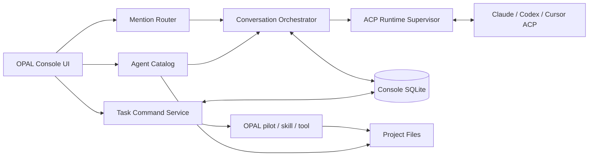

# OPAL Console ACP 에이전트 허브 구현 스펙

> 상태: 제안
> 작성일: 2026-09-10
> 범위: ACP 런타임 등록, 프로젝트 에이전트 자동 발견, 멘션 기반 대화·위임, 태스크 칸반 생성과 실행 추적

---

## 1. 결정 요약

OPAL Console을 프로젝트 현황 조회 화면에서 **프로젝트 에이전트 허브**로 확장한다.

핵심 동작은 다음과 같다.

1. Console은 프로젝트 루트의 `.opal/AGENT.md`를 읽어 프로젝트 PM을 자동 등록한다.
2. Console은 프로젝트·프레임워크 전문 에이전트와 사용자가 만든 에이전트를 하나의 Agent Catalog로 통합한다.
3. 사용자는 각 에이전트에 Claude·Codex·Cursor 등 ACP 런타임과 모델·모드·권한을 연결한다.
4. Project Brain 대화에서 멘션이 없으면 기본 PM, `@agent-id`가 있으면 해당 에이전트를 호출한다.
5. PM은 같은 대화에서 전문 에이전트를 호출하고 결과를 종합할 수 있다.
6. 태스크 칸반에서 새 태스크를 만들고 PM 또는 전문 에이전트에게 업무를 지시할 수 있다.
7. 태스크 생성·상태 변경은 기존 OPAL pilot·skill·tool 계약을 사용하며 Console이 상태 파일을 직접 편집하지 않는다.

이 설계는 기존 `docs/proposals/archives/opal-console-agent-channel.md`의 A안인 **Console 자체 ACP 호스트**를 채택한다. Buzz 연동은 핵심 경로에서 제외한다.

---

## 2. 목표와 제외 범위

### 2.1 목표


| ID  | 목표                                     |
| --- | -------------------------------------- |
| G-1 | 프로젝트 PM과 전문 에이전트를 파일에서 자동 발견한다.        |
| G-2 | 에이전트 역할 정의와 LLM 실행 설정을 분리한다.           |
| G-3 | 서로 다른 ACP 런타임을 동일한 대화 UX로 호출한다.        |
| G-4 | 멘션으로 대화 상대와 업무 담당자를 결정한다.              |
| G-5 | 에이전트 호출, 도구 실행, 승인, 결과를 추적 가능하게 기록한다.  |
| G-6 | 대화에서 태스크를 만들고 칸반에서 실행을 이어갈 수 있게 한다.    |
| G-7 | 기존 OPAL 하네스·pilot·state-tool 계약을 유지한다. |


### 2.2 1차 제외 범위

- 원격 다중 사용자 SaaS 운영
- 공급자 API를 Console이 직접 호출하는 별도 LLM 게이트웨이
- 자유 형식 에이전트 간 무제한 자율 대화
- 여러 에이전트가 같은 작업 디렉토리를 동시에 수정하는 자동 병렬 실행
- Project Brain의 지식 페이지를 대화 원문 저장소로 사용하는 방식
- 터미널 에뮬레이터로 각 CLI의 TUI를 그대로 재현하는 방식

---

## 3. 용어와 책임 경계


| 용어                 | 정의                                   | SSOT                                |
| ------------------ | ------------------------------------ | ----------------------------------- |
| Agent Definition   | 역할·전문성·규칙·참조 문서를 정의한 에이전트 원문         | `AGENT.md`                          |
| Agent Catalog      | 발견된 에이전트를 정규화한 읽기 모델                 | 원본 파일 + 인메모리/캐시 인덱스                 |
| Runtime Definition | ACP 서버 실행 명령, 인증 방식, 환경, 진단 상태       | Console 사용자 설정                      |
| Execution Binding  | 에이전트와 런타임·모델·모드·권한의 연결               | Console 사용자 설정                      |
| Conversation       | 프로젝트 안에서 메시지와 에이전트 실행을 묶는 대화방        | Console DB                          |
| Agent Participant  | 한 대화에 참여한 특정 에이전트                    | Conversation + Agent Definition 스냅샷 |
| Agent Run          | 사용자 멘션이나 에이전트 위임으로 발생한 한 번의 실행       | Console DB                          |
| ACP Session        | Agent Participant가 ACP 서버에 가진 멀티턴 세션 | ACP 서버 + Console 핸들                 |
| Task Draft         | 아직 OPAL 태스크 폴더가 만들어지지 않은 대화 기반 초안    | Console DB                          |
| OPAL Task          | pilot과 state-tool로 초기화된 정식 태스크       | 프로젝트 `tasks/`                       |


### 3.1 반드시 분리할 세 축

다음 세 정보는 하나의 레코드에 합치지 않는다.

```text
역할 정의      .opal/AGENT.md
실행 설정      OPAL PM -> Claude ACP -> model=sonnet
대화 실행      conversation-42 -> opal-pm -> ACP session abc
```

`AGENT.md`는 프로젝트와 함께 공유될 수 있지만 인증·실행 경로·개인 모델 선택은 사용자 환경에 속한다. 따라서 `AGENT.md`에 로컬 실행 파일이나 비밀값을 기록하지 않는다.

---

## 4. 현재 상태와 변경 경계

### 4.1 재사용할 현재 기반


| 현재 기반       | 재사용 범위                        | 근거                                                 |
| ----------- | ----------------------------- | -------------------------------------------------- |
| 프로젝트 스캔     | `.opal/AGENT.md`가 있는 프로젝트 발견  | `dashboard/backend/scanner.py`                     |
| 프로젝트 cwd 격리 | ACP `session/new.cwd` 검증에 재사용 | `dashboard/backend/adapters/opbr_adapter.py`       |
| Brain 화면    | 프로젝트 선택, 입력창, 상태 UI의 일부       | `dashboard/frontend/src/pages/brain/BrainPage.tsx` |
| 비동기 작업 UX   | 실행 상태 표현과 오류 처리 아이디어          | `dashboard/backend/adapters/brain_session.py`      |
| 태스크 칸반      | 생성된 정식 태스크의 조회·표시             | `dashboard/backend/routers/tasks.py`               |
| 전문 에이전트 상속  | 프로젝트 우선, 프레임워크 폴백             | `opal/core/references/pm/specialist-agent.md`      |
| 에이전트 플랫폼 변환 | 모델 레벨과 플랫폼별 어댑터 규칙            | `opal/core/references/agents.md`                   |
| 상태 변경       | pipeline 상태의 유일한 쓰기 경로        | `opal/tools/state-tool/`                           |


### 4.2 교체하거나 분리할 현재 기반


| 현재 동작                                            | 변경 방향                                      |
| ------------------------------------------------ | ------------------------------------------ |
| Claude·sonnet·medium 하드코딩                        | Runtime Definition과 Execution Binding으로 대체 |
| `[ASSISTANT]` + `//opbr query --read-only` 단일 경로 | 지식 질의와 PM 실행 대화를 별도 서비스로 분리                |
| `subprocess.run` 후 일괄 응답                         | ACP 비동기 스트리밍으로 대체                          |
| 단일 휘발성 Brain 세션                                  | 대화·메시지·실행 메타데이터 영속화                        |
| 프로젝트별 Claude 웜 핸들 풀                              | ACP Participant Session 수명주기로 대체           |
| GET 중심 태스크 라우터                                   | 별도 Task Command Service를 추가                |


### 4.3 아키텍처 원칙 변경

이 기능은 `docs/ARCHITECTURE.md`의 다음 기존 원칙을 의도적으로 변경한다.

- Console 읽기 전용 원칙
- 대화 내용 비영속 원칙
- LLM 호출을 Brain 읽기 전용 라우터 하나에만 격리하는 원칙

변경 후 원칙은 다음과 같다.

> Console의 프로젝트 데이터 읽기는 계속 기존 파일을 SSOT로 사용한다. 실행·대화·설정 쓰기는 Runtime, Conversation, Task Command 라우터에 한정하고 모든 쓰기를 감사 가능하게 기록한다.

---

## 5. 목표 아키텍처



### 5.1 백엔드 컴포넌트


| 컴포넌트                   | 책임                                        |
| ---------------------- | ----------------------------------------- |
| Agent Catalog Service  | 에이전트 파일 탐색, 파싱, 상속 해석, 충돌 판정, 변경 감지       |
| Runtime Registry       | ACP 런타임 등록·수정·비활성화, 진단 결과 저장              |
| ACP Runtime Supervisor | 프로세스 spawn, stdio 연결, 초기화, 종료, 재시작, 자원 상한 |
| Conversation Service   | 대화·메시지·참여자·실행·이벤트 영속화                     |
| Mention Router         | 멘션 파싱, 수신자 결정, 기본 PM 폴백, 위임 깊이 검사         |
| Permission Broker      | ACP 권한 요청을 UI로 전달하고 사용자 결정을 반환            |
| Task Command Service   | 태스크 초안, pilot 시작, 정식 태스크 생성, 대화 연결        |
| Event Stream Gateway   | ACP 이벤트를 WebSocket으로 FE에 전달               |


### 5.2 프런트엔드 화면


| 화면            | 추가 기능                                       |
| ------------- | ------------------------------------------- |
| 설정 &gt; 런타임   | Claude·Codex·Cursor 등록, 인증·Ready 진단, 기본값 설정 |
| 에이전트          | PM·전문·사용자 에이전트 목록, 원천 파일, 실행 바인딩, 활성 상태     |
| Project Brain | 지식과 PM 대화 탭, 대화 목록, 멘션 자동완성, 실행 이벤트, 승인 UI  |
| 태스크 칸반        | 새 태스크, 담당 에이전트, 연결 대화, 실행·승인 상태             |


---

## 6. Agent Catalog 스펙

### 6.1 탐색 순서


| 우선순위 | 경로                                           | 종류               |
| ----: | -------------------------------------------- | ---------------- |
| 1    | `{project}/.opal/AGENT.md`                   | 프로젝트 PM          |
| 2    | `{project}/.opal/agents/{agent-id}/AGENT.md` | 프로젝트 전문·사용자 에이전트 |
| 3    | `~/.opal/agents/{agent-id}/AGENT.md`         | 프레임워크 전문 에이전트    |


같은 `agent-id`가 프로젝트와 프레임워크에 모두 있으면 프로젝트 정의가 우선한다. 프로젝트 정의의 `extends`가 프레임워크 원본을 가리키면 두 본문을 순서대로 결합한다.

### 6.2 프로젝트 PM 자동 생성

루트 `.opal/AGENT.md`를 발견하면 논리 PM 레코드를 만든다. 파일을 복사하거나 수정하지 않는다.


| 필드             | 메타데이터 존재 시     | 메타데이터 부재 시           |
| -------------- | -------------- | -------------------- |
| `agent_id`     | `name`         | `{project-slug}-pm`  |
| `display_name` | `display_name` | `{PROJECT_NAME} PM`  |
| `kind`         | `kind`         | `pm`                 |
| `description`  | `description`  | 문서 첫 제목 또는 `프로젝트 PM` |
| `source_path`  | 실제 파일 경로       | 실제 파일 경로             |


예:

```text
/workspace/opal/.opal/AGENT.md -> @opal-pm -> OPAL PM
/workspace/mams/.opal/AGENT.md -> @mams-pm -> MAMS PM
```

### 6.3 선택 메타데이터

기존 루트 `AGENT.md`와 호환하기 위해 frontmatter는 선택 사항으로 둔다.

```yaml
---
name: opal-pm
display_name: OPAL PM
kind: pm
description: OPAL 프레임워크 프로젝트 PM
---
```

전문·사용자 에이전트는 다음 필드를 지원한다.

```yaml
---
name: opal-be-agent
display_name: OPAL Backend Agent
kind: specialist
extends: ~/.opal/agents/opal-be-agent/AGENT.md
model: standard
description: OPAL Console 백엔드 전문 에이전트
---
```

`model`은 실행 모델명이 아니라 OPAL 논리 레벨이다. 실제 모델은 Execution Binding에서 결정한다.

### 6.4 정규화 레코드

```json
{
  "agent_id": "opal-be-agent",
  "display_name": "OPAL Backend Agent",
  "kind": "specialist",
  "project_path": "/workspace/opal",
  "source_path": "/workspace/opal/.opal/agents/opal-be-agent/AGENT.md",
  "extends": "~/.opal/agents/opal-be-agent/AGENT.md",
  "model_level": "standard",
  "definition_digest": "sha256:...",
  "enabled": true,
  "validation": { "status": "valid", "messages": [] }
}
```

### 6.5 변경 감지

- 프로젝트 재스캔과 파일 mtime 변경 시 Catalog를 갱신한다.
- 새 실행은 최신 정의를 사용한다.
- 이미 시작된 Agent Run은 시작 시점의 `definition_digest`와 원문 스냅샷을 유지한다.
- 대화 참여자의 정의가 바뀌면 UI에 `에이전트 정의 변경됨`을 표시하고 다음 턴부터 갱신할지 선택할 수 있게 한다.

### 6.6 사용자 에이전트 생성

Console에서 프로젝트 전용 에이전트를 만들 수 있다.

1. 이름·설명·역할·전문 영역 입력
2. 기존 프레임워크 에이전트 상속 여부 선택
3. 생성될 `AGENT.md` 미리보기
4. 사용자 확인
5. `{project}/.opal/agents/{agent-id}/AGENT.md` 생성
6. Agent Catalog 재스캔과 유효성 검사
7. 런타임 바인딩 설정

에이전트 생성 규칙은 `opal-agent-creator`가 소유하고, Console은 해당 실행 경로를 호출한다. Console이 별도의 에이전트 문법을 만들지 않는다.

---

## 7. ACP 런타임과 실행 바인딩

### 7.1 Runtime Definition

```json
{
  "runtime_id": "claude-local",
  "display_name": "Claude Local",
  "protocol": "acp",
  "command": "/absolute/path/to/claude-agent-acp",
  "args": [],
  "env_refs": ["CLAUDE_CODE_EXECUTABLE"],
  "auth_method": "runtime_default",
  "enabled": true
}
```

규칙:

- 실행 명령은 shell 문자열이 아니라 `command`와 `args[]`로 저장한다.
- `command`는 등록 시 절대경로로 해석해 저장한다.
- 비밀값은 저장하지 않고 OS 환경·키체인·공급자 CLI 로그인 상태를 참조한다.
- stdout은 ACP 프로토콜 전용, stderr는 진단 로그 전용으로 취급한다.
- 런타임 삭제보다 비활성화를 기본으로 한다. 기존 대화의 실행 기록을 보존해야 하기 때문이다.

### 7.2 지원 런타임 초기값


| 런타임         | ACP 실행 방식              | 비고                          |
| ----------- | ---------------------- | --------------------------- |
| Claude Code | `claude-agent-acp` 어댑터 | 하부 Claude CLI 경로와 로그인 상태 진단 |
| Codex CLI   | `codex-acp` 어댑터        | 하부 Codex CLI 로그인 상태 진단      |
| Cursor CLI  | `agent acp`            | 네이티브 ACP 서버                 |


Agent Catalog와 Conversation Service는 런타임별 조건문을 갖지 않는다. 런타임 차이는 Runtime Adapter에만 둔다.

### 7.3 Ready 진단

Ready는 LLM 프롬프트 성공을 의미하지 않는다. 다음 단계를 구분해 표시한다.


| 상태              | 판정                                 |
| --------------- | ---------------------------------- |
| `missing`       | 실행 파일을 찾을 수 없음                     |
| `launchable`    | 프로세스가 시작되고 ACP framing이 성립         |
| `auth_required` | 초기화 결과 인증 필요                       |
| `ready`         | initialize·capability 협상과 인증 조건 충족 |
| `incompatible`  | 프로토콜 버전·필수 capability 불일치          |
| `error`         | 비정상 종료·응답 타임아웃·잘못된 출력              |


진단은 실제 업무 프롬프트를 보내지 않는다.

### 7.4 Execution Binding

```json
{
  "project_path": "/workspace/opal",
  "agent_id": "opal-pm",
  "runtime_id": "claude-local",
  "model_preference": "sonnet",
  "thought_level": "medium",
  "mode": "agent",
  "permission_policy": "ask",
  "is_project_default": true
}
```

우선순위는 다음과 같다.

1. 새 대화·새 실행에서 사용자가 지정한 일회성 override
2. 프로젝트의 해당 에이전트 Execution Binding
3. 프로젝트 기본 PM binding
4. Console 전역 기본 runtime

모델·모드·추론 수준은 ACP 세션이 광고하는 config options를 우선 사용한다. 런타임이 해당 옵션을 광고하지 않을 때만 Runtime Adapter가 CLI 인자 폴백을 적용한다.

---

## 8. 대화와 멘션 라우팅

### 8.1 Project Brain 정보 구조

Project Brain 화면을 다음 두 영역으로 나눈다.


| 영역    | 목적                                |
| ----- | --------------------------------- |
| 지식    | `.opal/brain/` 검색·인용, 기존 읽기 전용 질의 |
| PM 대화 | PM·전문·사용자 에이전트와 대화하고 업무 실행        |


지식 페이지와 대화 원문은 서로 다른 저장소에 둔다. 에이전트가 만든 재사용 가치가 있는 결정만 기존 brain ingest 계약으로 지식에 반영한다.

### 8.2 새 대화

1. 현재 프로젝트를 확정한다.
2. 프로젝트 기본 PM과 Execution Binding을 해석한다.
3. Conversation을 생성한다.
4. PM Agent Definition의 digest와 binding 스냅샷을 기록한다.
5. 첫 메시지가 오기 전에는 ACP 프로세스를 지연 생성한다.
6. 첫 메시지에 멘션이 없으면 기본 PM을 호출한다.

새 대화 화면에서 기본 PM을 다른 에이전트로 바꾸거나 런타임·모델을 일회성으로 override할 수 있다. override는 Agent Definition을 수정하지 않는다.

### 8.3 멘션 문법

```text
@opal-pm 로그인 오류를 태스크로 정리해줘.
@opal-be-agent 인증 갱신 로직을 분석해줘.
@opal-pm 구현을 진행하고 @opal-test-agent에게 검증을 맡겨줘.
```

멘션은 Catalog에 등록되고 활성화된 `agent_id`만 허용한다. FE는 `@` 입력 시 프로젝트에서 사용할 수 있는 에이전트를 자동완성한다.

### 8.4 결정적 라우팅 규칙


| 입력          | 수신자                           |
| ----------- | ----------------------------- |
| 멘션 없음       | 프로젝트 기본 PM                    |
| 멘션 1개       | 멘션된 에이전트                      |
| 멘션 여러 개     | 첫 멘션은 lead, 나머지는 collaborator |
| 알 수 없는 멘션   | 실행하지 않고 후보를 안내                |
| 비활성 에이전트 멘션 | 실행하지 않고 binding 또는 활성화 안내     |


여러 멘션을 발견했다고 모든 에이전트를 즉시 병렬 실행하지 않는다. lead가 요청을 해석하고 collaborator 호출 여부를 결정한다. 사용자가 `각자 답변`처럼 명시한 경우에만 독립 fan-out을 허용한다.

### 8.5 PM의 에이전트 위임

PM은 같은 대화 안에서 전문 에이전트를 호출할 수 있다.

```text
사용자 메시지
  -> OPAL PM Agent Run
      -> BE Agent Run
      -> Test Agent Run
  -> OPAL PM 종합 응답
```

위임 실행은 다음 필드를 가진다.

- `conversation_id`
- `run_id`
- `parent_run_id`
- `requested_by_agent_id`
- `target_agent_id`
- `task_id` 또는 `task_draft_id`
- `depth`

기본 제한:

- 위임 깊이 최대 3
- 한 parent run의 직접 하위 실행 최대 5
- 한 대화의 동시 실행 최대 3
- 같은 에이전트가 동일 parent chain에 반복 등장하면 순환 호출로 차단

### 8.6 컨텍스트 전달

전문 에이전트에게 전체 대화와 모든 숨은 실행 내용을 무조건 전달하지 않는다. 다음 Context Envelope를 구성한다.

```json
{
  "project": { "path": "/workspace/opal", "name": "OPAL" },
  "request": "인증 갱신 로직을 분석해줘",
  "requested_by": "opal-pm",
  "conversation_summary": "관련 대화 요약",
  "task": { "task_id": null, "draft_id": "draft-12" },
  "references": ["docs/ARCHITECTURE.md"],
  "constraints": ["읽기 전용 분석"],
  "expected_output": "원인, 영향 파일, 권고"
}
```

PM은 전문 에이전트 결과를 그대로 완료 선언에 사용하지 않고 검토·종합한다. 직접 멘션된 전문 에이전트는 사용자에게 자신의 이름으로 응답한다.

---

## 9. ACP 세션 수명주기

### 9.1 Participant별 세션

한 Conversation 안에서 각 Agent Participant는 독립 ACP 세션을 가진다.

```text
conversation-42
  opal-pm          -> claude-local -> acp-session-a
  opal-be-agent    -> codex-local  -> acp-session-b
  opal-test-agent  -> cursor-local -> acp-session-c
```

같은 에이전트의 다음 멘션은 해당 대화의 기존 ACP 세션을 재개한다. 다른 대화에서는 새 세션을 만든다.

### 9.2 세션 시작 순서

1. Runtime Definition과 Agent Binding을 해석한다.
2. 프로젝트 경로를 canonical path로 검증한다.
3. Runtime Supervisor가 ACP 서버 프로세스를 시작한다.
4. `initialize`로 프로토콜·capability·인증 방식을 협상한다.
5. 필요하면 `authenticate`를 수행한다.
6. `session/new`에 프로젝트 cwd와 허용된 MCP 서버를 전달한다.
7. 광고된 config options로 model·mode·thought level을 설정한다.
8. Agent Definition과 Context Envelope를 첫 prompt 컨텍스트로 적용한다.
9. `session/prompt`를 전송하고 `session/update`를 스트리밍한다.

### 9.3 이벤트 정규화

런타임별 ACP 업데이트를 다음 UI 이벤트로 정규화한다.


| 이벤트                    | UI 표현              |
| ---------------------- | ------------------ |
| `message.chunk`        | 에이전트 답변 스트리밍       |
| `thought.chunk`        | 접을 수 있는 진행 정보      |
| `tool.started`         | 도구 이름·목적·대상        |
| `tool.updated`         | 진행 상태와 출력 요약       |
| `tool.completed`       | 성공·실패와 변경 파일       |
| `permission.requested` | 승인 카드              |
| `plan.updated`         | 계획 패널              |
| `config.updated`       | 모델·모드 변경 표시        |
| `usage.updated`        | 토큰·비용 정보가 있을 때 표시  |
| `run.completed`        | stop reason과 최종 상태 |
| `run.failed`           | 오류 종류와 재시도 가능 여부   |


FE는 정규화 이벤트만 소비한다. 원본 ACP payload는 기본적으로 저장하지 않으며, 사용자가 특정 실행의 진단 기록을 켠 경우에만 제한된 보존 기간과 redaction을 적용해 저장한다. ACP가 명시적으로 제공한 진행 요약은 기록할 수 있지만 모델의 숨은 내부 추론을 추출하거나 저장하려고 시도하지 않는다.

### 9.4 취소·종료·복구

- 사용자가 실행 중지를 누르면 `session/cancel`을 우선 호출한다.
- 응답이 없으면 유예 시간 후 해당 프로세스를 종료한다.
- 대화 종료 시 `session/close` capability가 있으면 호출한다.
- Console 재시작 후 `session/load`가 가능하면 기존 세션을 재개한다.
- 재개 불가 시 기존 대화는 읽을 수 있게 유지하고, 요약을 포함한 새 ACP 세션으로 이어가기 옵션을 제공한다.
- 프로세스 크래시는 해당 Participant만 `disconnected`로 만들고 다른 대화 참여자에 영향을 주지 않는다.

---

## 10. 권한과 실행 안전성

### 10.1 권한 정책


| 정책                | 동작                                   |
| ----------------- | ------------------------------------ |
| `ask`             | 변경·명령 실행마다 ACP permission 요청을 UI에 표시 |
| `read_only`       | 읽기 계열만 허용하고 쓰기 계열은 거부                |
| `trusted_project` | 사용자가 프로젝트·도구 범위에 대해 저장한 허용 규칙 적용     |


무조건 승인하는 `bypassPermissions`는 기본 정책과 UI 선택지에서 제외한다.

권한 응답:

- 이번만 허용
- 이 프로젝트에서 같은 범위 항상 허용
- 거부

영구 허용은 실행 파일 전체가 아니라 정규화된 capability와 프로젝트 경로 범위로 저장한다.

### 10.2 경로·프로세스 방어

- 프로젝트 cwd는 Console 스캔 대상 프로젝트의 canonical path와 일치해야 한다.
- 심볼릭 링크 해석 후 프로젝트 루트 이탈을 검사한다.
- Runtime command에 shell expansion을 적용하지 않는다.
- 등록되지 않은 실행 파일과 임의 shell command를 ACP 서버로 시작하지 않는다.
- 환경변수는 allowlist된 이름만 자식 프로세스에 전달한다.
- stdout 프로토콜 오류와 stderr 로그를 분리한다.
- 런타임별 메모리·프로세스·동시 실행 상한을 둔다.

### 10.3 Console 접근 보호

127.0.0.1 바인딩을 유지하면서 다음을 추가한다.

- 세션 인증 토큰
- Origin 검증
- 상태 변경 요청의 CSRF 방어
- WebSocket 연결 인증
- 권한 결정과 파일 변경의 감사 로그

---

## 11. 대화 영속 모델

Console 운영 데이터는 프로젝트 brain이나 task 파일에 섞지 않고 사용자 영역의 SQLite에 저장한다.

권장 위치:

```text
~/.opal/console/opal-console.db
```

### 11.1 핵심 테이블


| 테이블                    | 주요 필드                                                                              |
| ---------------------- | ---------------------------------------------------------------------------------- |
| `runtime_definitions`  | runtime_id, command, args, auth_method, enabled, health                            |
| `agent_bindings`       | project_path, agent_id, runtime_id, model, mode, permission_policy                 |
| `conversations`        | conversation_id, project_path, title, default_agent_id, created_at                 |
| `participants`         | conversation_id, agent_id, definition_digest, binding_snapshot, acp_session_id     |
| `messages`             | message_id, conversation_id, sequence, role, agent_id, content, status, created_at |
| `message_revisions`    | message_id, revision, content, reason, created_at                                  |
| `agent_runs`           | run_id, parent_run_id, target_agent_id, status, depth, stop_reason                 |
| `run_events`           | run_id, sequence, event_type, normalized_payload, raw_ref                          |
| `permission_decisions` | run_id, capability, scope, decision, decided_at                                    |
| `context_checkpoints`  | conversation_id, participant_id, from_sequence, to_sequence, summary               |
| `task_drafts`          | draft_id, conversation_id, request, pilot, mode, assignee, status                  |
| `task_links`           | task_id, project_path, conversation_id, draft_id                                   |
| `notifications`        | notification_id, project_path, type, severity, source_ref, read_at                 |


### 11.2 저장 규칙

- 비밀키·인증 토큰은 DB에 저장하지 않는다.
- Agent Definition 원문 스냅샷은 실행 재현에 필요한 범위만 저장한다.
- 메시지 삭제와 대화 보존 기간을 사용자 설정으로 제공한다.
- Project Brain ingest는 대화 전체가 아니라 사용자가 승인한 결정·지식만 대상으로 한다.
- 태스크 상태의 SSOT는 계속 `state.json`이며 DB는 링크와 UI 실행 상태만 저장한다.

### 11.3 로그 계층과 소유권

로그는 목적별로 나눈다. 하나의 거대한 텍스트 로그에 대화·도구·상태·오류를 섞지 않는다.


| 로그                     | 내용                               | 저장 위치                            | 역할                  |
| ---------------------- | -------------------------------- | -------------------------------- | ------------------- |
| Conversation Log       | 사용자·에이전트·시스템 메시지, 멘션, 첨부 참조      | Console SQLite                   | 대화 복원·검색            |
| Agent Run Log          | 실행 시작·진행·도구·위임·취소·완료             | Console SQLite                   | 실행 트리·관측성           |
| Permission Audit       | 요청 capability, 대상, 사용자 결정        | Console SQLite                   | 보안 감사               |
| Task Run Log           | 단계·워커·검증·상태 전이의 정규화 사건           | `tasks/{task}/run/run-log.jsonl` | 프로젝트와 함께 이동하는 실행 증거 |
| Runtime Diagnostic Log | 프로세스 시작·종료·ACP framing·stderr 요약 | 사용자 로그 디렉토리                      | 장애 진단               |
| Project Brain          | 승인된 결정·설계·재사용 지식                 | `.opal/brain/`                   | 장기 지식               |


Conversation Log는 Task Run Log를 대체하지 않는다. 대화가 태스크와 연결되면 Task Run Log에는 필요한 실행 사건만 투영하고, 대화 전문은 복제하지 않는다. 투영 이벤트는 Console의 `run_id`·`event_id`를 `source_ref`로 가져 중복과 출처를 판별할 수 있게 한다.

`docs/proposals/opal-task-run-log.md`의 append-only 이벤트 계약을 Task Run Log의 상세 설계로 사용한다. Console은 ACP 이벤트를 그 계약으로 변환하는 하나의 수집 채널이며 `state.json`의 현재 상태 소유권을 가져오지 않는다.

### 11.4 Conversation Log 계약

메시지는 다음 공통 필드를 갖는다.

```json
{
  "message_id": "msg_01...",
  "conversation_id": "conv_01...",
  "sequence": 18,
  "created_at": "2026-09-10T17:10:00+09:00",
  "role": "user",
  "agent_id": null,
  "content_type": "markdown",
  "content": "@opal-pm 이 요청을 태스크로 만들어줘",
  "mentions": ["opal-pm"],
  "reply_to_message_id": null,
  "run_id": "run_01...",
  "task_refs": [],
  "artifact_refs": [],
  "status": "committed"
}
```

규칙:

- `sequence`는 대화 안에서 단조 증가하며 재연결 후에도 순서를 보장한다.
- 사용자 메시지는 DB 커밋 후 Agent Run을 생성한다. 저장 실패 시 LLM 실행을 시작하지 않는다.
- 스트리밍 중인 에이전트 답변은 draft message에 누적하고 완료 시 한 트랜잭션으로 committed 처리한다.
- 중단된 스트림도 `interrupted` 상태와 마지막 수신 지점까지 보존한다.
- 메시지 수정은 원문을 덮어쓰지 않고 새 revision을 추가한다. 이미 실행을 유발한 메시지 수정은 과거 Run을 바꾸지 않는다.
- 삭제는 기본적으로 soft delete이며 연결된 Task Run·Permission Audit은 삭제하지 않는다.
- 시스템 메시지는 세션 재개, 모델 변경, 권한 결정, 태스크 연결처럼 사용자에게 의미 있는 사건만 기록한다.

### 11.5 Agent Run 이벤트 계약

Agent Run은 최소한 다음 사건을 남긴다.

```text
run.queued
run.started
session.created|session.resumed
message.streaming
tool.started|tool.completed            조건부
permission.requested|resolved          조건부
delegate.requested|completed           조건부
artifact.changed                       조건부
validation.completed                   조건부
run.completed|failed|cancelled|lost    정확히 하나
```

필수 종료 사건이 없는 실행은 완료가 아니라 `lost`로 복구한다. 서버 재시작 시 `running` 상태 Run을 조사해 ACP session 재연결, 프로세스 종료 확인, `lost` 확정 중 하나로 닫는다.

각 이벤트는 `event_id`, `run_id`, `sequence`, `timestamp`, `event_type`, `actor`, `summary`, `data`, `source_ref`를 가진다. 저장 후 이벤트를 수정하지 않으며 정정은 `event.corrected`로 추가한다.

### 11.6 검색과 탐색

대화 로그는 다음 조건으로 검색할 수 있어야 한다.

- 프로젝트
- 대화 제목·메시지 본문
- 에이전트·런타임·모델
- 태스크 ID
- 변경 파일·artifact 경로
- 도구·검증 종류
- 성공·실패·취소·승인 대기 상태
- 날짜 범위

SQLite FTS 인덱스는 사용자·에이전트의 committed 메시지와 이벤트 `summary`만 대상으로 한다. 원본 ACP payload, stderr 전문, 삭제된 메시지, 비밀값 가능성이 높은 필드는 색인하지 않는다.

대화에는 제목, 태그, 즐겨찾기, archive 상태를 제공한다. 첫 사용자 메시지에서 제목을 결정론적으로 잘라 기본값을 만들고, LLM 제목 생성은 선택 기능으로 둔다.

### 11.7 컨텍스트 압축과 재개

로그 보존과 LLM에 전달할 컨텍스트는 분리한다. 전체 로그가 존재해도 매 턴 모두 프롬프트에 넣지 않는다.

1. 최근 메시지와 현재 task·artifact 참조를 우선 구성한다.
2. 런타임이 제공하는 context/usage 정보를 기준으로 예산을 계산한다.
3. 임계에 도달하면 요약 checkpoint를 생성한다.
4. checkpoint에는 포함한 메시지 sequence 범위, 참여 에이전트, 열린 결정, 미완료 작업, task·artifact 참조를 기록한다.
5. 원본 메시지는 그대로 보존하고 이후 프롬프트만 checkpoint + 최근 메시지로 구성한다.
6. 사용자는 요약 내용을 보고 수정하거나 새 대화로 분기할 수 있다.

에이전트마다 본 세부 컨텍스트가 다를 수 있으므로 checkpoint는 Conversation 공통 요약과 Participant별 작업 메모를 구분한다.

### 11.8 보존·삭제·내보내기

기본 정책:


| 데이터                          | 기본 보존                      |
| ---------------------------- | -------------------------- |
| committed 대화 메시지·정규화 Run 이벤트 | 사용자가 삭제할 때까지               |
| 권한 결정·Task Run 링크            | 연결 태스크 수명 동안               |
| 원본 ACP payload               | 기본 저장 안 함, 진단 opt-in 시 30일 |
| Runtime stderr 상세            | 7일, 오류 요약은 Run에 유지         |
| soft-deleted 대화              | 7일 복구 후 영구 삭제 가능           |


사용자는 대화를 Markdown과 JSON으로 내보낼 수 있다. Markdown은 읽기·공유용이며 JSON은 messages, participants, runs, task refs를 포함한 재가공용이다. 비밀값 redaction을 내보내기에도 동일하게 적용한다.

`기록하지 않는 대화` 모드를 제공한다. 이 모드에서는 메시지와 정규화 이벤트를 프로세스 메모리에만 두고 화면을 닫거나 서버가 종료되면 폐기한다. 파일 변경·권한 결정·정식 태스크 생성처럼 감사가 필요한 사건은 비기록 모드에서도 최소 Audit 이벤트를 남긴다는 점을 시작 전에 표시한다.

### 11.9 사용량과 비용

ACP 런타임이 usage 정보를 제공하면 다음을 Run 단위로 저장한다.

- 입력·출력 토큰
- cache read/write 사용량
- 실행 시간
- 모델
- 공급자가 제공한 비용

공급자가 비용을 제공하지 않으면 Console이 임의 가격표로 비용을 확정하지 않는다. 추정 기능을 추가하는 경우 가격표 버전과 계산 시점을 함께 기록하고 `estimated`로 표시한다.

프로젝트·에이전트·태스크별 사용량을 조회하고, 사용자 설정 한도를 넘기기 전에 경고할 수 있게 한다.

---

## 12. 태스크 칸반 생성 스펙

### 12.1 진입점

두 경로를 지원한다.

1. 칸반의 `새 태스크` 버튼
2. 대화에서 `@project-pm 이 내용을 태스크로 만들어줘`

두 경로 모두 먼저 Task Draft를 만들고 같은 확정 절차를 사용한다.

### 12.2 새 태스크 입력


| 필드                     | 필수  | 설명                |
| ---------------------- | :---: | ----------------- |
| 프로젝트                   | O   | 현재 프로젝트 기본값       |
| 요청                     | O   | 해결할 문제와 기대 결과     |
| lead agent             | O   | 기본 PM 또는 멘션한 에이전트 |
| pilot                  | 선택  | 미지정 시 PM 추천       |
| mode                   | 선택  | 기본 프로젝트 정책 사용     |
| runtime/model override | 선택  | 이 태스크 실행에만 적용     |
| 참조 대화                  | 자동  | 생성 근거 메시지 범위      |


### 12.3 생성 수명주기

```text
draft
  -> refining       PM이 질문·요구사항 정리
  -> ready          TASK 초안과 pilot 제안 완료
  -> creating       사용자 확인 후 OPAL 생성 계약 실행
  -> created        task_id와 폴더 생성, state 초기화 완료
  -> running        에이전트 실행 시작
  -> failed         생성 실패, 파일·상태 불일치 없음 보장
```

### 12.4 정식 생성 계약

Task Command Service는 다음 순서로 실행한다.

1. 프로젝트와 요청을 검증한다.
2. PM을 호출해 pilot·mode·태스크 이름·수용 기준 초안을 만든다.
3. 사용자에게 생성될 태스크 요약을 보여준다.
4. 사용자가 생성하면 기존 태스크 번호 채번 규칙으로 폴더를 결정한다.
5. 선택된 pilot의 `pipeline.json`을 해석한다.
6. `state-tool init --rows-from <pipeline.json>`으로 상태를 초기화한다.
7. `op-task` 계약으로 `TASK.md`를 생성한다.
8. 생성 검증이 모두 통과하면 Task Draft를 `created`로 변경한다.
9. Conversation과 정식 task_id를 연결한다.
10. 칸반 조회 캐시를 무효화하고 새 카드를 표시한다.

`state.json` 직접 편집, Console 전용 TASK 템플릿, 임의 태스크 폴더 형식은 금지한다.

### 12.5 실행과 칸반 표시

태스크 카드에 다음 정보를 추가한다.

- lead agent
- 현재 실행 중인 agent
- runtime과 model
- 연결 conversation
- 마지막 Agent Run 상태
- 승인 대기 배지
- 실행 중지·대화 열기 액션

칸반 컬럼은 현재처럼 프로젝트 파일에서 파생한다. Agent Run의 `running` 상태만으로 태스크 pipeline 상태를 변경하지 않는다.

---

## 13. API 계약 초안

### 13.1 Agent Catalog


| Method | Path                              | 목적                    |
| ------ | --------------------------------- | --------------------- |
| GET    | `/api/agents?project=`            | 프로젝트에서 사용 가능한 에이전트 목록 |
| GET    | `/api/agents/{agent_id}?project=` | 정의·상속·검증·binding 조회   |
| POST   | `/api/agents`                     | 프로젝트 사용자 에이전트 초안·생성   |
| POST   | `/api/agents/rescan`              | Agent Catalog 재스캔     |
| PUT    | `/api/agents/{agent_id}/binding`  | 런타임·모델·권한 연결          |


### 13.2 Runtime


| Method | Path                               | 목적                         |
| ------ | ---------------------------------- | -------------------------- |
| GET    | `/api/runtimes`                    | 런타임 목록과 health             |
| POST   | `/api/runtimes`                    | 런타임 등록                     |
| PUT    | `/api/runtimes/{runtime_id}`       | 런타임 수정·비활성화                |
| POST   | `/api/runtimes/{runtime_id}/probe` | ACP initialize 기반 Ready 진단 |


### 13.3 Conversation


| Method | Path                                               | 목적                        |
| ------ | -------------------------------------------------- | ------------------------- |
| GET    | `/api/conversations?project=`                      | 대화 목록                     |
| POST   | `/api/conversations`                               | 새 대화 생성                   |
| GET    | `/api/conversations/{id}`                          | 메시지·참여자·실행 상태 조회          |
| POST   | `/api/conversations/{id}/messages`                 | 메시지 등록과 Mention Router 실행 |
| POST   | `/api/conversations/{id}/runs/{run_id}/cancel`     | 실행 취소                     |
| POST   | `/api/conversations/{id}/permissions/{request_id}` | 권한 결정                     |
| WS     | `/api/conversations/{id}/events`                   | 메시지·도구·권한·실행 이벤트 스트림      |


### 13.4 Log와 검색


| Method | Path                                     | 목적                         |
| ------ | ---------------------------------------- | -------------------------- |
| GET    | `/api/logs/search`                       | 대화·Run·task·artifact 통합 검색 |
| GET    | `/api/conversations/{id}/timeline`       | 메시지와 실행 사건의 정렬된 타임라인       |
| GET    | `/api/runs/{run_id}`                     | 실행 트리·도구·권한·사용량 상세         |
| GET    | `/api/conversations/{id}/export?format=` | Markdown 또는 JSON 내보내기      |
| POST   | `/api/conversations/{id}/checkpoint`     | 수동 컨텍스트 요약 checkpoint      |
| DELETE | `/api/conversations/{id}`                | soft delete                |
| POST   | `/api/conversations/{id}/restore`        | 보존 기간 안의 대화 복구             |


### 13.5 Task Command


| Method | Path                                 | 목적                      |
| ------ | ------------------------------------ | ----------------------- |
| POST   | `/api/task-drafts`                   | 칸반 또는 대화에서 초안 생성        |
| PUT    | `/api/task-drafts/{draft_id}`        | 요청·pilot·담당 수정          |
| POST   | `/api/task-drafts/{draft_id}/refine` | PM에게 초안 구체화 요청          |
| POST   | `/api/task-drafts/{draft_id}/create` | 사용자 확인 후 정식 OPAL 태스크 생성 |
| GET    | `/api/tasks/detail`                  | 기존 정식 태스크 조회 유지         |


상태 변경 API는 HTTP 요청 안에서 장시간 LLM 실행을 기다리지 않는다. 명령을 생성하고 WebSocket 이벤트로 진행 상태를 전달한다.

---

## 14. UX 세부 스펙

### 14.1 런타임 설정

- 런타임 카드: 이름, 종류, command, 버전, 인증, health
- `진단` 버튼: 단계별 결과와 stderr 요약
- 모델 목록은 ACP config options에서 동적으로 표시
- 등록하지 않은 모델 문자열을 강제로 저장하지 않음
- 기본 런타임 지정

### 14.2 에이전트 화면

- 그룹: PM / 프로젝트 전문 / 프레임워크 / 사용자 생성
- 원천 경로와 상속 관계 표시
- 정의 변경·파싱 오류 배지
- 런타임·모델·모드·권한 binding
- 멘션 ID 복사
- 새 사용자 에이전트 생성

### 14.3 대화 화면

- 좌측: 프로젝트 대화 목록
- 중앙: 발화자별 메시지와 ACP 스트리밍
- 우측: 참여 에이전트, task 링크, runtime/model, 현재 실행
- 입력창: `@` 자동완성, 첨부할 프로젝트 파일·태스크 선택
- 도구 이벤트: 기본 접힘, 변경·실패·권한 요청은 펼침
- 각 응답에 agent, runtime, model, run status 표시
- 대화 검색, 태그, 즐겨찾기, archive, 내보내기
- 특정 메시지에서 새 대화 분기
- context 사용량과 마지막 checkpoint 범위 표시
- 사용자 메시지 수정 시 `새 실행으로 다시 보내기` 제공

### 14.4 태스크 칸반

- 상단 `새 태스크` 버튼
- 카드에서 연결 대화 열기
- 담당 에이전트 멘션으로 업무 추가 지시
- 승인 대기와 실행 중 상태 표시
- drag-and-drop으로 `state.json`을 직접 바꾸는 기능은 1차 제외

### 14.5 활동·알림 센터

사용자가 Console 화면을 계속 보고 있지 않아도 다음 사건을 놓치지 않게 한다.


| 알림                  | 조건                              | 기본 중요도 |
| ------------------- | ------------------------------- | ------ |
| 권한 승인 대기            | ACP permission request 수신       | 높음     |
| 사용자 Gate 대기         | pilot의 사용자 확인 필요                | 높음     |
| 태스크 blocked         | state-tool 또는 Agent Run blocker | 높음     |
| Agent Run 완료        | 백그라운드 실행 완료                     | 보통     |
| Agent Run 실패·lost   | 실패 또는 연결 단절                     | 높음     |
| Agent Definition 변경 | 활성 대화의 정의 digest와 원본 불일치        | 보통     |
| Runtime 인증 만료       | probe 또는 실행에서 auth_required     | 높음     |


1차 알림은 Console 안의 알림 센터와 브라우저 알림으로 한정한다. 이메일·Slack 같은 외부 채널은 별도 연동으로 둔다. 동일 source event에서 알림을 한 번만 만들고 읽음·해결 상태를 분리한다.

### 14.6 변경 파일과 검증 검토

업무 실행 대화에는 답변뿐 아니라 실제 프로젝트 변경 결과가 보여야 한다.

- Agent Run 시작 시 git 상태와 대상 프로젝트 기준점을 기록한다.
- Run 종료 시 변경 파일 목록과 diff 요약을 수집한다.
- 기존 사용자 변경과 해당 Run 변경을 구분할 수 없으면 구분 불가로 표시한다.
- 생성·수정·삭제 파일, 실행한 검증, 종료 코드를 Run 상세에서 확인할 수 있게 한다.
- 사용자는 diff를 확인한 뒤 후속 수정, 검증 재실행, 태스크 연결을 요청할 수 있다.
- 자동 되돌리기는 1차 범위에서 제외하고, 안전한 복구 안내와 명시적 사용자 동작을 사용한다.

### 14.7 실행 큐와 백그라운드 작업

- 프로젝트별 쓰기 Run은 기본 직렬화한다.
- 읽기 전용 Run은 설정된 동시 실행 상한 안에서 병렬 처리할 수 있다.
- 큐에는 대기 이유, 선행 Run, 예상 시작 순서를 표시한다.
- 서버 종료 시 queued Run은 복구하고 running Run은 재연결 또는 lost 판정한다.
- 사용자는 queued Run을 취소하거나 우선순위를 바꿀 수 있다.
- 같은 메시지의 중복 전송은 idempotency key로 한 번만 실행한다.

---

## 15. 오류와 관측성

### 15.1 오류 종류


| 오류                          | 사용자 동작                           |
| --------------------------- | -------------------------------- |
| Agent Definition 파싱 실패      | 원천 파일과 오류 위치 표시, 실행 차단           |
| runtime missing             | 설정 화면으로 이동                       |
| auth required               | 해당 CLI 인증 방법 안내                  |
| ACP incompatible            | 지원 프로토콜과 수신 버전 표시                |
| permission timeout          | 실행 일시정지 후 다시 승인 가능               |
| process crash               | Participant 재연결 또는 새 세션 선택       |
| session resume unsupported  | 요약 기반 새 세션 전환                    |
| task create partial failure | 생성 산출물 검증 후 복구 안내, created 처리 금지 |
| delegation cycle            | 호출 chain 표시 후 하위 실행 차단           |


### 15.2 로그

다음 식별자를 모든 로그에 포함한다.

- `project_id`
- `conversation_id`
- `run_id`
- `parent_run_id`
- `agent_id`
- `runtime_id`
- `acp_session_id`
- `task_id`

프롬프트 원문, 환경변수 값, 인증 정보는 일반 로그에 남기지 않는다.

### 15.3 운영 지표

다음 지표를 로컬 진단 화면에서 확인할 수 있게 한다.

- active·queued·waiting_permission·lost Run 수
- runtime별 프로세스 수, 시작 실패, 비정상 종료, 평균 첫 응답 시간
- WebSocket 재연결과 누락 sequence 복구 횟수
- 대화·이벤트 DB 크기와 raw diagnostic 사용량
- 프로젝트·에이전트·모델별 실행 시간과 usage
- 권한 대기·사용자 Gate 대기 시간
- Task Draft 생성 성공·실패와 정식 태스크 전환율

지표는 동작 진단을 위한 로컬 집계이며 외부 telemetry 전송은 별도 opt-in 없이는 수행하지 않는다.

---

## 16. 단계별 구현 계획

### Phase 0 — 계약 확정과 기술 스파이크

**목적**: 세 런타임의 실제 ACP 차이를 코드 구조 확정 전에 확인한다.

작업:

1. Python ACP SDK 버전과 프로토콜 버전을 고정한다.
2. Claude·Codex·Cursor 각각 `initialize -> auth -> session/new -> prompt -> cancel/close`를 실측한다.
3. 각 런타임의 config options, session load, permission, tool update 지원을 기록한다.
4. 한글·긴 응답·도구 호출·권한 요청 스트리밍 fixture를 수집한다.
5. `docs/ARCHITECTURE.md`와 `docs/SECURITY.md`의 원칙 변경안을 확정한다.

완료 기준:

- 세 런타임 지원 매트릭스가 실제 실행 증거로 작성됨
- 최소 한 런타임에서 한 턴 스트리밍과 권한 왕복 성공
- 프로토콜 불일치와 인증 실패가 구분됨

### Phase 1 — Agent Catalog 읽기 모델

**목적**: 기존 파일을 수정하지 않고 모든 에이전트를 발견한다.

작업:

1. `AgentDefinition` 모델과 Markdown/frontmatter parser를 구현한다.
2. 루트 `.opal/AGENT.md`의 PM fallback ID·이름 생성을 구현한다.
3. 프로젝트·프레임워크 에이전트 탐색 우선순위를 구현한다.
4. `extends` 해석과 순환·누락 검증을 구현한다.
5. definition digest와 변경 감지를 구현한다.
6. Agent Catalog API와 읽기 UI를 추가한다.

완료 기준:

- OPAL과 MAMS 같은 복수 프로젝트 PM이 각각 자동 등록됨
- 프로젝트 전문 에이전트가 프레임워크 원본보다 우선함
- 잘못된 에이전트는 다른 에이전트 탐색을 막지 않고 invalid로 표시됨

### Phase 2 — Runtime Registry와 Ready 진단

**목적**: ACP 실행 환경을 안전하게 등록하고 검증한다.

작업:

1. Runtime Definition 저장소와 CRUD API를 구현한다.
2. command canonicalization과 env allowlist를 구현한다.
3. Runtime Supervisor의 spawn·timeout·stderr capture를 구현한다.
4. ACP initialize·authentication·capability probe를 구현한다.
5. 런타임 설정 UI와 health 상태를 구현한다.
6. Agent Execution Binding API와 UI를 구현한다.

완료 기준:

- Claude·Codex·Cursor를 개별 등록하고 health를 판별함
- missing, auth_required, incompatible, ready가 구분됨
- 에이전트별 runtime/model binding이 저장됨

### Phase 3 — ACP Conversation Core

**목적**: 단일 에이전트와 안정적인 영속 대화를 완성한다.

작업:

1. SQLite migration, WAL, 백업·복구 계약과 Conversation 저장소를 구현한다.
2. Conversation·Participant·Message·Message Revision·Run·Run Event 모델을 구현한다.
3. 메시지 commit 후 실행, 스트리밍 draft와 interrupted 복구를 구현한다.
4. Participant별 ACP 세션 수명주기를 구현한다.
5. session update 정규화와 단조 sequence 저장을 구현한다.
6. WebSocket 이벤트 스트림과 sequence 기반 재연결을 구현한다.
7. Permission Broker와 cancel·close를 구현한다.
8. Project Brain에 `지식`과 `PM 대화` 탭을 추가한다.
9. 대화 목록·재오픈·재시작 복구를 구현한다.
10. 기본 대화 검색과 soft delete·restore를 구현한다.

완료 기준:

- 기본 PM과 멀티턴 대화 가능
- 답변·도구·권한 이벤트가 실시간 표시됨
- 새로고침 후 대화와 실행 결과가 복원됨
- 실행 취소가 ACP와 프로세스에 전파됨
- 중단된 스트림이 사라지지 않고 interrupted로 복원됨
- 프로젝트·본문·에이전트·태스크로 대화를 검색할 수 있음

### Phase 4 — Mention Router

**목적**: 같은 대화에서 원하는 에이전트를 직접 호출한다.

작업:

1. 멘션 tokenizer와 Catalog resolver를 구현한다.
2. 멘션 없음·단일·복수·미등록 규칙을 구현한다.
3. FE `@` 자동완성과 에이전트 상태 표시를 구현한다.
4. 대화당 Agent Participant lazy 생성을 구현한다.
5. 에이전트별 독립 runtime과 ACP session을 연결한다.
6. 직접 멘션 응답의 agent attribution을 구현한다.

완료 기준:

- `@opal-pm`, `@opal-be-agent`를 같은 대화에서 교대로 호출 가능
- 각 에이전트가 자신의 runtime/model/session을 사용함
- 알 수 없는 멘션이 LLM 호출 없이 거부됨

### Phase 5 — PM 위임과 다중 에이전트 조율

**목적**: PM이 전문 에이전트를 호출하고 결과를 종합한다.

작업:

1. Agent Run parent-child 모델과 Context Envelope를 구현한다.
2. PM의 delegate 요청을 내부 Agent Run으로 변환한다.
3. 깊이·fan-out·동시 실행·순환 제한을 구현한다.
4. 하위 실행 상태와 결과를 PM 세션에 반환한다.
5. 대화 UI에 실행 트리와 agent별 결과를 표시한다.
6. 공유 cwd 쓰기 충돌을 막는 프로젝트 실행 lock을 구현한다.
7. 실행 큐, idempotency key, 재시작 후 queued/running 복구를 구현한다.

완료 기준:

- PM이 BE·Test 에이전트를 순차 호출하고 종합 응답함
- 순환 위임과 상한 초과가 결정적으로 차단됨
- 쓰기 실행 두 개가 같은 프로젝트에서 무단으로 겹치지 않음

### Phase 6 — 사용자 에이전트 생성

**목적**: 사용자가 프로젝트에 필요한 에이전트를 추가한다.

작업:

1. agent creator 입력 폼과 AGENT.md 미리보기를 구현한다.
2. `opal-agent-creator` 호출 어댑터를 구현한다.
3. 프로젝트 전용·프레임워크 상속 생성 모드를 지원한다.
4. 생성 후 Catalog 재스캔·검증·binding 흐름을 연결한다.
5. 이름 충돌·경로 이탈·잘못된 extends를 차단한다.

완료 기준:

- UI에서 만든 에이전트가 프로젝트 `.opal/agents/`에 표준 형식으로 생성됨
- 생성 직후 멘션 자동완성에 나타남
- Console 밖의 지원 CLI에서도 동일 정의를 사용할 수 있음

### Phase 7 — 칸반 태스크 생성

**목적**: 대화와 칸반에서 정식 OPAL 태스크를 만든다.

작업:

1. Task Draft 저장소와 API를 구현한다.
2. 칸반 `새 태스크` drawer를 구현한다.
3. 대화 메시지에서 Task Draft 생성 액션을 구현한다.
4. PM refine 실행과 pilot·mode 추천을 구현한다.
5. 생성 미리보기와 사용자 확인을 구현한다.
6. 채번·pilot pipeline·state-tool init·op-task 실행 어댑터를 구현한다.
7. 부분 실패 복구와 생성 검증을 구현한다.
8. Task-Conversation 링크와 카드 실행 상태를 구현한다.
9. ACP Run 사건을 `opal-task-run-log` 계약의 Task Run 이벤트로 투영한다.
10. `source_ref`로 Console event와 Task Run event의 출처를 연결한다.

완료 기준:

- 칸반과 대화 두 경로가 동일한 Task Draft 계약을 사용함
- 확인 전 프로젝트 파일이 생성되지 않음
- 확인 후 표준 폴더·TASK.md·state.json이 생성됨
- 생성된 카드에서 연결 대화와 담당 에이전트를 열 수 있음
- 태스크 실행 증거가 대화 전문 없이 `run/run-log.jsonl`에 남음

### Phase 8 — 로그 활용과 작업 검토

**목적**: 축적된 로그를 검색·재개·검토·지식화에 실제로 사용한다.

작업:

1. 통합 로그 검색과 필터, Run timeline을 구현한다.
2. 대화 태그·즐겨찾기·archive를 구현한다.
3. Markdown·JSON 내보내기와 redaction을 구현한다.
4. Conversation·Participant context checkpoint와 요약 검토 UI를 구현한다.
5. 모델 context·usage 표시와 사용자 한도 경고를 구현한다.
6. Run 시작 기준점, 변경 파일, diff 요약, 검증 결과 수집을 구현한다.
7. 활동·알림 센터와 브라우저 알림을 구현한다.
8. 기록하지 않는 대화와 최소 Audit 경계를 구현한다.
9. 보존 기간, soft delete 만료, raw diagnostic 정리 작업을 구현한다.

완료 기준:

- 과거 대화를 프로젝트·에이전트·태스크·파일로 찾을 수 있음
- 긴 대화를 checkpoint로 이어가면서 원본 로그가 보존됨
- Run이 만든 변경과 검증 결과를 한 화면에서 검토할 수 있음
- 승인 대기·실패·완료 알림이 중복 없이 표시됨
- 내보낸 로그에서 비밀값과 삭제 대상이 노출되지 않음
- 보존 정책이 DB와 파일 진단 로그에 실제 적용됨

### Phase 9 — 하드닝과 기존 Brain 전환

**목적**: 운영 안정성을 확보하고 임시 호환 경로를 정리한다.

작업:

1. 프로세스 누수·크래시·서버 재시작·DB migration 복구 테스트를 수행한다.
2. 인증·Origin·CSRF·WebSocket 권한을 검증한다.
3. 로그 redaction, export, soft delete, 보존 정책을 검증한다.
4. 동시 실행·대형 이벤트·느린 권한 응답·대용량 검색 부하를 검증한다.
5. DB 손상·disk full·event partial commit 복구를 검증한다.
6. 기존 Claude Brain session/prewarm 경로의 사용량을 확인한다.
7. 지식 질의 호환 경로를 유지한 채 기존 대화 세션 코드를 단계적으로 제거한다.
8. 사용자 문서·도움말·설정 마이그레이션을 완료한다.

완료 기준:

- 비정상 종료 후 고아 프로세스가 남지 않음
- 권한 없는 HTTP·WebSocket 쓰기가 거부됨
- 기존 Project Brain 지식 질의가 회귀하지 않음
- 구형 설정 사용자가 명확한 마이그레이션 안내를 받음
- DB·로그 쓰기 실패가 LLM 실행이나 태스크 완료로 fail-open되지 않음

---

## 17. 릴리스 분할


| 릴리스                       | 포함 Phase | 사용자 가치                           |
| ------------------------- | -------- | -------------------------------- |
| R1 Agent Foundation       | 0~2      | PM·전문 에이전트 자동 발견과 런타임 연결         |
| R2 Agent Conversation MVP | 3~4      | Project Brain에서 PM·전문 에이전트 멘션 대화 |
| R3 Orchestration          | 5~6      | PM 위임과 사용자 에이전트 생성               |
| R4 Task Execution         | 7        | 대화·칸반 기반 정식 태스크 생성과 실행 연결        |
| R5 History &amp; Review   | 8        | 로그 검색·컨텍스트 재개·diff 검토·알림         |
| R6 Stable                 | 9        | 보안·복구·호환성 하드닝                    |


R2를 첫 사용 가능한 제품 경계로 본다. R1만 배포하면 설정은 가능하지만 실제 사용자 업무 흐름이 닫히지 않는다.

---

## 18. 전체 수용 기준

- [ ] 프로젝트 루트 `.opal/AGENT.md`가 `{PROJECT} PM`으로 자동 등록된다.
- [ ] PM 정의는 원본 파일을 SSOT로 사용하며 Console 설정에 복제되지 않는다.
- [ ] 프로젝트·프레임워크·사용자 에이전트가 동일 Catalog에 나타난다.
- [ ] 프로젝트 에이전트가 같은 ID의 프레임워크 에이전트보다 우선한다.
- [ ] Claude·Codex·Cursor ACP 런타임을 등록하고 독립적으로 진단할 수 있다.
- [ ] 에이전트마다 runtime·model·mode·permission을 연결할 수 있다.
- [ ] 새 대화의 무멘션 메시지는 기본 PM을 호출한다.
- [ ] `@agent-id`로 같은 대화에서 다른 에이전트를 호출할 수 있다.
- [ ] 에이전트 응답에 실제 agent·runtime·model·run 상태가 표시된다.
- [ ] PM이 전문 에이전트를 호출하고 결과를 종합할 수 있다.
- [ ] 위임 깊이·fan-out·순환·동시 실행 제한이 적용된다.
- [ ] ACP 답변·도구·계획·권한 이벤트가 스트리밍된다.
- [ ] 사용자가 실행을 취소하고 권한 요청을 승인·거부할 수 있다.
- [ ] 대화와 실행 기록이 새로고침·Console 재시작 후 복원된다.
- [ ] 대화 메시지, Agent Run, 권한 감사, Task Run Log의 소유권이 분리된다.
- [ ] 실행 중단·서버 재시작 시 종료 사건 없는 Run이 `lost` 또는 `interrupted`로 복구된다.
- [ ] 과거 대화를 프로젝트·에이전트·태스크·파일·상태·날짜로 검색할 수 있다.
- [ ] 긴 대화는 checkpoint로 압축해 재개하고 원본 메시지는 보존한다.
- [ ] 대화를 Markdown·JSON으로 내보낼 수 있고 redaction이 적용된다.
- [ ] 기록하지 않는 대화에서도 파일 변경·권한·태스크 생성의 최소 Audit은 유지된다.
- [ ] 런타임이 제공한 usage와 모델을 Run 단위로 확인할 수 있다.
- [ ] Agent Run의 변경 파일·diff 요약·검증 결과를 확인할 수 있다.
- [ ] 권한 대기·실패·blocked·완료 알림을 중복 없이 확인할 수 있다.
- [ ] UI에서 표준 프로젝트 에이전트를 생성하고 즉시 멘션할 수 있다.
- [ ] 칸반과 대화에서 같은 계약으로 Task Draft를 만들 수 있다.
- [ ] 사용자 확인 전에는 정식 태스크 파일이 생성되지 않는다.
- [ ] 정식 태스크 생성은 기존 채번·pilot·op-task·state-tool 계약을 사용한다.
- [ ] 태스크 pipeline 상태는 프로젝트 `state.json`이 계속 SSOT다.
- [ ] 대화 원문은 Project Brain 지식 저장소에 자동 복제되지 않는다.
- [ ] 비밀값이 설정 DB·일반 로그·프로젝트 파일에 기록되지 않는다.

---

## 19. 권고 결정


| 항목                  | 권고                                                     |
| ------------------- | ------------------------------------------------------ |
| Project Brain 화면 구조 | `지식`과 `PM 대화` 탭으로 분리                                   |
| 기본 수신자              | 프로젝트 루트 `.opal/AGENT.md`에서 발견한 PM                      |
| 복수 멘션               | 첫 멘션 lead, 나머지 collaborator                            |
| 에이전트 생성 위치          | 1차는 프로젝트 `.opal/agents/`만 지원                           |
| 대화 저장               | Console 사용자 영역 SQLite                                  |
| 로그 기본값              | committed 메시지·정규화 이벤트 저장, raw ACP payload 미저장          |
| Task Run Log        | 기존 append-only 제안 계약 사용, Console event는 source_ref로 연결 |
| 긴 대화                | 원본 보존 + 범위가 명시된 context checkpoint                     |
| 비기록 대화              | 메시지는 휘발성, 변경·권한·태스크 사건은 최소 Audit 유지                    |
| 태스크 저장              | 기존 프로젝트 `tasks/`와 state-tool 계약 유지                     |
| ACP 프로세스 격리         | 대화의 Agent Participant별 세션, 초기에는 연결도 개별 격리              |
| 권한 기본값              | `ask`                                                  |
| 첫 제품 경계             | R2 Agent Conversation MVP                              |


이 결정으로 구현을 시작하면 기존 OPAL 파일 체계와 하네스를 유지하면서 Console이 PM·전문·사용자 에이전트를 실제로 실행하는 단일 진입점이 된다.
