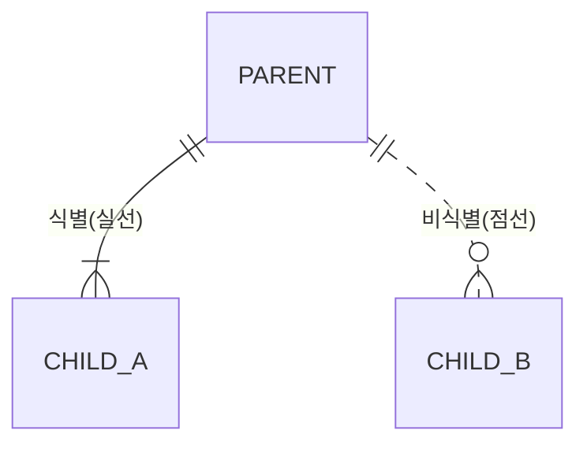

# Mermaid ERD 가이드

> op-data-model 스킬 참조 문서 (erd-modeler에서 이관)
> 개념 모델링 및 논리 모델링에 사용

---

## 1. 기본 문법

### 엔티티 정의

```mermaid
erDiagram
    ENTITY_NAME["한글 엔티티명"] {
        타입 컬럼명 키종류 "한글 속성명"
    }
```

지원하는 키 종류: `PK`, `FK`, `UK`
지원하는 타입: `bigint`, `int`, `varchar`, `decimal`, `datetime`, `date`, `char`, `text`, `boolean`

### 관계 표현

```
||--||    1:1 필수
||--o|    1:1 선택
||--|{    1:N 필수
||--o{    1:N 선택
}|--|{    M:N 필수 (개념 모델에서만 사용)
```

| 기호 | 의미 |
|------|------|
| `||` | 정확히 1 (필수) |
| `o|` | 0 또는 1 (선택) |
| `|{` | 1 이상 (필수) |
| `o{` | 0 이상 (선택) |

### 관계 라벨

```
PARENT ||--o{ CHILD : "관계명"
```

관계명은 한글 동사형을 사용한다: "운영한다", "포함한다", "속한다"

### 식별/비식별 관계

Mermaid에서는 실선과 점선으로 구분한다:
- 실선 `--`: 식별 관계 (자식 PK에 부모 PK 포함)
- 점선 `..`: 비식별 관계 (자식 일반 속성에 FK)



---

## 2. 개념 모델링 템플릿

개념 모델에서는 속성을 넣지 않고, 엔티티와 관계만 표현한다.
M:N 관계를 허용한다.

```mermaid
erDiagram
    %% ========================================
    %% 개념 ERD: SA{N} - {영역명}
    %% 프로젝트: {프로젝트명}
    %% 작성일: YYYY-MM-DD
    %% ========================================

    COMPANY["회사 정보"] ||--o{ BRAND["브랜드 정보"] : "운영한다"
    BRAND ||--o{ CAMPAIGN["캠페인 정보"] : "집행한다"
    CAMPAIGN ||--o{ ADGROUP["광고그룹 정보"] : "포함한다"
    ADGROUP ||--o{ KEYWORD["키워드 정보"] : "포함한다"
    ADGROUP ||--o{ CREATIVE["소재 정보"] : "포함한다"
```

### 개념 모델 규칙

- 엔티티명: 영문 대문자 (COMPANY, BRAND 등)
- 한글명: `["한글명"]` 형식, 끝에 "정보" 필수
- 속성: 작성하지 않음
- 관계명: 한글 동사형
- M:N: 허용 (논리 모델에서 해소)

---

## 3. 논리 모델링 템플릿

논리 모델에서는 속성, 키, 데이터타입을 상세화한다.
M:N 관계는 매핑 엔티티로 해소한다.

```mermaid
erDiagram
    %% ========================================
    %% 논리 ERD: SA{N} - {영역명}
    %% 프로젝트: {프로젝트명}
    %% 작성일: YYYY-MM-DD
    %% ========================================

    CAMPAIGN_BSC["캠페인 기본 정보"] {
        bigint campaign_id PK "캠페인식별자"
        bigint company_id FK "회사식별자"
        bigint brand_id FK "브랜드식별자"
        varchar media_cd "매체코드"
        varchar campaign_nm "캠페인명"
        varchar campaign_type_cd "캠페인유형코드"
        varchar campaign_state_cd "캠페인상태코드"
        decimal daily_budget_amt "일예산금액"
        date start_date "시작일자"
        date end_date "종료일자"
        varchar ext_campaign_id "외부캠페인식별자"
        char use_yn "사용여부"
        datetime created_dt "생성일시"
        datetime updated_dt "수정일시"
    }

    COMPANY_BSC["회사 기본 정보"] ||..o{ CAMPAIGN_BSC : "집행한다"
    BRAND_BSC["브랜드 기본 정보"] ||..o{ CAMPAIGN_BSC : "소속된다"
```

### 논리 모델 규칙

- 엔티티명: 영문 대문자 + 유형 접미어 (CAMPAIGN_BSC, MEMBER_BSC)
- 한글명: `["한글명 정보"]` 형식
- 속성: 표준용어사전의 영문약어명 사용 (소문자)
- 타입: 도메인사전 기반 (bigint, varchar, decimal 등)
- 키: PK, FK, UK 표시
- 한글 속성명: `"한글용어명"` 형식 (표준용어사전 참조)
- 관계: 식별(--) / 비식별(..) 구분
- M:N: 매핑 엔티티로 해소

### M:N 해소 예시

개념 모델:
```
BRAND }|--|{ MEDIA : "광고한다"
```

논리 모델:
```
BRAND_BSC ||--o{ BRAND_MEDIA_MAP : "매핑된다"
MEDIA_BSC ||--o{ BRAND_MEDIA_MAP : "매핑된다"

BRAND_MEDIA_MAP["브랜드매체 매핑 정보"] {
    bigint brand_media_map_id PK "브랜드매체매핑식별자"
    bigint brand_id FK "브랜드식별자"
    varchar media_cd FK "매체코드"
    char use_yn "사용여부"
    datetime created_dt "생성일시"
}
```

---

## 4. 설명 문서 (.md) 템플릿

각 Mermaid 파일에 대응하는 설명 문서를 작성한다.

```markdown
# ERD SA{N}: {영역명}

> 작성일: YYYY-MM-DD | 작성자: {작성자} | 단계: 개념/논리

## 1. 영역 설명
{이 Subject Area가 다루는 업무 범위}

## 2. 엔티티 목록

| 엔티티 | 한글명 | 설명 | 유형 |
|--------|--------|------|------|
| CAMPAIGN_BSC | 캠페인 기본 정보 | 광고 캠페인 마스터 | 기본 |

## 3. 관계 목록

| 부모 | 자식 | 관계명 | 카디널리티 | 식별여부 |
|------|------|--------|-----------|---------|
| COMPANY_BSC | CAMPAIGN_BSC | 집행한다 | 1:N | 비식별 |

## 4. 설계 결정사항
- {왜 이렇게 설계했는지, 대안은 무엇이었는지}

---
변경이력:
| 버전 | 날짜 | 작성자 | 변경내용 |
```

---

## 5. 주의사항

- Mermaid erDiagram은 FK가 어느 컬럼을 참조하는지 선으로 연결하지 못한다. 대신 속성에 `FK` 표시를 하고, 설명 문서의 관계 목록에서 참조 관계를 명시한다.
- 한글명에 특수문자(괄호 등)가 있으면 렌더링 오류가 날 수 있다. 순수 한글+숫자만 사용한다.
- 엔티티가 15개 이상이면 Subject Area를 분할한다.
