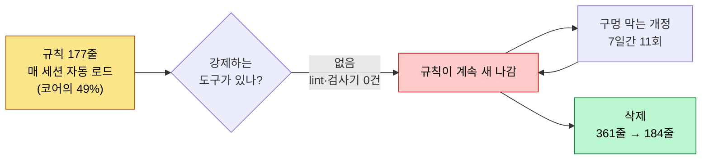
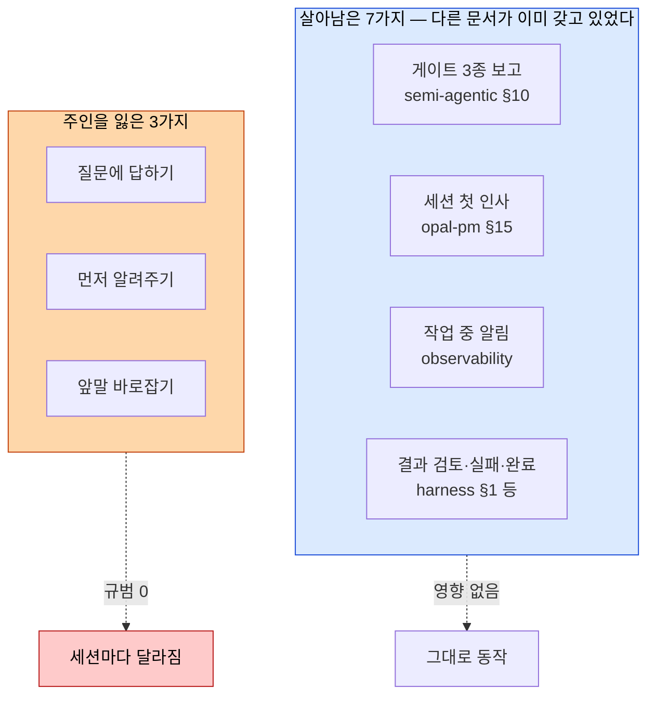
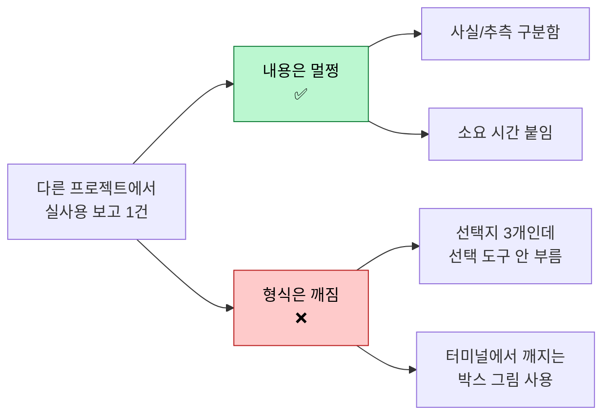

# 보고 형식을 왜 없앴나 — 처음 보는 사람을 위한 설명

> 근거: 이 프로젝트의 실물(`tasks/108-.../DONE.md`, `opal/core/AGENT.md`, `.opal/brain/`)에서 가져왔습니다. 일반 지식으로 채운 곳은 없습니다.

**한 문장**: 알투가 말할 때 지켜야 할 「보고 서식 규칙 177줄」이 매 세션 자동으로 읽히고 있었는데, 그 규칙을 강제하는 장치가 하나도 없어서 통째로 걷어냈습니다.

---

## 무슨 일이 있었나

**규칙은 있는데 지키는지 아무도 안 봤습니다.** 검사 도구를 전부 뒤졌지만 이 서식을 판정하는 lint·QA 게이트가 0건이었습니다 (`tasks/108-260906-opds-보고형식-전면제거/TASK.md` §배경 분석).

**그래서 규칙이 규칙을 낳았습니다.** 한 규칙이 만든 빠져나갈 구멍을 다음 규칙이 막는 식으로 13번 고쳤고, 그중 11번이 단 7일에 몰렸습니다 (`.opal/brain/pages/concept/norm-proliferation-spiral-without-enforcement.md:19`).

**비용은 매 세션 지불됐습니다.** 이 177줄은 프로젝트 안이든 밖이든 모든 대화 시작에 무조건 읽혔고, 항상 읽히는 문서의 **절반**을 차지했습니다 (`tasks/108-.../DONE.md:12`).

---

## 지운다고 다 사라지는 건 아니었다

**「보고」는 하나가 아니라 10가지였습니다.** 지운 절이 실제로 혼자 갖고 있던 건 3가지뿐이고, 나머지 7가지는 다른 문서가 이미 주인이었습니다 (`.opal/brain/pages/concept/report-norm-topology-10-types.md:31`).

**그래서 파장이 작았습니다.** 단계 전환 승인 같은 중요한 보고는 `opal-harness-semi-agentic.md:124`가 따로 갖고 있어 그대로입니다.

---

## 지워보니 이렇게 되더라 (실제 관측 1건)

**스스로 잘하는 것과 못하는 것이 갈렸습니다.** 「사실과 추측을 구분한다」·「소요 시간을 붙인다」는 아무도 안 시켜도 지켜졌고, 「선택지를 고르게 내보낸다」·「터미널에서 안 깨지게 쓴다」는 첫 보고부터 무너졌습니다.

**그래서 다시 적을 규칙은 2개면 될 것 같습니다.** 모델이 알아서 하는 걸 문서에 적는 건 낭비고, 무너지는 2개만 남기면 됩니다 — 게다가 그 2개는 「도구를 불렀나」·「깨지는 문자를 썼나」로 **기계가 판정할 수 있습니다**.

---

## 지금 상태

| 항목 | 값 |
|------|-----|
| 항상 읽히는 문서 | 361줄 → **184줄** |
| 지운 규칙 | 177줄 |
| 새로 쓴 대체 규칙 | **아직 없음** (일부러) |
| 다음 할 일 | 사례를 더 모아 2줄짜리 최소 규칙 정하기 |

> 대체 규칙을 곧바로 안 쓴 이유: 무엇이 실제로 필요한지 **관측하고 정하려고**입니다. 위 「실사용 관측 1건」이 그 첫 데이터입니다 (`tasks/108-.../DONE.md:90` 이월 2번).
