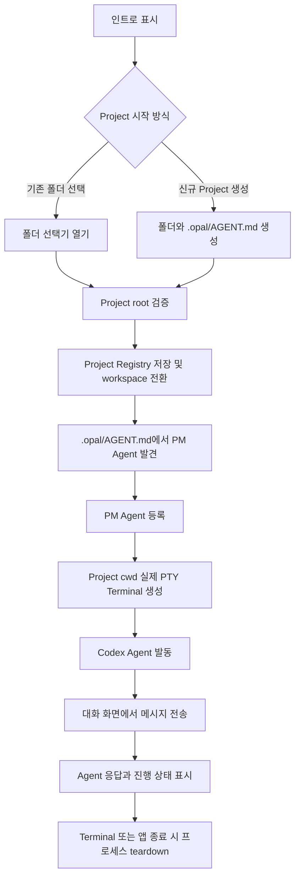

# USER_JOURNEY: WorkStudio MVP Agent Conversation

## 목적

WorkStudio MVP의 첫 사용자 접촉 경로를 인트로에서 Agent 대화까지 하나의 실제 Project 흐름으로 고정한다. 이 문서는 Loop 1 백로그 분해와 최종 여정 스모크의 원천이며, 핵심 경로에서 `simulated` 또는 `not_connected` 경계가 남지 않는 상태를 완료 기준으로 삼는다.

## 사용자 여정

| 단계 | 사용자 행동 | 시스템 반응 |
|---|---|---|
| 1. 인트로 진입 | 저장된 workspace가 없는 상태로 WorkStudio를 처음 실행한다. | 인트로 화면을 열고 기존 Project 열기와 신규 Project 생성 액션을 제공한다. |
| 2. 기존 Project 열기 | 사용자가 로컬 폴더 선택기로 기존 폴더를 선택한다. | 선택 취소는 인트로 유지 상태로 표시하고, 선택된 경로는 Project root 후보로 검증한다. |
| 3. 신규 Project 생성 | 사용자가 위치와 이름을 입력해 새 Project 폴더를 만든다. | 폴더를 생성하고 최소 `.opal/AGENT.md`를 초기화한다. Git 초기화는 수행하지 않는다. 생성 실패는 복구 가능한 오류로 표시한다. |
| 4. Project 등록 및 전환 | 사용자가 유효한 Project를 현재 workspace로 연다. | 기존 Project Registry에 Project를 저장하고 현재 workspace로 전환한다. 잘못된 경로 또는 접근 불가는 별도 상태로 표시한다. |
| 5. PM Agent 발견 | 사용자가 열린 Project의 Agent 후보를 확인한다. | `.opal/AGENT.md`에서 PM Agent를 발견해 등록 후보로 표시한다. PM 미발견 시 Agent 등록 불가 상태와 재선택 액션을 제공한다. |
| 6. PM Agent 등록 | 사용자가 발견된 PM Agent를 등록한다. | PM Agent를 실행 후보로 등록하고 Project workspace의 실행 준비 상태를 갱신한다. MVP 지원 Agent는 Codex 하나로 제한한다. |
| 7. Terminal 생성 | 사용자가 Project cwd에서 Terminal을 생성한다. | Electron main의 PTY gateway가 실제 PTY를 만들고 입력, 출력, resize, interrupt, close 이벤트를 typed preload IPC로 renderer에 전달한다. |
| 8. Agent 발동 | 사용자가 등록된 Codex Agent를 선택해 실행한다. | Agent adapter가 PTY transport 위에 실행 명령과 상태 변환을 소유하고, 실행 중, 실패, 종료 상태를 구분해 표시한다. |
| 9. 대화 수행 | 사용자가 대화 화면에서 메시지를 입력하고 전송한다. | 메시지를 실제 Agent 세션에 전달하고 응답, 진행, 종료 상태를 화자별로 구분해 보여준다. PTY byte stream과 대화 기록은 분리해 관리한다. |
| 10. 종료 및 정리 | 사용자가 Terminal 또는 앱을 종료한다. | Terminal 종료는 대화 화면에 명시하고 재시작 액션을 제공한다. 앱 종료 시 WorkStudio가 소유한 PTY와 Agent 프로세스를 teardown한다. 세션 복원은 MVP 이후로 이월한다. |

## 정상 흐름

## 취소·실패·종료 상태

| 상태 | 발생 시점 | 사용자에게 보여줄 반응 | 복구 경로 |
|---|---|---|---|
| 폴더 선택 취소 | 기존 Project 열기 | 인트로를 유지하고 이전 선택을 변경하지 않는다. | 다시 기존 Project 열기 또는 신규 Project 생성을 선택한다. |
| 잘못된 Project 경로 | Project root 검증 | 접근 불가, 삭제됨, Project 조건 불충족을 구분해 표시한다. | 다른 폴더를 선택하거나 신규 Project를 생성한다. |
| 신규 Project 생성 실패 | 폴더 생성 또는 `.opal/AGENT.md` 초기화 | 권한, 중복 이름, 파일 생성 실패를 구분해 표시한다. | 위치나 이름을 바꿔 다시 생성한다. |
| PM Agent 미발견 | `.opal/AGENT.md` 탐색 | 실행 후보 없음 상태를 표시하고 PM 등록을 진행하지 않는다. | Project를 다시 선택하거나 `.opal/AGENT.md`가 있는 Project를 연다. |
| Terminal 생성 실패 | PTY 생성 | shell, cwd, 권한 오류를 Terminal 생성 실패로 표시한다. | Project 상태를 확인한 뒤 Terminal 생성을 다시 시도한다. |
| Agent 실행 실패 | Codex Agent 발동 | adapter가 시작 실패, 명령 실패, 종료 코드를 구분해 표시한다. | Terminal을 유지한 채 재시도하거나 새 Terminal을 생성한다. |
| Terminal 예기치 못한 종료 | 대화 수행 중 | 대화 입력을 비활성화하고 종료 코드 또는 signal을 표시한다. | 새 Terminal을 만들고 Agent를 다시 발동한다. |
| 앱 종료 | 모든 실행 상태 | WorkStudio 소유 PTY와 Agent 프로세스를 종료한다. | 다음 실행 시 저장된 Project Registry에서 다시 시작한다. |

## 백로그 분해 기준

| 여정 단계 | 연결 기능 |
|---|---|
| 인트로 진입, Project 등록 및 전환 | WS-F101 Project Registry 회귀 유지 |
| 기존 Project 열기, 신규 Project 생성 | WS-F102 Project 열기·생성 |
| PM Agent 발견, PM Agent 등록 | WS-F103 PM Agent 발견·등록 |
| Terminal 생성, 종료 및 정리 | WS-F104 실제 PTY Terminal |
| Agent 발동 | WS-F105 Agent Launcher |
| 대화 수행 | WS-F106 Agent Conversation |

## 여정 스모크 원천

최종 여정 스모크는 저장 상태가 없는 WorkStudio 실행에서 시작해 신규 Project 생성, PM Agent 등록, 실제 PTY Terminal 생성, Codex Agent 발동, 사용자 메시지 전송, Agent 응답 표시, 앱 종료 teardown까지 한 번에 관통해야 한다. 기존 Project 열기 경로는 별도 회귀 시나리오로 검증하되, 두 경로 모두 Project Registry와 `.opal/AGENT.md` 발견 결과가 동일한 Agent 실행 후보로 수렴해야 한다.
